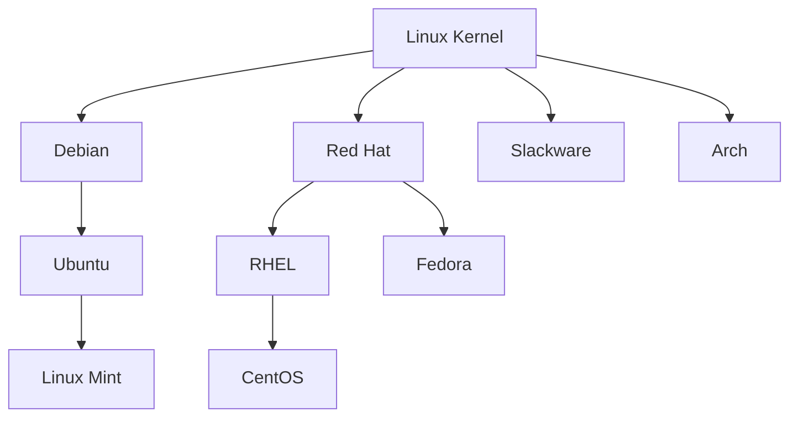

# Linux Learning Notes

<div align="center">
  
</div>

## Table of Contents

- [Introduction](#introduction)
- [Basic Commands](#basic-commands)
- [File System](#file-system)
- [User and Permission Management](#user-and-permission-management)
- [Process Management](#process-management)
- [System Monitoring](#system-monitoring)
- [Network Configuration](#network-configuration)
- [Shell Scripting Basics](#shell-scripting-basics)
- [System Service Management](#system-service-management)
- [Package Management](#package-management)
- [Learning Resources](#learning-resources)

## Introduction

Linux is a free and open-source Unix-like operating system, first released by Linus Torvalds in 1991. It is currently the most widely used server operating system in the world and is also widely used in embedded devices and personal computers.

### Linux Distributions

Common Linux distributions include:

- Ubuntu - Suitable for beginners, user-friendly interface
- CentOS/RHEL - Preferred for enterprise servers
- Debian - Stable and reliable, strong community support
- Fedora - Testing platform for new technologies
- Arch Linux - Highly customizable, rolling updates



## Basic Commands

### File Operation Commands

```bash
# List directory contents
ls -la

# Change directory
cd /path/to/directory

# Create directory
mkdir new_directory

# Remove file
rm filename

# Remove directory
rm -rf directory

# Copy file
cp source destination

# Move/rename file
mv source destination

# View file contents
cat filename

# View file contents with paging
less filename

# Find files
find /path -name "filename"
```

### System Information Commands

```bash
# Display system information
uname -a

# Display disk usage
df -h

# Display directory size
du -sh /path

# Display memory usage
free -m

# Display current logged in users
who

# Display hostname
hostname
```

## File System

The Linux Filesystem Hierarchy Standard (FHS) defines the main directories and their contents:

- `/bin` - Basic command binaries
- `/boot` - Boot loader files
- `/dev` - Device files
- `/etc` - System configuration files
- `/home` - User home directories
- `/lib` - Shared library files
- `/mnt` - Temporary mount points
- `/opt` - Optional software packages
- `/proc` - Process information
- `/root` - Root user's home directory
- `/sbin` - System binaries
- `/tmp` - Temporary files
- `/usr` - User programs
- `/var` - Variable data files

```mermaid
graph TD
    Root[/] --> bin[/bin]
    Root --> boot[/boot]
    Root --> dev[/dev]
    Root --> etc[/etc]
    Root --> home[/home]
    Root --> lib[/lib]
    Root --> mnt[/mnt]
    Root --> opt[/opt]
    Root --> proc[/proc]
    Root --> root[/root]
    Root --> sbin[/sbin]
    Root --> tmp[/tmp]
    Root --> usr[/usr]
    Root --> var[/var]
```

## User and Permission Management

### User Management Commands

```bash
# Add user
useradd username

# Set password
passwd username

# Delete user
userdel username

# Modify user information
usermod options username

# Switch user
su - username

# Execute command with root privileges
sudo command
```

### File Permissions

Linux file permissions consist of three permission groups: owner (u), group (g), and others (o). Each group has read (r), write (w), and execute (x) permissions.

```bash
# Change file permissions
chmod permissions filename

# Change file owner
chown user:group filename

# Change file group
chgrp group filename
```

Permission examples:
- `chmod 755 file` sets permissions to rwxr-xr-x
- `chmod u+x file` adds execute permission for the owner
- `chmod g-w file` removes write permission from the group

## Process Management

```bash
# View processes
ps aux

# Real-time process viewer
top

# Terminate process
kill PID

# Force terminate process
kill -9 PID

# Run command in background
command &

# View background jobs
jobs

# Bring job to foreground
fg job_number
```

## System Monitoring

```bash
# System load monitoring
uptime

# Detailed system resource usage
htop

# Network connection monitoring
netstat -tuln

# Process resource usage
ps aux --sort=-%cpu

# Disk I/O monitoring
iotop

# Real-time filesystem event monitoring
inotifywait
```

## Network Configuration

```bash
# Display network interfaces
ifconfig
ip addr show

# Test network connection
ping host

# DNS lookup
nslookup domain
dig domain

# Display routing table
route -n
ip route

# Download files
wget url
curl url -o filename

# Network port scanning
nmap host
```

## Shell Scripting Basics

Shell scripts are important automation tools in Linux/Unix systems.

### Basic Syntax Example

```bash
#!/bin/bash

# Variable definition
NAME="Linux"
echo "Hello, $NAME!"

# Conditional statements
if [ "$NAME" = "Linux" ]; then
    echo "Name is Linux"
else
    echo "Name is not Linux"
fi

# Loops
for i in {1..5}; do
    echo "Number: $i"
done

# Functions
function greet() {
    echo "Hello, $1!"
}

greet "World"
```

## System Service Management

### Systemd Service Management

```bash
# Start service
systemctl start service_name

# Stop service
systemctl stop service_name

# Restart service
systemctl restart service_name

# View service status
systemctl status service_name

# Enable service at boot
systemctl enable service_name

# Disable service at boot
systemctl disable service_name
```

### Log Viewing

```bash
# View system logs
journalctl

# View specific service logs
journalctl -u service_name

# View logs in real-time
journalctl -f
```

## Package Management

### Debian/Ubuntu (APT)

```bash
# Update package lists
apt update

# Upgrade all packages
apt upgrade

# Install package
apt install package_name

# Remove package
apt remove package_name

# Search for package
apt search keyword
```

### CentOS/RHEL (YUM/DNF)

```bash
# Update all packages
yum update

# Install package
yum install package_name

# Remove package
yum remove package_name

# Search for package
yum search keyword
```

## Learning Resources

- [Linux Documentation Project](https://tldp.org/)
- [Linux Journey](https://linuxjourney.com/)
- [Linux Command Library](https://linuxcommandlibrary.com/)
- [Linux Survival](https://linuxsurvival.com/)
- [Unix/Linux Stack Exchange](https://unix.stackexchange.com/)

---

> This document is continuously updated. Suggestions and additional content are welcome. 