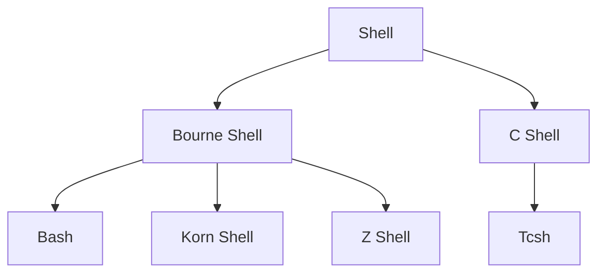

# Shell Scripting Basics

## What is Shell Scripting

Shell scripting is a method of writing script programs in Shell, commonly used for automating system administration tasks, file operations, and program deployment. In Linux/Unix systems, shell scripts are important tools for system management and automation.

## Types of Shells

Common Shell types in Linux include:

- Bash (Bourne Again Shell) - The most commonly used Shell
- Sh (Bourne Shell) - The original Unix Shell
- Zsh (Z Shell) - A powerful Shell, the default Shell in macOS since Catalina
- Fish - A user-friendly Shell
- Ksh (Korn Shell) - Combines features of Bourne Shell and C Shell



## Your First Shell Script

Create and execute a simple Shell script:

```bash
#!/bin/bash

# This is my first Shell script
echo "Hello, World!"
```

Save it as `hello.sh`, give it execute permission, and run it:

```bash
chmod +x hello.sh
./hello.sh
```

## Shell Scripting Basic Syntax

### Variables

Defining and using variables in Shell scripts:

```bash
#!/bin/bash

# Define variables
NAME="Linux"
AGE=30

# Use variables
echo "My name is $NAME"
echo "I am $AGE years old"

# Read-only variables
readonly CONSTANT="Value that cannot be modified"
echo $CONSTANT

# Delete variables
unset AGE
echo "AGE is $AGE"
```

### String Operations

Strings are the most commonly used data type in Shell programming:

```bash
#!/bin/bash

# String definition
STR1="Hello"
STR2="World"

# String concatenation
GREETING="$STR1 $STR2"
echo $GREETING

# String length
echo "Length of GREETING: ${#GREETING}"

# Extract substring
echo "Substring: ${GREETING:0:5}"
```

### Arrays

Bash supports one-dimensional arrays:

```bash
#!/bin/bash

# Define array
FRUITS=("Apple" "Banana" "Cherry")

# Access array elements
echo "First fruit: ${FRUITS[0]}"

# All elements
echo "All fruits: ${FRUITS[@]}"

# Array length
echo "Number of fruits: ${#FRUITS[@]}"

# Add element
FRUITS+=("Dragon fruit")
echo "After adding: ${FRUITS[@]}"
```

### Conditional Statements

Using if statements for conditional logic:

```bash
#!/bin/bash

AGE=25

# Basic if statement
if [ $AGE -gt 18 ]; then
    echo "Adult"
else
    echo "Minor"
fi

# if-elif-else statement
if [ $AGE -lt 13 ]; then
    echo "Child"
elif [ $AGE -lt 18 ]; then
    echo "Teenager"
else
    echo "Adult"
fi

# File test
if [ -f "/etc/passwd" ]; then
    echo "/etc/passwd exists"
fi

# String comparison
NAME="Linux"
if [ "$NAME" = "Linux" ]; then
    echo "Name is Linux"
fi
```

### Loop Structures

Shell scripts support multiple loop structures:

```bash
#!/bin/bash

# for loop
for i in {1..5}; do
    echo "Number: $i"
done

# while loop
count=1
while [ $count -le 5 ]; do
    echo "Count: $count"
    ((count++))
done

# until loop
num=1
until [ $num -gt 5 ]; do
    echo "Num: $num"
    ((num++))
done

# break and continue
for i in {1..10}; do
    if [ $i -eq 3 ]; then
        continue
    fi
    if [ $i -eq 8 ]; then
        break
    fi
    echo "Value: $i"
done
```

### Functions

Function definition and calling in Shell scripts:

```bash
#!/bin/bash

# Define function
function greet() {
    echo "Hello, $1!"
}

# Call function
greet "World"

# Function with return value
function add() {
    local sum=$(($1 + $2))
    echo $sum
}

# Get function return value
result=$(add 5 3)
echo "5 + 3 = $result"
```

### Input and Output

Handling user input and script output:

```bash
#!/bin/bash

# Read user input
echo "Enter your name:"
read name
echo "Hello, $name!"

# Command line arguments
echo "Script name: $0"
echo "First argument: $1"
echo "Second argument: $2"
echo "All arguments: $@"
echo "Number of arguments: $#"

# Redirect output
echo "This goes to file" > output.txt
echo "This is appended to file" >> output.txt

# Pipe
echo "Hello World" | grep "Hello"
```

## Practical Shell Script Examples

### System Information Script

```bash
#!/bin/bash

# Script to display system information
echo "================= System Information ================="
echo "Hostname: $(hostname)"
echo "Kernel Version: $(uname -r)"
echo "System Time: $(date)"
echo "Uptime: $(uptime -p)"
echo "CPU Info: $(grep 'model name' /proc/cpuinfo | head -1 | cut -d ':' -f2)"
echo "Total Memory: $(free -h | grep Mem | awk '{print $2}')"
echo "Used Memory: $(free -h | grep Mem | awk '{print $3}')"
echo "Disk Usage:"
df -h | grep '^/dev/'
```

### File Backup Script

```bash
#!/bin/bash

# Script to backup a specified directory
SRC_DIR="/path/to/source"
BACKUP_DIR="/path/to/backup"
TIMESTAMP=$(date +%Y%m%d_%H%M%S)
BACKUP_FILE="backup_$TIMESTAMP.tar.gz"

# Check if source directory exists
if [ ! -d $SRC_DIR ]; then
    echo "Source directory does not exist: $SRC_DIR"
    exit 1
fi

# Create backup directory (if it doesn't exist)
mkdir -p $BACKUP_DIR

# Create backup
tar -czf "$BACKUP_DIR/$BACKUP_FILE" -C "$(dirname $SRC_DIR)" "$(basename $SRC_DIR)"

# Check if backup was successful
if [ $? -eq 0 ]; then
    echo "Backup successfully created: $BACKUP_DIR/$BACKUP_FILE"
else
    echo "Backup failed"
    exit 1
fi

# Delete backups older than 30 days
find $BACKUP_DIR -name "backup_*.tar.gz" -type f -mtime +30 -delete
```

### Log Monitoring Script

```bash
#!/bin/bash

# Script to monitor log files for specific keywords
LOG_FILE="/var/log/syslog"
KEYWORDS=("error" "failed" "warning")
MAIL_TO="admin@example.com"

# Check if log file exists
if [ ! -f $LOG_FILE ]; then
    echo "Log file does not exist: $LOG_FILE"
    exit 1
fi

# Find keywords
for keyword in "${KEYWORDS[@]}"; do
    matches=$(grep -i $keyword $LOG_FILE | tail -10)
    if [ ! -z "$matches" ]; then
        echo "Found keyword: $keyword"
        echo "$matches"
        echo "=================="
        
        # Could add code to send email here
        # echo "$matches" | mail -s "Log Alert: $keyword" $MAIL_TO
    fi
done
```

## Best Practices

1. **Always add comments**: Use comments to explain the purpose of the script and complex logic
2. **Error handling**: Check command execution results and handle error situations appropriately
3. **Use variables**: Avoid hardcoded values, use variables to increase flexibility
4. **Security**: Handle user input carefully, avoid common security vulnerabilities
5. **Modularity**: Encapsulate reusable code into functions
6. **Logging**: Record script execution process and results
7. **Debugging**: Use `bash -x script.sh` for debugging

## Advanced Topics

- Regular expressions and text processing
- Signal handling and process control
- Concurrency and background tasks
- Shell script testing frameworks
- Interacting with system APIs

---

> This document is continuously updated. Suggestions and additional content are welcome. 