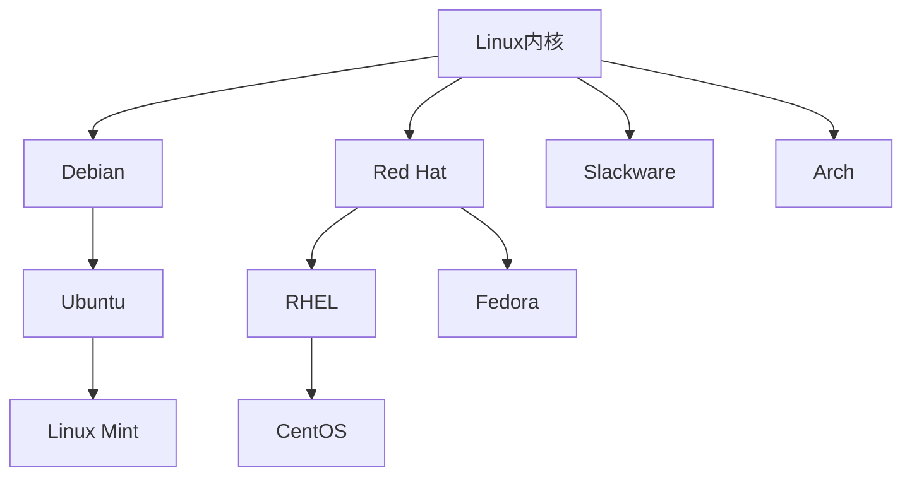

# Linux 学习笔记

<div align="center">
  
</div>

## 目录

- [简介](#简介)
- [基础命令](#基础命令)
- [文件系统](#文件系统)
- [用户和权限管理](#用户和权限管理)
- [进程管理](#进程管理)
- [系统监控](#系统监控)
- [网络配置](#网络配置)
- [Shell脚本基础](#shell脚本基础)
- [系统服务管理](#系统服务管理)
- [软件包管理](#软件包管理)
- [学习资源](#学习资源)

## 简介

Linux是一种自由开源的类Unix操作系统，由Linus Torvalds于1991年首次发布。它是目前世界上最广泛使用的服务器操作系统，也广泛应用于嵌入式设备和个人计算机中。

### Linux发行版

常见的Linux发行版包括：

- Ubuntu - 适合初学者，友好的用户界面
- CentOS/RHEL - 企业级服务器首选
- Debian - 稳定可靠，社区支持强大
- Fedora - 新技术的测试平台
- Arch Linux - 高度定制化，滚动更新



## 基础命令

### 文件操作命令

```bash
# 列出目录内容
ls -la

# 切换目录
cd /path/to/directory

# 创建目录
mkdir new_directory

# 删除文件
rm filename

# 删除目录
rm -rf directory

# 复制文件
cp source destination

# 移动/重命名文件
mv source destination

# 查看文件内容
cat filename

# 分页查看文件内容
less filename

# 查找文件
find /path -name "filename"
```

### 系统信息命令

```bash
# 显示系统信息
uname -a

# 显示磁盘使用情况
df -h

# 显示目录大小
du -sh /path

# 显示内存使用情况
free -m

# 显示当前登录用户
who

# 显示主机名
hostname
```

## 文件系统

Linux文件系统层次结构标准(FHS)定义了主要目录及其内容：

- `/bin` - 基本命令二进制文件
- `/boot` - 启动加载程序文件
- `/dev` - 设备文件
- `/etc` - 系统配置文件
- `/home` - 用户主目录
- `/lib` - 共享库文件
- `/mnt` - 临时挂载点
- `/opt` - 可选软件包
- `/proc` - 进程信息
- `/root` - root用户主目录
- `/sbin` - 系统二进制文件
- `/tmp` - 临时文件
- `/usr` - 用户程序
- `/var` - 可变数据文件

```mermaid
graph TD
    Root[/] --> bin[/bin]
    Root --> boot[/boot]
    Root --> dev[/dev]
    Root --> etc[/etc]
    Root --> home[/home]
    Root --> lib[/lib]
    Root --> mnt[/mnt]
    Root --> opt[/opt]
    Root --> proc[/proc]
    Root --> root[/root]
    Root --> sbin[/sbin]
    Root --> tmp[/tmp]
    Root --> usr[/usr]
    Root --> var[/var]
```

## 用户和权限管理

### 用户管理命令

```bash
# 添加用户
useradd username

# 设置密码
passwd username

# 删除用户
userdel username

# 修改用户信息
usermod options username

# 切换用户
su - username

# 以root权限执行命令
sudo command
```

### 文件权限

Linux文件权限由三组权限组成：所有者(u)、组(g)和其他人(o)。每组有读(r)、写(w)和执行(x)权限。

```bash
# 修改文件权限
chmod permissions filename

# 修改文件所有者
chown user:group filename

# 修改文件组
chgrp group filename
```

权限示例：
- `chmod 755 file` 设置权限为rwxr-xr-x
- `chmod u+x file` 为所有者添加执行权限
- `chmod g-w file` 从组中移除写权限

## 进程管理

```bash
# 查看进程
ps aux

# 实时查看进程
top

# 终止进程
kill PID

# 强制终止进程
kill -9 PID

# 后台运行命令
command &

# 查看后台作业
jobs

# 将作业带到前台
fg job_number
```

## 系统监控

```bash
# 系统负载监控
uptime

# 详细系统资源使用情况
htop

# 网络连接监控
netstat -tuln

# 进程资源使用情况
ps aux --sort=-%cpu

# 磁盘I/O监控
iotop

# 实时文件系统事件监控
inotifywait
```

## 网络配置

```bash
# 显示网络接口
ifconfig
ip addr show

# 测试网络连接
ping host

# DNS查询
nslookup domain
dig domain

# 显示路由表
route -n
ip route

# 下载文件
wget url
curl url -o filename

# 网络端口扫描
nmap host
```

## Shell脚本基础

Shell脚本是Linux/Unix系统中重要的自动化工具。

### 基本语法示例

```bash
#!/bin/bash

# 变量定义
NAME="Linux"
echo "Hello, $NAME!"

# 条件语句
if [ "$NAME" = "Linux" ]; then
    echo "Name is Linux"
else
    echo "Name is not Linux"
fi

# 循环
for i in {1..5}; do
    echo "Number: $i"
done

# 函数
function greet() {
    echo "Hello, $1!"
}

greet "World"
```

## 系统服务管理

### Systemd服务管理

```bash
# 启动服务
systemctl start service_name

# 停止服务
systemctl stop service_name

# 重启服务
systemctl restart service_name

# 查看服务状态
systemctl status service_name

# 设置开机自启动
systemctl enable service_name

# 禁用开机自启动
systemctl disable service_name
```

### 日志查看

```bash
# 查看系统日志
journalctl

# 查看特定服务日志
journalctl -u service_name

# 实时查看日志
journalctl -f
```

## 软件包管理

### Debian/Ubuntu (APT)

```bash
# 更新软件包列表
apt update

# 升级所有软件包
apt upgrade

# 安装软件包
apt install package_name

# 删除软件包
apt remove package_name

# 搜索软件包
apt search keyword
```

### CentOS/RHEL (YUM/DNF)

```bash
# 更新所有软件包
yum update

# 安装软件包
yum install package_name

# 删除软件包
yum remove package_name

# 搜索软件包
yum search keyword
```

## 学习资源

- [Linux Documentation Project](https://tldp.org/)
- [Linux Journey](https://linuxjourney.com/)
- [Linux Command Library](https://linuxcommandlibrary.com/)
- [Linux Survival](https://linuxsurvival.com/)
- [Unix/Linux Stack Exchange](https://unix.stackexchange.com/)

---

> 本文档持续更新中，欢迎提出建议和补充内容。 