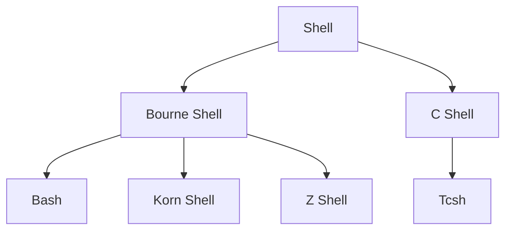

# Shell脚本编程基础

## 什么是Shell脚本

Shell脚本是一种用Shell编写的脚本程序，通常用于自动化系统管理任务、文件操作和程序部署等。在Linux/Unix系统中，Shell脚本是系统管理和自动化的重要工具。

## Shell的类型

Linux中常见的Shell类型包括：

- Bash (Bourne Again Shell) - 最常用的Shell
- Sh (Bourne Shell) - 最初的Unix Shell
- Zsh (Z Shell) - 功能强大的Shell，macOS Catalina之后的默认Shell
- Fish - 用户友好的Shell
- Ksh (Korn Shell) - 融合了Bourne Shell和C Shell的特性



## 第一个Shell脚本

创建并执行一个简单的Shell脚本：

```bash
#!/bin/bash

# 这是我的第一个Shell脚本
echo "Hello, World!"
```

保存为`hello.sh`后，赋予执行权限并运行：

```bash
chmod +x hello.sh
./hello.sh
```

## Shell脚本基础语法

### 变量

在Shell脚本中定义和使用变量：

```bash
#!/bin/bash

# 定义变量
NAME="Linux"
AGE=30

# 使用变量
echo "My name is $NAME"
echo "I am $AGE years old"

# 只读变量
readonly CONSTANT="不可修改的值"
echo $CONSTANT

# 删除变量
unset AGE
echo "AGE is $AGE"
```

### 字符串操作

字符串是Shell编程中最常用的数据类型：

```bash
#!/bin/bash

# 字符串定义
STR1="Hello"
STR2="World"

# 字符串连接
GREETING="$STR1 $STR2"
echo $GREETING

# 字符串长度
echo "Length of GREETING: ${#GREETING}"

# 提取子字符串
echo "Substring: ${GREETING:0:5}"
```

### 数组

Bash支持一维数组：

```bash
#!/bin/bash

# 定义数组
FRUITS=("Apple" "Banana" "Cherry")

# 访问数组元素
echo "First fruit: ${FRUITS[0]}"

# 所有元素
echo "All fruits: ${FRUITS[@]}"

# 数组长度
echo "Number of fruits: ${#FRUITS[@]}"

# 添加元素
FRUITS+=("Dragon fruit")
echo "After adding: ${FRUITS[@]}"
```

### 条件判断

使用if语句进行条件判断：

```bash
#!/bin/bash

AGE=25

# 基本if语句
if [ $AGE -gt 18 ]; then
    echo "成年"
else
    echo "未成年"
fi

# if-elif-else语句
if [ $AGE -lt 13 ]; then
    echo "儿童"
elif [ $AGE -lt 18 ]; then
    echo "青少年"
else
    echo "成人"
fi

# 文件测试
if [ -f "/etc/passwd" ]; then
    echo "/etc/passwd exists"
fi

# 字符串比较
NAME="Linux"
if [ "$NAME" = "Linux" ]; then
    echo "Name is Linux"
fi
```

### 循环结构

Shell脚本支持多种循环结构：

```bash
#!/bin/bash

# for循环
for i in {1..5}; do
    echo "Number: $i"
done

# while循环
count=1
while [ $count -le 5 ]; do
    echo "Count: $count"
    ((count++))
done

# until循环
num=1
until [ $num -gt 5 ]; do
    echo "Num: $num"
    ((num++))
done

# break和continue
for i in {1..10}; do
    if [ $i -eq 3 ]; then
        continue
    fi
    if [ $i -eq 8 ]; then
        break
    fi
    echo "Value: $i"
done
```

### 函数

Shell脚本中的函数定义和调用：

```bash
#!/bin/bash

# 定义函数
function greet() {
    echo "Hello, $1!"
}

# 调用函数
greet "World"

# 带返回值的函数
function add() {
    local sum=$(($1 + $2))
    echo $sum
}

# 获取函数返回值
result=$(add 5 3)
echo "5 + 3 = $result"
```

### 输入和输出

处理用户输入和脚本输出：

```bash
#!/bin/bash

# 读取用户输入
echo "Enter your name:"
read name
echo "Hello, $name!"

# 命令行参数
echo "Script name: $0"
echo "First argument: $1"
echo "Second argument: $2"
echo "All arguments: $@"
echo "Number of arguments: $#"

# 重定向输出
echo "This goes to file" > output.txt
echo "This is appended to file" >> output.txt

# 管道
echo "Hello World" | grep "Hello"
```

## 实用Shell脚本示例

### 系统信息脚本

```bash
#!/bin/bash

# 显示系统信息的脚本
echo "================= 系统信息 ================="
echo "主机名: $(hostname)"
echo "内核版本: $(uname -r)"
echo "系统时间: $(date)"
echo "已开机时间: $(uptime -p)"
echo "CPU信息: $(grep 'model name' /proc/cpuinfo | head -1 | cut -d ':' -f2)"
echo "内存总量: $(free -h | grep Mem | awk '{print $2}')"
echo "内存使用: $(free -h | grep Mem | awk '{print $3}')"
echo "磁盘使用情况:"
df -h | grep '^/dev/'
```

### 文件备份脚本

```bash
#!/bin/bash

# 备份指定目录的脚本
SRC_DIR="/path/to/source"
BACKUP_DIR="/path/to/backup"
TIMESTAMP=$(date +%Y%m%d_%H%M%S)
BACKUP_FILE="backup_$TIMESTAMP.tar.gz"

# 检查源目录是否存在
if [ ! -d $SRC_DIR ]; then
    echo "源目录不存在: $SRC_DIR"
    exit 1
fi

# 创建备份目录(如果不存在)
mkdir -p $BACKUP_DIR

# 创建备份
tar -czf "$BACKUP_DIR/$BACKUP_FILE" -C "$(dirname $SRC_DIR)" "$(basename $SRC_DIR)"

# 检查备份是否成功
if [ $? -eq 0 ]; then
    echo "备份成功创建: $BACKUP_DIR/$BACKUP_FILE"
else
    echo "备份失败"
    exit 1
fi

# 删除超过30天的备份
find $BACKUP_DIR -name "backup_*.tar.gz" -type f -mtime +30 -delete
```

### 日志监控脚本

```bash
#!/bin/bash

# 监控日志文件的指定关键词
LOG_FILE="/var/log/syslog"
KEYWORDS=("error" "failed" "warning")
MAIL_TO="admin@example.com"

# 检查日志文件是否存在
if [ ! -f $LOG_FILE ]; then
    echo "日志文件不存在: $LOG_FILE"
    exit 1
fi

# 查找关键词
for keyword in "${KEYWORDS[@]}"; do
    matches=$(grep -i $keyword $LOG_FILE | tail -10)
    if [ ! -z "$matches" ]; then
        echo "发现关键词: $keyword"
        echo "$matches"
        echo "=================="
        
        # 可以添加发送邮件的代码
        # echo "$matches" | mail -s "日志告警: $keyword" $MAIL_TO
    fi
done
```

## 最佳实践

1. **始终添加注释**：使用注释说明脚本的目的和复杂逻辑
2. **错误处理**：检查命令执行结果，适当处理错误情况
3. **使用变量**：避免硬编码值，使用变量增加灵活性
4. **安全性**：谨慎处理用户输入，避免常见的安全漏洞
5. **模块化**：将可重用的代码封装成函数
6. **日志**：记录脚本执行过程和结果
7. **调试**：使用`bash -x script.sh`进行调试

## 进阶主题

- 正则表达式和文本处理
- 信号处理和进程控制
- 并发和后台任务
- Shell脚本测试框架
- 与系统API交互

---

> 本文档持续更新中，欢迎提出建议和补充内容。 