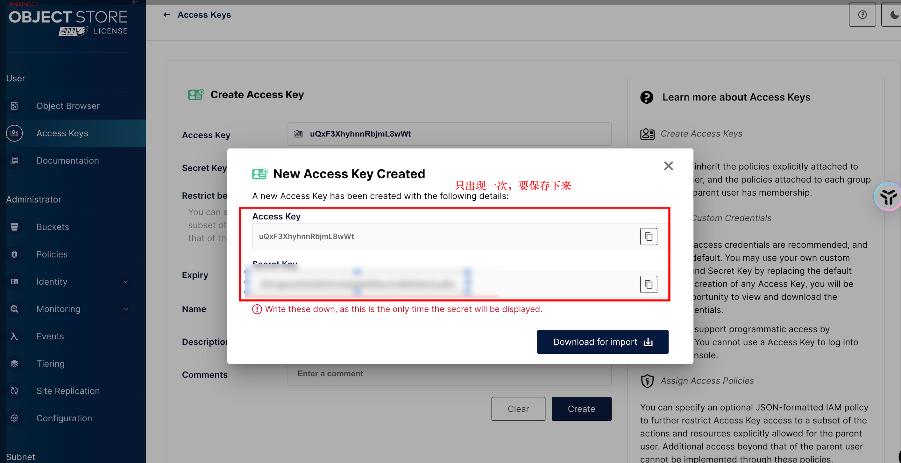

# MinIO 使用指南

## 目录

[1. 目录](#目录)

[2. 一、Mac M1/M2 安装与启动](#一mac-m1m2-安装与启动)

- [2.1 安装 MinIO](#安装-minio)

- [2.2 启动服务](#启动服务)

- - [- 方式一：本地启动](#方式一本地启动)

- - [- 方式二：Docker 启动（推荐）](#方式二docker-启动推荐)

- [2.5 访问控制台](#访问控制台)

- [2.6 常用 Docker 命令](#常用-docker-命令)

[3. 二、基本配置](#二基本配置)

- [3.1 初始设置](#初始设置)

- [3.2 存储桶管理](#存储桶管理)

[4. 三、Java SDK 使用](#三java-sdk-使用)

- [4.1 添加依赖](#添加依赖)

- [4.2 基本配置](#基本配置)

- [4.3 配置文件](#配置文件)

- [4.4 文件操作示例](#文件操作示例)

[5. 四、最佳实践](#四最佳实践)

- [5.1 安全建议](#安全建议)

- [5.2 性能优化](#性能优化)

- [5.3 监控管理](#监控管理)

[6. 五、常见问题](#五常见问题)

- [6.1 安装和启动问题](#安装和启动问题)

- [6.2 使用问题](#使用问题)

[7. 六、参考资源](#六参考资源)


## 一、Mac M1/M2 安装与启动

### 安装 MinIO

```bash
# 使用 Homebrew 安装（Apple Silicon）
arch -arm64 brew install minio/stable/minio

# 或使用 Docker（推荐）
docker pull minio/minio:latest
```

### 启动服务

#### 方式一：本地启动

```bash
# 创建数据目录
mkdir -p ~/minio/data

# 启动服务（指定数据目录）
minio server ~/minio/data

# 或指定自定义路径
minio server /Users/your-username/workspace/tool/minio_data
```

#### 方式二：Docker 启动（推荐）

```bash
# 创建数据和配置目录
mkdir -p ~/minio/data
mkdir -p ~/minio/config

# 启动 MinIO 容器（Apple Silicon 兼容）
docker run -d \
  --name minio \
  -p 9000:9000 \
  -p 9001:9001 \
  -v ~/minio/data:/data \
  -v ~/minio/config:/root/.minio \
  -e "MINIO_ROOT_USER=minioadmin" \
  -e "MINIO_ROOT_PASSWORD=minioadmin" \
  --platform linux/arm64/v8 \
  minio/minio server /data --console-address ":9001"

# 查看容器状态
docker ps -a | grep minio

# 查看日志
docker logs minio
```

### 访问控制台

- Web 管理控制台：http://localhost:9001
- API 端点：http://localhost:9000

### 常用 Docker 命令

```bash
# 启动容器
docker start minio

# 停止容器
docker stop minio

# 重启容器
docker restart minio

# 删除容器
docker rm -f minio
```

## 二、基本配置

### 初始设置

1. **登录控制台**
   - 默认用户名：minioadmin
   - 默认密码：minioadmin
   - 首次登录后建议修改默认凭证

2. **创建访问密钥**
   
   - 在左侧导航菜单中选择 "Access Keys"
   
   
   
   - 点击 "Create access key" 按钮
   
   
   
   - 系统会生成 Access Key 和 Secret Key
   
   
   
   - 务必保存这些凭证，它们只会显示一次
   
   > 注意：如果忘记密钥，需要重新创建新的密钥对，旧的密钥将无法恢复

### 存储桶管理

1. **创建存储桶**
   1. 点击顶部的 "Create Bucket" 按钮
   2. 输入存储桶名称（必须是全局唯一的）
   3. 选择区域（可选）
   4. 点击创建完成

2. **访问策略设置**
   1. 在存储桶列表中选择目标存储桶
   2. 点击 "Edit Policy" 按钮
   3. 可以选择预定义策略或自定义策略：
      - 预定义策略：readonly/readwrite/writeonly
      - 自定义策略：使用 JSON 格式定义详细权限
   4. 默认创建的存储桶是私有的，需要手动修改权限才能公开访问

## 三、Java SDK 使用

### 添加依赖

```xml
<dependency>
    <groupId>io.minio</groupId>
    <artifactId>minio</artifactId>
    <version>8.5.2</version>
</dependency>
```

### 基本配置

```java
@Configuration
public class MinioConfig {
    @Value("${minio.endpoint}")
    private String endpoint;
    
    @Value("${minio.accessKey}")
    private String accessKey;
    
    @Value("${minio.secretKey}")
    private String secretKey;
    
    @Bean
    public MinioClient minioClient() {
        return MinioClient.builder()
                .endpoint(endpoint)
                .credentials(accessKey, secretKey)
                .build();
    }
}
```

### 配置文件

```yaml
# application.yml
minio:
  endpoint: http://localhost:9000
  accessKey: your-access-key
  secretKey: your-secret-key
  bucketName: your-bucket-name
```

### 文件操作示例

```java
@Service
@Slf4j
public class MinioService {
    @Autowired
    private MinioClient minioClient;
    
    @Value("${minio.bucketName}")
    private String bucketName;
    
    // 上传文件
    public String uploadFile(MultipartFile file) {
        try {
            // 生成文件名
            String fileName = generateFileName(file.getOriginalFilename());
            
            // 上传文件
            minioClient.putObject(PutObjectArgs.builder()
                    .bucket(bucketName)
                    .object(fileName)
                    .stream(file.getInputStream(), file.getSize(), -1)
                    .contentType(file.getContentType())
                    .build());
            
            // 返回文件访问路径
            return getFileUrl(fileName);
        } catch (Exception e) {
            log.error("文件上传失败", e);
            throw new RuntimeException("文件上传失败");
        }
    }
    
    // 下载文件
    public InputStream downloadFile(String fileName) {
        try {
            return minioClient.getObject(GetObjectArgs.builder()
                    .bucket(bucketName)
                    .object(fileName)
                    .build());
        } catch (Exception e) {
            log.error("文件下载失败", e);
            throw new RuntimeException("文件下载失败");
        }
    }
    
    // 删除文件
    public void deleteFile(String fileName) {
        try {
            minioClient.removeObject(RemoveObjectArgs.builder()
                    .bucket(bucketName)
                    .object(fileName)
                    .build());
        } catch (Exception e) {
            log.error("文件删除失败", e);
            throw new RuntimeException("文件删除失败");
        }
    }
    
    // 生成文件访问URL（临时）
    public String getPresignedUrl(String fileName, Integer expiry) {
        try {
            return minioClient.getPresignedObjectUrl(GetPresignedObjectUrlArgs.builder()
                    .bucket(bucketName)
                    .object(fileName)
                    .expiry(expiry, TimeUnit.MINUTES)
                    .build());
        } catch (Exception e) {
            log.error("获取文件访问URL失败", e);
            throw new RuntimeException("获取文件访问URL失败");
        }
    }
    
    // 生成文件名
    private String generateFileName(String originalFilename) {
        String timestamp = new SimpleDateFormat("yyyyMMddHHmmss").format(new Date());
        String random = UUID.randomUUID().toString().substring(0, 8);
        String extension = originalFilename.substring(originalFilename.lastIndexOf("."));
        return timestamp + "_" + random + extension;
    }
    
    // 获取文件URL
    private String getFileUrl(String fileName) {
        try {
            return String.format("%s/%s/%s", endpoint, bucketName, fileName);
        } catch (Exception e) {
            log.error("获取文件URL失败", e);
            throw new RuntimeException("获取文件URL失败");
        }
    }
}
```

## 四、最佳实践

### 安全建议

1. **访问控制**
   - 使用强密码
   - 定期轮换访问密钥
   - 遵循最小权限原则
   - 避免使用root用户运行服务

2. **数据保护**
   - 启用服务端加密
   - 配置版本控制
   - 定期备份重要数据
   - 使用 HTTPS 进行传输加密

### 性能优化

1. **上传优化**
   - 使用分片上传处理大文件（>5MB）
   - 合理设置分片大小（通常1-5MB）
   - 启用并发上传
   - 使用异步处理

2. **访问优化**
   - 使用临时URL而不是永久公开
   - 合理设置缓存策略
   - 使用CDN加速访问
   - 实现断点续传

### 监控管理

1. **系统监控**
   - 监控存储使用量
   - 监控API请求量
   - 监控错误率
   - 监控容器资源使用

2. **告警设置**
   - 设置容量告警阈值
   - 设置性能告警指标
   - 设置安全告警规则
   - 配置告警通知方式

## 五、常见问题

### 安装和启动问题

- **问题**: Docker 容器无法启动
  ```bash
  # 解决方案：检查端口占用
  lsof -i :9000
  lsof -i :9001
  
  # 清理并重新创建容器
  docker rm -f minio
  docker volume prune  # 清理未使用的卷
  ```

- **问题**: 访问控制台失败
  ```bash
  # 解决方案：检查网络和防火墙
  curl http://localhost:9001
  docker logs minio
  ```

### 使用问题

- **问题**: 上传大文件失败
  ```java
  // 解决方案：使用分片上传
  int partSize = 10 * 1024 * 1024;  // 10MB per part
  ```

- **问题**: 文件访问权限问题
  ```json
  // 存储桶策略示例
  {
    "Version": "2012-10-17",
    "Statement": [
      {
        "Effect": "Allow",
        "Principal": "*",
        "Action": ["s3:GetObject"],
        "Resource": ["arn:aws:s3:::your-bucket-name/*"]
      }
    ]
  }
  ```

## 六、参考资源

- [MinIO 官方文档](https://min.io/docs/minio/linux/index.html)
- [MinIO Docker Hub](https://hub.docker.com/r/minio/minio/)
- [MinIO Java SDK 文档](https://min.io/docs/minio/linux/developers/java/API.html)
- [MinIO GitHub](https://github.com/minio/minio)
