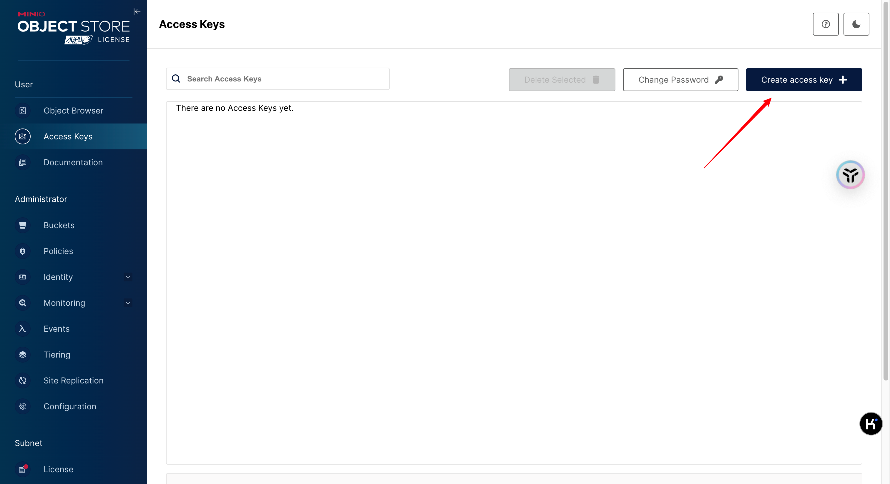
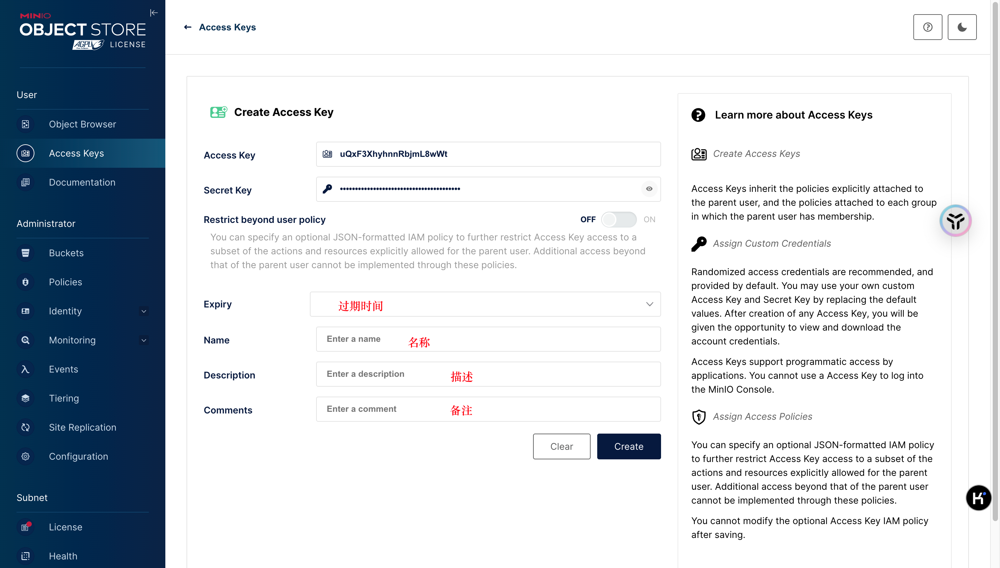
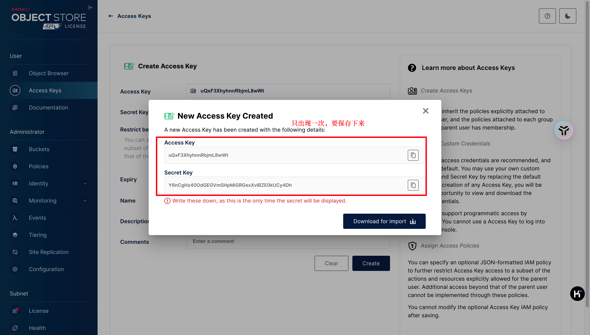
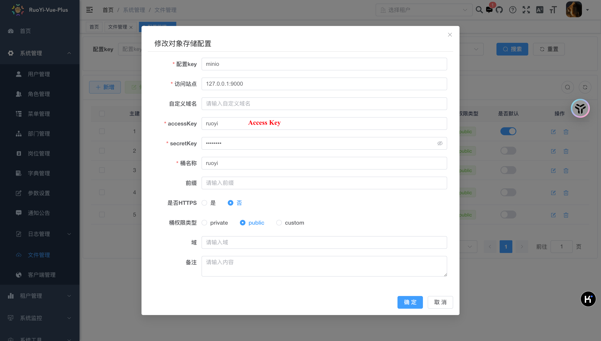
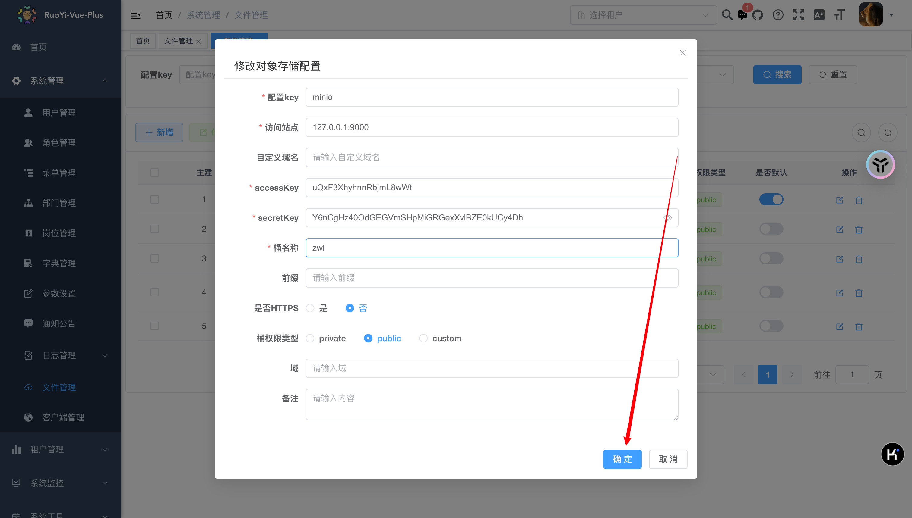
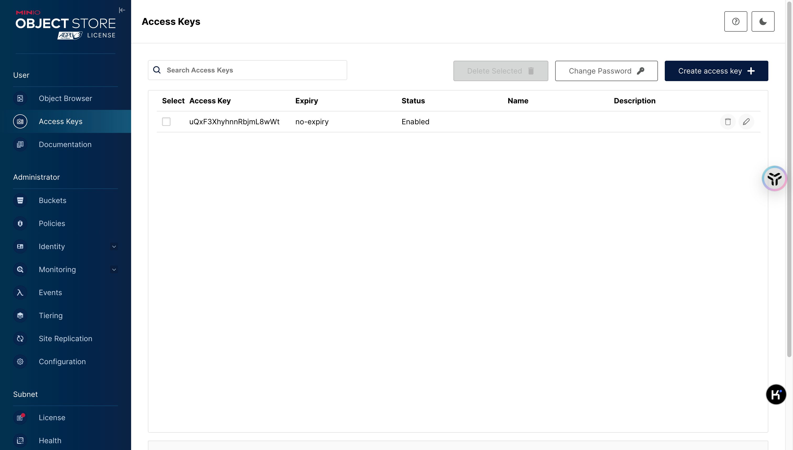

如果忘记密钥需要重新创建之后才可以，记得密钥的话可以修改

默认构建的桶是private的，需要修改这个部分的设置才可以预览。

别人的关于这方面的一些学习记录：

[OSS模块](https://blog.csdn.net/Michelle_Zhong/article/details/126484358?ops_request_misc=%257B%2522request%255Fid%2522%253A%2522f965a0b45eebc7e3a148aeb4ba681dfc%2522%252C%2522scm%2522%253A%252220140713.130102334.pc%255Fblog.%2522%257D&request_id=f965a0b45eebc7e3a148aeb4ba681dfc&biz_id=0&utm_medium=distribute.pc_search_result.none-task-blog-2~blog~first_rank_ecpm_v1~rank_v31_ecpm-1-126484358-null-null.nonecase&utm_term=OSS&spm=1018.2226.3001.4450)