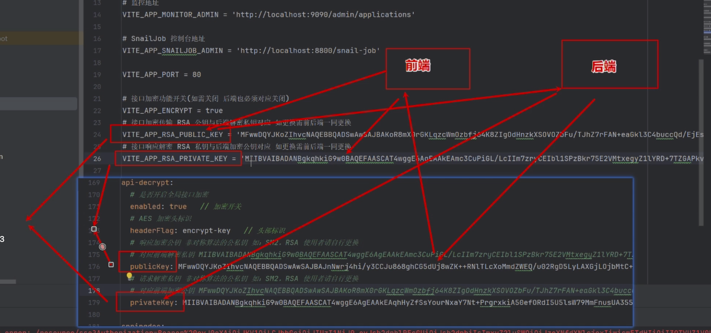

# 【Ruoyi-Vue-Plus】Api加解密和数据加解密


使用加密头标识经过编码后的密钥

使用base64、对称加密和非对称加密


数据库加解密过程：把需要加密的字段以及加解密配置缓存起来，通过Mybatis的拦截器拦截入参进行加密，拦截查询的结果进行解密


 

| 特性         | 对称加密                 | 非对称加密                 | 哈希加密                 |
| ------------ | ------------------------ | -------------------------- | ------------------------ |
| 密钥使用     | 单一密钥用于加密和解密   | 公钥加密，私钥解密         | 不使用密钥               |
| 速度         | 快                       | 慢                         | 中等                     |
| 安全性       | 中等（取决于密钥管理）   | 高                         | 高（但用途不同）         |
| 主要用途     | 大量数据加密             | 密钥交换，数字签名         | 数据完整性验证，密码存储 |
| 可逆性       | 可逆                     | 可逆                       | 不可逆                   |
| 输出数据大小 | 略大于输入               | 明显大于输入               | 固定大小                 |
| 典型算法     | AES, DES, 3DES           | RSA, ECC, DSA              | MD5, SHA-1, SHA-256      |
| 密钥分发     | 需要安全渠道             | 公钥可公开分发             | 不需要分发               |
| 计算复杂度   | 低                       | 高                         | 中等                     |
| 适用数据量   | 大                       | 小                         | 任意                     |
| 密钥长度     | 通常较短（如128, 256位） | 通常较长（如2048, 4096位） | 不适用                   |
| 应用场景     | 文件加密，数据库加密     | HTTPS，数字签名            | 密码存储，区块链         |
| 优点         | 速度快，适合大量数据     | 安全性高，密钥管理简单     | 单向操作，适合验证       |
| 缺点         | 密钥管理复杂             | 速度慢，不适合大量数据     | 不能用于加密解密         |


Hex编码和Base64编码都是将二进制数据转换为字符串形式的编码方式，但它们有一些明显的区别：

###   Hex编码

1. **表示形式**：Hex编码使用16个字符（0-9和A-F）来表示数据。每个字节的数据被转换为两个十六进制字符。
2. **编码长度**：由于每个字节用两个字符表示，Hex编码后的长度是原始数据长度的两倍。
3. **用途**：Hex编码常用于表示二进制数据的可读格式，尤其在调试和数据传输中，比如MAC地址、SHA散列值等。

### Base64编码

1. **表示形式**：Base64编码使用64个字符（A-Z, a-z, 0-9, +, /）来表示数据，还有一个用于填充的字符（=）。每三个字节的数据被转换为四个Base64字符。
2. **编码长度**：Base64编码后的长度大约是原始数据长度的四分之三（精确为 \(\lceil \frac{4}{3} \times \text{原始长度} \rceil\)）。
3. **用途**：Base64编码常用于在需要文本传输的场景中传输二进制数据，例如通过电子邮件、嵌入图像数据的URL、以及在XML和JSON中嵌入二进制数据。

### 示例

假设有一个简单的字符串 "Hello"：

- **原始二进制数据**：`01001000 01100101 01101100 01101100 01101111`

#### Hex编码：
- **Hex编码**：`48 65 6C 6C 6F`
- **字符串形式**：`48656C6C6F`

#### Base64编码：
- **Base64编码**：`SGVsbG8=`

### 总结

- **Hex编码**：更易读，每个字节转换为两个字符，主要用于调试和表示二进制数据。
- **Base64编码**：更紧凑，主要用于将二进制数据嵌入文本数据中传输。


请求和响应做到能够控制加解密





前端：

1. 判断是否需要加密
2. 生成AES密钥
3. 加密Base64
4.   


```
前端 (Vue)
+-----------------------------------+
|                                   |
|  +----------------------------+   |
|  | 公钥获取与存储             |   |     后端 (Spring Boot)
|  | +------------------------+ |   |     +-----------------------------------+
|  | | 请求公钥 (Axios/Fetch) | +<------->|                                   |
|  | | 存储公钥 (Cookie)      | |   |     |  +----------------------------+   |
|  | +------------------------+ |   |     |  | 公钥分发                   |   |
|  +----------------------------+   |     |  | +------------------------+ |   |
|                                   |     |  | | Controller 接口       | |   |
|  +----------------------------+   |     |  | +------------------------+ |   |
|  | 对称密钥生成与加密         |   |     |                                   |
|  | +------------------------+ |   |     |  +----------------------------+   |
|  | | 生成对称密钥 (WebCryp) | |   |     |  | 密钥对生成与管理         |   |
|  | | 加密对称密钥 (JSEncrypt) | +<-------|  | +------------------------+ |   |
|  | +------------------------+ |   |     |  | | 生成RSA密钥对         | |   |
|  +----------------------------+   |     |  | | 安全存储私钥           | |   |
|                                   |     |  | +------------------------+ |   |
|  +----------------------------+   |     |  +----------------------------+   |
|  | 数据加密与解密             |   |     |                                   |
|  | +------------------------+ |   |     |  +----------------------------+   |
|  | | Vue 工具类实现         | |   |     |  | 对称密钥解密             |   |
|  | | Axios 拦截器加解密     | +<-------|  | +------------------------+ |   |
|  | +------------------------+ |   |     |  | | 解密对称密钥         | |   |
|  +----------------------------+   |     |  | | 数据加解密             | |   |
|                                   |     |  | +------------------------+ |   |
+-----------------------------------+     +-----------------------------------+

```


​	