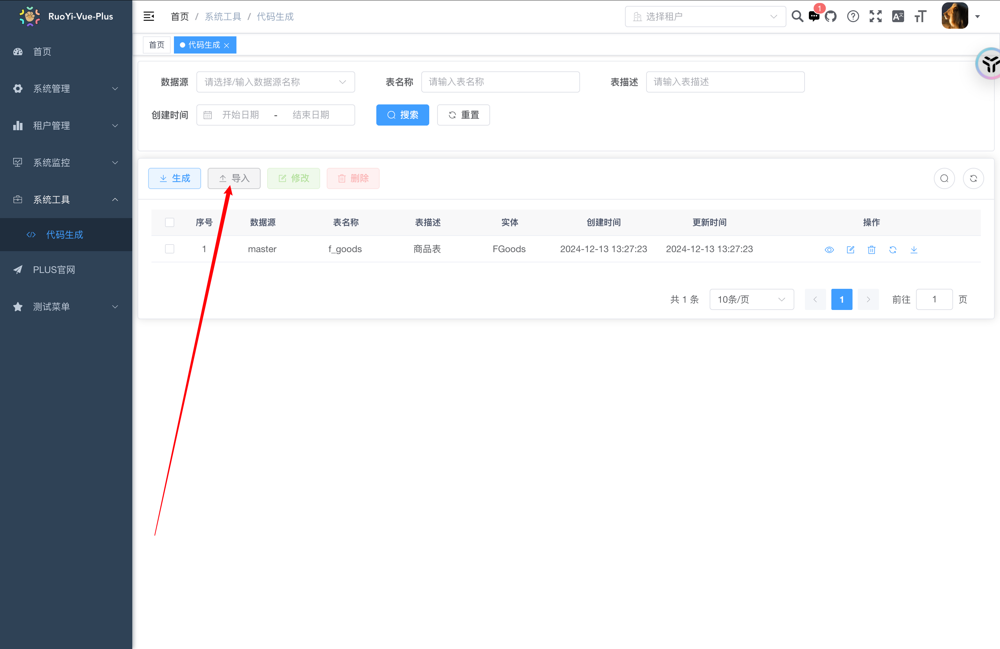
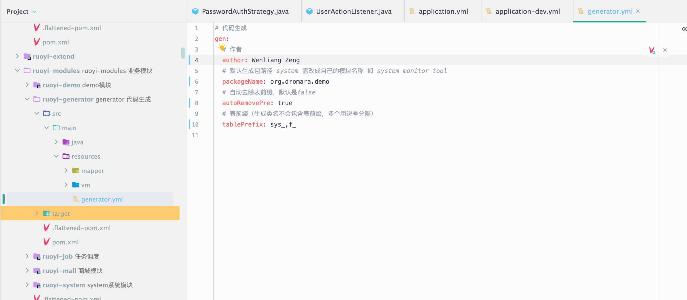

# 【Ruoyi-Vue-Plus】业务开发流程

## 目录

[1. 目录](#目录)

[2. 设计表](#设计表)

[3. 生成代码](#生成代码)

- [3.1 导入表](#导入表)

- [3.2 修改代码生成配置](#修改代码生成配置)

- [3.3 下载代码](#下载代码)

## 设计表

表名最好用单独的前缀

图片上传存储的是OSSID，如果有多张图片就用varchar 255

商品描述用text

## 生成代码

### 导入表

### 修改代码生成配置

### 下载代码

放到响应的位置即可