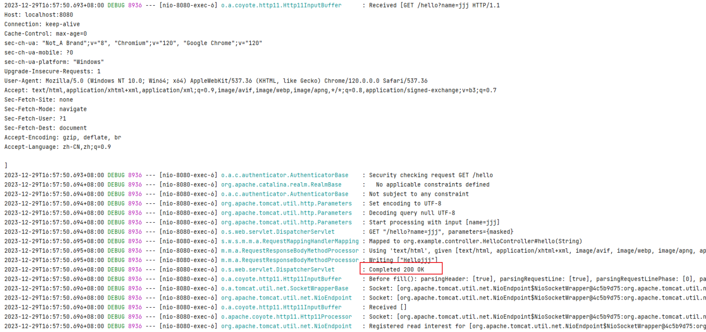
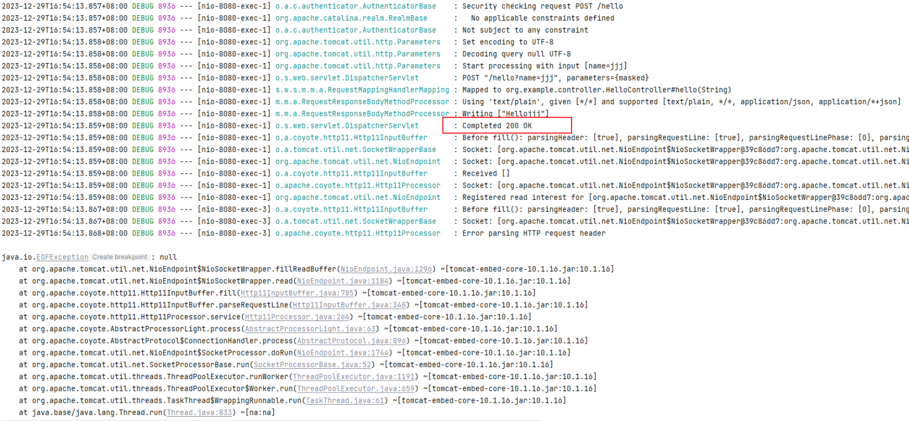
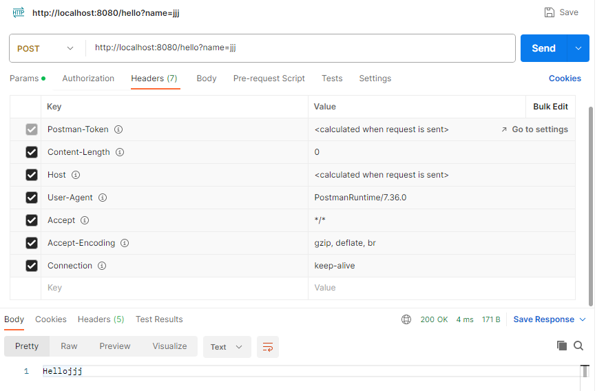
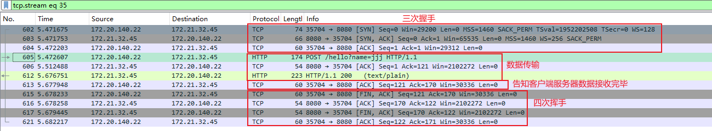

# EOFException异常说明

## 目录
[1. 目录](#目录)
[2. 异常详情](#异常详情)
[3. 问题重现](#问题重现)
    [3.1 Controller代码](#controller代码)
    [3.2 EOFException重现](#eofexception重现)
[4. 问题原因](#问题原因)
[5. 影响说明](#影响说明)


## 异常详情

oracle对该异常的[解释](https://docs.oracle.com/javase/8/docs/api/java/io/EOFException.html)如下：

> Signals that an end of file or end of stream has been reached unexpectedly during input.
> This exception is mainly used by data input streams to signal end of stream. Note that many other input
> operations return a special value on end of stream rather than throwing an exception.

这个异常表示的是在输入过程中意外到达文件终点或数据流终点的信号。

## 问题重现

### Controller代码

```java
@RestController
public class HelloController {
    @RequestMapping("/hello")
    public Object hello(@RequestParam(value = "name", required = false) String name) {
        return name;
    }
}
```

### EOFException重现

**浏览器访问**

浏览器直接访问`http://localhost:8080/hello?name=jjj`



**curl请求访问**

curl请求代码：`curl -H "Connection: keep-alive" -X POST http://172.21.32.45:8080/hello?name=jjj`



**postman访问**

postman的请求方式为：




三种访问方式之下，请求都正常结束并返回相应的参数，只有在curl请求访问过程中出现了EOF异常，三种访问并没有什么区别，查看异常信息。

```shell
2023-12-29 15:27:19.668 DEBUG 5384 --- [nio-8080-exec-3] c.r.connector.http11.Http11Processor     : Error parsing HTTP request header
java.io.EOFException: null
	at org.apache.tomcat.util.net.NioEndpoint$NioSocketWrapper.fillReadBuffer(NioEndpoint.java:1296) ~[tomcat-embed-core-10.1.16.jar:10.1.16]
	at org.apache.tomcat.util.net.NioEndpoint$NioSocketWrapper.read(NioEndpoint.java:1184) ~[tomcat-embed-core-10.1.16.jar:10.1.16]
	at org.apache.coyote.http11.Http11InputBuffer.fill(Http11InputBuffer.java:785) ~[tomcat-embed-core-10.1.16.jar:10.1.16]
	at org.apache.coyote.http11.Http11InputBuffer.parseRequestLine(Http11InputBuffer.java:348) ~[tomcat-embed-core-10.1.16.jar:10.1.16]
	at org.apache.coyote.http11.Http11Processor.service(Http11Processor.java:264) ~[tomcat-embed-core-10.1.16.jar:10.1.16]
	at org.apache.coyote.AbstractProcessorLight.process(AbstractProcessorLight.java:63) ~[tomcat-embed-core-10.1.16.jar:10.1.16]
	at org.apache.coyote.AbstractProtocol$ConnectionHandler.process(AbstractProtocol.java:896) ~[tomcat-embed-core-10.1.16.jar:10.1.16]
	at org.apache.tomcat.util.net.NioEndpoint$SocketProcessor.doRun(NioEndpoint.java:1744) ~[tomcat-embed-core-10.1.16.jar:10.1.16]
	at org.apache.tomcat.util.net.SocketProcessorBase.run(SocketProcessorBase.java:52) ~[tomcat-embed-core-10.1.16.jar:10.1.16]
	at org.apache.tomcat.util.threads.ThreadPoolExecutor.runWorker(ThreadPoolExecutor.java:1191) ~[tomcat-embed-core-10.1.16.jar:10.1.16]
	at org.apache.tomcat.util.threads.ThreadPoolExecutor$Worker.run(ThreadPoolExecutor.java:659) ~[tomcat-embed-core-10.1.16.jar:10.1.16]
	at org.apache.tomcat.util.threads.TaskThread$WrappingRunnable.run(TaskThread.java:61) ~[tomcat-embed-core-10.1.16.jar:10.1.16]
	at java.base/java.lang.Thread.run(Thread.java:833) ~[na:na]
2023-12-29 15:27:19.668 DEBUG 5384 --- [nio-8080-exec-3] c.r.connector.http11.Http11Processor     : Error state [CLOSE_CONNECTION_NOW] reported while processing request
java.io.EOFException: null
	at org.apache.tomcat.util.net.NioEndpoint$NioSocketWrapper.fillReadBuffer(NioEndpoint.java:1296) ~[tomcat-embed-core-10.1.16.jar:10.1.16]
	at org.apache.tomcat.util.net.NioEndpoint$NioSocketWrapper.read(NioEndpoint.java:1184) ~[tomcat-embed-core-10.1.16.jar:10.1.16]
	at org.apache.coyote.http11.Http11InputBuffer.fill(Http11InputBuffer.java:785) ~[tomcat-embed-core-10.1.16.jar:10.1.16]
	at org.apache.coyote.http11.Http11InputBuffer.parseRequestLine(Http11InputBuffer.java:348) ~[tomcat-embed-core-10.1.16.jar:10.1.16]
	at org.apache.coyote.http11.Http11Processor.service(Http11Processor.java:264) ~[tomcat-embed-core-10.1.16.jar:10.1.16]
	at org.apache.coyote.AbstractProcessorLight.process(AbstractProcessorLight.java:63) ~[tomcat-embed-core-10.1.16.jar:10.1.16]
	at org.apache.coyote.AbstractProtocol$ConnectionHandler.process(AbstractProtocol.java:896) ~[tomcat-embed-core-10.1.16.jar:10.1.16]
	at org.apache.tomcat.util.net.NioEndpoint$SocketProcessor.doRun(NioEndpoint.java:1744) ~[tomcat-embed-core-10.1.16.jar:10.1.16]
	at org.apache.tomcat.util.net.SocketProcessorBase.run(SocketProcessorBase.java:52) ~[tomcat-embed-core-10.1.16.jar:10.1.16]
	at org.apache.tomcat.util.threads.ThreadPoolExecutor.runWorker(ThreadPoolExecutor.java:1191) ~[tomcat-embed-core-10.1.16.jar:10.1.16]
	at org.apache.tomcat.util.threads.ThreadPoolExecutor$Worker.run(ThreadPoolExecutor.java:659) ~[tomcat-embed-core-10.1.16.jar:10.1.16]
	at org.apache.tomcat.util.threads.TaskThread$WrappingRunnable.run(TaskThread.java:61) ~[tomcat-embed-core-10.1.16.jar:10.1.16]
	at java.base/java.lang.Thread.run(Thread.java:833) ~[na:na]
```

在异常信息中可以看到`CLOSE_CONNECTION_NOW`出现，也就是当前连接被关闭了，在curl方式下通过抓包工具抓取流量包。



可以看到在流量包传输的过程中，数据已经正常传输完成，即，**这个异常并不会影响正常的HTTP请求**。

## 问题原因

当客户端发送的HTTP请求为短连接时，服务器接收完数据之后给客户端发送200报文，然后客户端主动开始挥手。挥手完成后socket关闭，那么此时由于socket被关闭了，此时**请求数据已经处理完**了，但是还没有跳出处理请求的循环，因此抛出异常`Error state [CLOSE_CONNECTION_NOW] reported while processing request`。当客户端发送的HTTP请求为长连接时，只有当连接超时才会开始挥手。

## 影响说明

抛出异常的代码如下：

```java
...
n = getSocket().read(buffer);
if (n == -1) {
        throw new EOFException();
    }
...
```

这里抛出异常的原因是服务器从当前socket读取数据的过程中读到了数据流的末尾（read方法在读取到末尾是会返回-1）。这一部分代码是为了防止非阻塞的IO请求陷入死循环导致OOM，但是其实在抛出异常之前，请求的数据已经处理完毕了，因此不会对请求的数据产生影响。