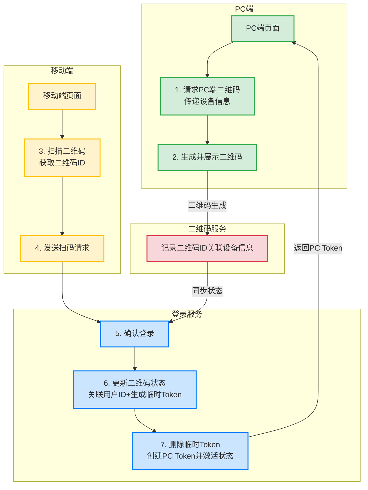

# 二维码扫码登录流程设计

## 目录
- [功能概述](#功能概述)
- [技术架构](#技术架构)
- [详细流程](#详细流程)
- [实现要点](#实现要点)

## 功能概述
二维码扫码登录是一种常见的快捷登录方式，用户通过移动端扫描PC端展示的二维码来完成登录操作。整个过程安全、便捷，无需手动输入账号密码。

## 技术架构

## 详细流程

1. **PC端请求二维码**
   - PC端携带设备信息请求生成二维码
   - 设备信息包括：设备ID、浏览器信息等

2. **生成二维码**
   - 服务端生成唯一的二维码ID
   - 关联PC端设备信息
   - 返回二维码图片或二维码内容

3. **移动端扫描**
   - 用户通过APP扫描二维码
   - 获取二维码ID信息

4. **发送扫码请求**
   - 移动端将二维码ID发送到服务端
   - 携带移动端用户的登录状态

5. **确认登录**
   - 服务端验证移动端用户状态
   - 确认二维码ID的有效性

6. **更新状态**
   - 关联用户ID和二维码ID
   - 生成临时Token
   - 更新二维码状态为已扫描

7. **完成登录**
   - 删除临时Token
   - 创建PC端的登录Token
   - 激活登录状态
   - 返回Token给PC端

## 实现要点

1. **安全性考虑**
   - 二维码设置短期有效期（通常2-3分钟）
   - 使用一次性Token
   - 加密传输所有信息

2. **状态管理**
   - 二维码状态：未扫描、已扫描、已确认、已过期
   - 使用Redis管理二维码状态
   - 定期清理过期数据

3. **异常处理**
   - 二维码过期处理
   - 网络异常重试机制
   - 并发请求处理

4. **性能优化**
   - 使用长连接实时通知PC端状态变化
   - 合理设置缓存策略
   - 控制二维码生成频率 