# LaTeX + VSCode + Git + PyCharm 科研工具链配置指南

## 目录
- [1. 目录](#目录)
- [2. 为什么选择这个工具链？](#为什么选择这个工具链)
    - [2.1 VSCode 作为 LaTeX 编辑器的优势](#vscode-作为-latex-编辑器的优势)
    - [2.2 Git 版本控制的重要性](#git-版本控制的重要性)
- [3. 环境配置指南](#环境配置指南)
    - [3.1 LaTeX 环境安装](#latex-环境安装)
        - [    方式一：官方安装（推荐）](#方式一官方安装推荐)
        - [    方式二：镜像源安装（国内推荐）](#方式二镜像源安装国内推荐)
    - [3.4 VSCode 配置](#vscode-配置)
        - [    基础安装](#基础安装)
        - [    关键配置](#关键配置)
    - [3.7 Git 配置](#git-配置)
- [4. 最佳实践](#最佳实践)
    - [4.1 LaTeX 写作建议](#latex-写作建议)
    - [4.2 常见问题解决](#常见问题解决)
- [5. 扩展资源](#扩展资源)


## 为什么选择这个工具链？

### VSCode 作为 LaTeX 编辑器的优势

1. **丰富的插件生态**
   - LaTeX Workshop：提供完整的 LaTeX 编译和预览支持
   - LTeX：支持多语言拼写检查和语法建议

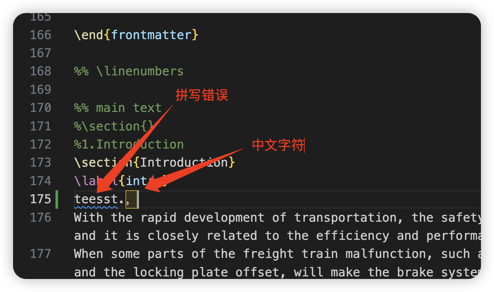

2. **强大的编辑功能**
   - 智能代码补全
   - 快速检索和替换
   - 实时预览
   - 多文件协同编辑

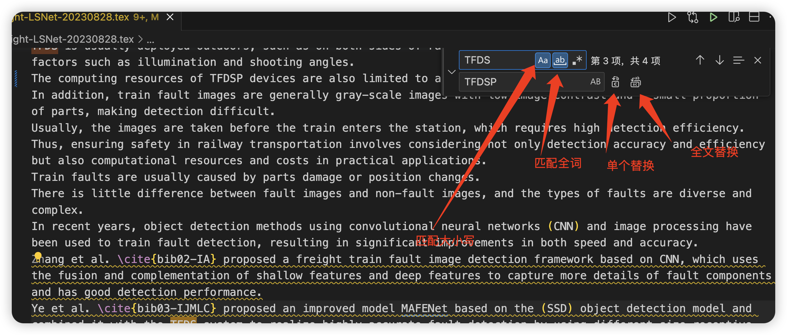

3. **便捷的 PDF 同步**
   - PDF -> LaTeX：双击定位源代码，也可以设置 ctrl+单击
   - LaTeX -> PDF：右键单击 SyncTex from cursor 定位到 PDF 具体位置
   - 实时预览更新

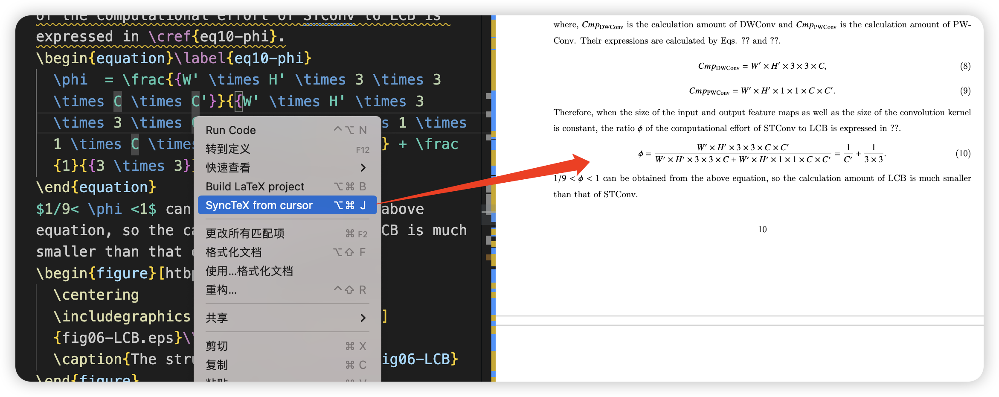

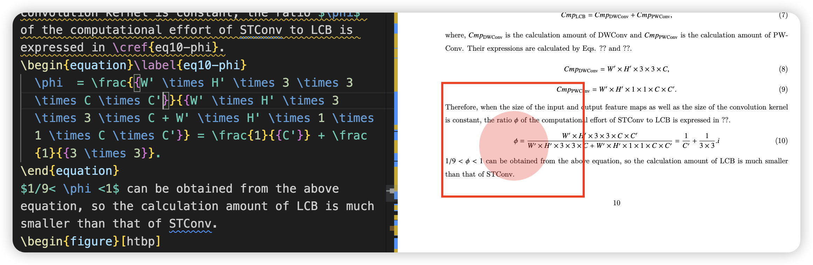

4. **其他优势**
   - 设置简单：通过 JSON 配置实现多种功能
   - 兼容性强：编译文件在 WinEdict 上同样能够编译通过
   - 软件开源：无需破解付费，安装简单

### Git 版本控制的重要性

结合 Github 进行版本控制，提高论文修改效率：

- **论文版本管理**
  - 创建分支进行修改尝试
  - 随时可回退到之前版本
  - 详细的修改历史记录

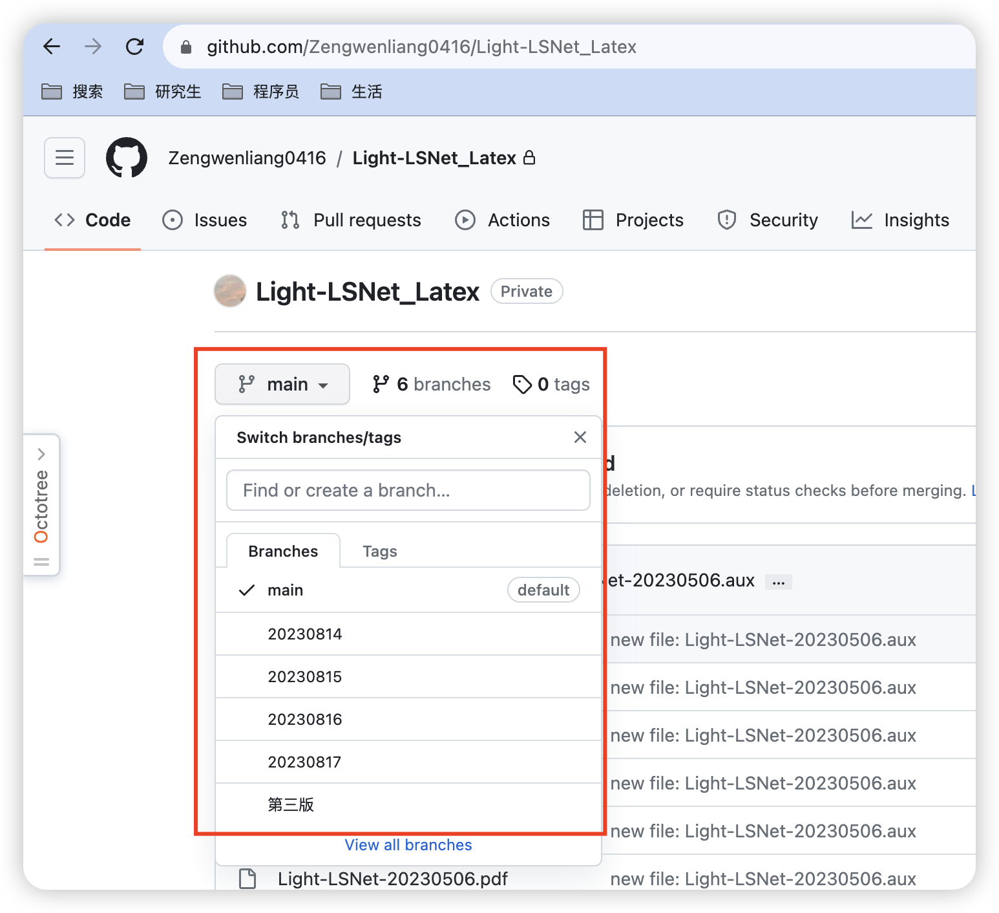

> 🔔 **安全提示**：论文仓库必须设置为 **private**，防止论文泄露！每次更新论文时创建新分支，保留修改记录，最终版再合并到主分支。

## 环境配置指南

### LaTeX 环境安装

#### 方式一：官方安装（推荐）

1. 访问 [TeX Live 官网](https://www.tug.org/texlive/)，找到下载位置：

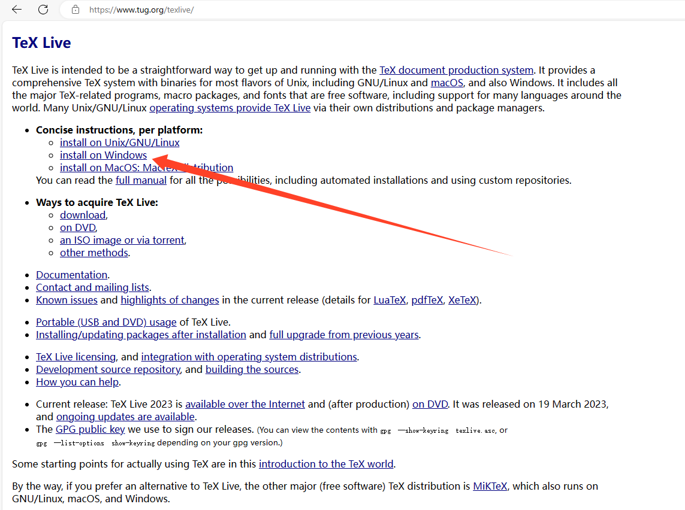

2. 点击下载：

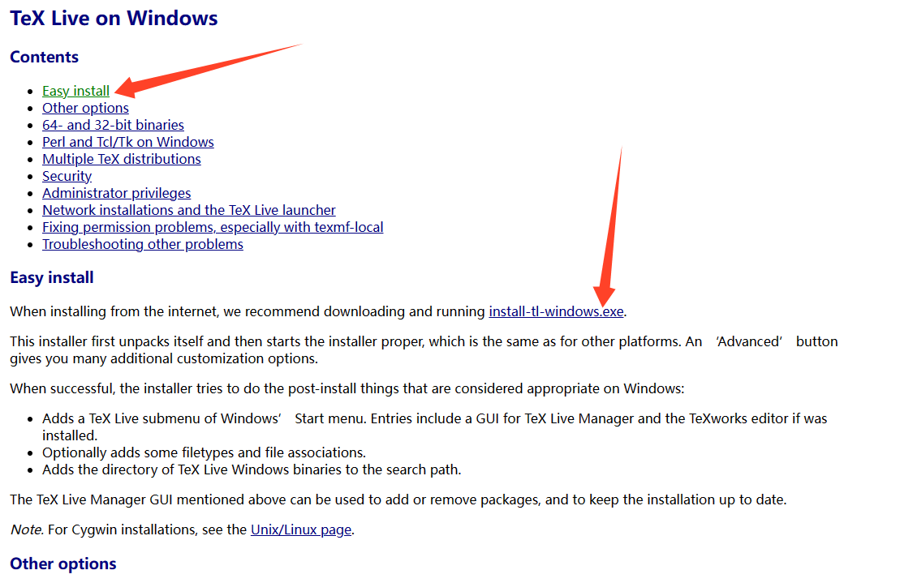

3. 自定义安装路径：

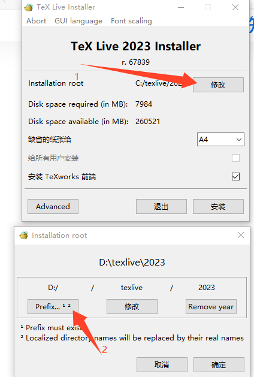

> ⚠️ **注意**：安装过程较慢，大约需要 2-3 小时才能完成所有包的安装

#### 方式二：镜像源安装（国内推荐）

从国内镜像源安装，详细教程参考：[使用VSCode编写LaTeX - 知乎](https://zhuanlan.zhihu.com/p/38178015)

### VSCode 配置

#### 基础安装

1. 访问 [VSCode 官网](https://code.visualstudio.com/download) 下载：

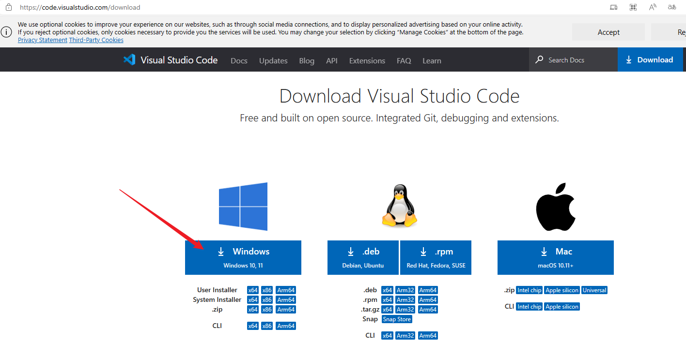

2. 安装必备插件：
   - LaTeX Workshop（编译运行工具）
   - LTeX（拼写检查工具）
   - Git Graph（可选，用于可视化版本控制）


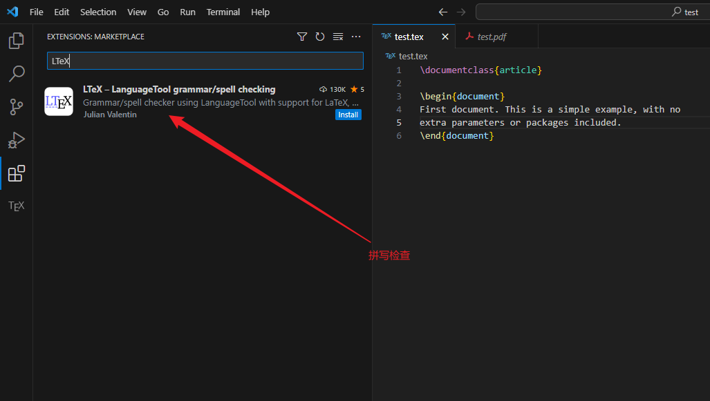

#### 关键配置

1. 在 VSCode 中按下 F1，点击 user settings 进入 JSON 配置页面：

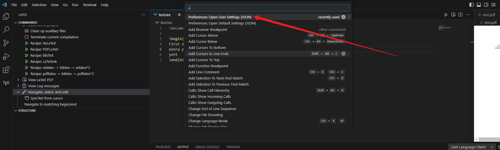

2. 添加以下配置：

```json
{
    "latex-workshop.latex.autoBuild.run": "onSave",
    "latex-workshop.showContextMenu": true,
    "latex-workshop.intellisense.package.enabled": true,
    "latex-workshop.message.error.show": false,
    "latex-workshop.message.warning.show": false,
    "latex-workshop.view.pdf.viewer": "tab",
    "latex-workshop.latex.autoClean.run": "onBuilt",
    "latex-workshop.latex.recipes": [
        {
            "name": "xelatex -> bibtex -> xelatex*2",
            "tools": [
                "xelatex",
                "bibtex",
                "xelatex",
                "xelatex"
            ]
        }
    ],
    "latex-workshop.latex.tools": [
        {
            "name": "xelatex",
            "command": "xelatex",
            "args": [
                "-synctex=1",
                "-interaction=nonstopmode",
                "-file-line-error",
                "%DOCFILE%"
            ]
        },
        {
            "name": "bibtex",
            "command": "bibtex",
            "args": [
                "%DOCFILE%"
            ]
        }
    ]
}
```

### Git 配置

1. **初始设置**
   ```bash
   git config --global user.name "Your Name"
   git config --global user.email "your.email@example.com"
   ```

2. **常用命令**
   ```bash
   git add .                    # 暂存更改
   git commit -m "提交说明"      # 提交更改
   git branch                   # 查看分支
   git checkout [branch name]   # 切换分支
   git merge [branch name]      # 合并分支
   git push                     # 推送到远程
   ```

## 最佳实践

### LaTeX 写作建议

1. **项目组织**
   - 使用清晰的目录结构
   - 分章节存放源文件
   - 统一管理图片和参考文献

2. **版本控制**
   - 重要修改创建新分支
   - 提交信息要清晰明确
   - 每天至少备份一次

### 常见问题解决

1. **编译错误**
   - 检查 LaTeX 语法
   - 查看编译日志
   - 确保所需包已安装

2. **PDF 预览问题**
   - 确认 PDF 查看器设置
   - 检查 SyncTeX 配置
   - 清理临时文件后重试

## 扩展资源

- [LaTeX 官方文档](https://www.latex-project.org/help/documentation/)
- [VSCode LaTeX Workshop 文档](https://github.com/James-Yu/LaTeX-Workshop/wiki)
- [Git 教程](https://git-scm.com/book/zh/v2)

---

> 💡 **小贴士**：在发送给他人之前，建议在 WinEdict 上编译验证一遍，确保兼容性。
