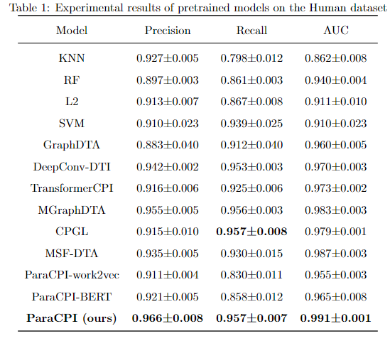
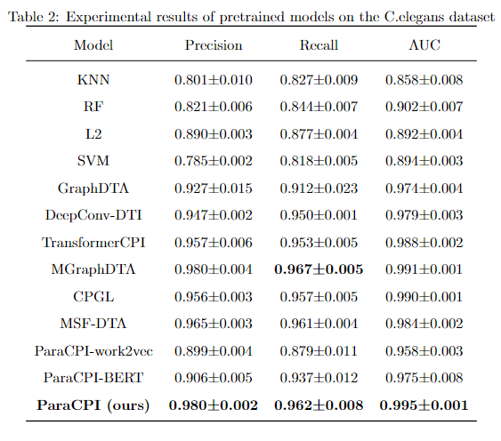

# 【ParaCPI】一审

## 审稿人一

Recommendation: Author Should Prepare A Major Revision For A Second Review

Comments:
1- In the abstract it is better to explain what is average performance, AUC, or AUPR?
2- What is DTA? The authors should define this term in the manuscript,
3- What is partial node?
4- This sentence is not clear "The warm-start setting refers to the type of compounds or proteins that have been included in the test set in the training set."
5-What is the position in Table 3? May be positive!!!

建议 作者应准备重大修订，以供二审

评论：
1- 在摘要中最好解释一下什么是平均绩效、AUC 或 AUPR？
2- 什么是 DTA？作者应该在手稿中定义这个术语、
3- 什么是部分节点？
4- 这句话不清楚："热启动设置指的是训练集中测试集所包含的化合物或蛋白质类型"。
5-表 3 中的位置是什么？可能是正！！！！

## 审稿人二

Reviewer: 2

Recommendation: Author Should Prepare A Minor Revision

Comments:
The methods described in this paper combine embedded information about chemical compounds and proteins to predict their potential interactions. For chemical compounds, similar methods alone have been proposed in the suggested reference (MG-BERT) with an unsupervised molecule representation method. It might be useful if the authors can refer to the MG-BERT method for some inspiration. As for the protein representation, I'm conservative about the effectiveness of using amino acid sequences. The life science community has been working so hard to predict 3D protein structures from sequences, with the recent milestone of AlphaFold 3. The basic assumption is that 3D structural information can be a lot more informative there 1D sequences. I'm highly curious how the proposed method can be improved with more high-level features/information/structures, etc.

I'd suggest the authors to further investigate a little bit on this perspective.

评论员 2

建议： 作者应准备小幅修订

评论：
本文描述的方法结合了化合物和蛋白质的嵌入信息来预测它们之间潜在的相互作用。对于化合物，建议的参考文献（MG-BERT）中已单独提出了类似的方法，即无监督分子表示法。如果作者能参考 MG-BERT 方法，也许会有所启发。至于蛋白质表示法，我对使用氨基酸序列的有效性持保守态度。生命科学界一直在努力从序列预测三维蛋白质结构，最近的里程碑式成果是 AlphaFold 3。其基本假设是，三维结构信息比一维序列信息量大得多。我非常好奇如何利用更多高级特征/信息/结构等来改进所提出的方法。

我建议作者从这个角度进一步研究一下。

的确，对于化合物而言，生成有效的原子表示能够大大提高CPI预测的准确率。我们在实验初期也采用过类似于MG-BERT中提出的方法。我们采用了经典work2vec和BERT两种方式对化合物数据集进行预训练。起初为了生成一个具有泛化性的预训练模型，我们将本文的五个数据集中的化合物汇总得到一个预训练模型，随后分别在Human数据集和C.elegans数据集上微调后得到化合物的原子表示。最后将特征输入到ParaCPI中训练并测试实验结果。ParaCPI使用预训练模型获取化合物原子表示实验结果如表 1 和表2所示。

表1和表2中的ParaCPI-work2vec和ParaCPI-BERT分别代表采用work2vec和BERT预训练获取化合物原子表示的模型。从表1的实验结果可以看出，尽管ParaCPI-work2vec和ParaCPI-BERT的三个指标具有了一定的竞争力，但是相比于ParaCPI模型还是存在一定的差距。在Human数据集上，ParaCPI-work2vec和ParaCPI-BERT的Precision分别比ParaCPI低了5.70%和4.66%ParaCPI-work2vec和ParaCPI-BERT的Recall分别比MGrpahDTA低了13.27%和10.34%。ParaCPI-work2vec和ParaCPI-BERT的AUC分别比MGrpahDTA低了3.63%和2.62%。表2的实验结果同样可以看出ParaCPI-work2vec和ParaCPI-BERT在C.elegans数据集上表现不佳。这种现象可能是因为预训练模型中可能掺杂了不同数据集的表征信息，导致在测试结果不佳。ParaCPI以化合物的SMILES序列作为输入，采用NE算法结合ParaCPIGNN模块获取化合物的原子表示。这种方式能够有效地获取到化合物的原子特征并且在冷启动环境中体现了其泛化能力。

对于蛋白质表示法，三维结构信息确实比一维序列信息大得多。然而，获取蛋白质准确的3D信息结构却是耗时耗力的，这也是蛋白质的3D结构数据集稀缺的原因。当前用于预测的AlphaFold 3尽管体现了其优越性，但是也具有陷入双重陷阱的风险（即使用预测错误的3D结构信息预测CPI）。

MG-BERT: leveraging unsupervised atomic representation learning for molecular property prediction

与TransformerCPI类似，MG-BERT模型结合了GNNs的局部信息传播机制和BERT的高级能力，提高了分子图结构学习的效率。。作者进一步引入了掩蔽原子预测法，这是一种高效的自监督学习策略。通过该策略，在大规模未标记数据集上预训练MG-BERT模型，可以更好地挖掘分子的上下文信息。此方法生成的原子特征对上下文高度敏感，适用于多种复杂的预测任务。

CGINet: graph convolutional network‑based model for identifying chemical‑gene interaction in an integrated multi‑relational graph

在CPI预测中，原子特征的有效表示能显著提高预测准确性。CGINet模型特别采用了子图视角来促进特征学习过程：初始节点嵌入首先通过学习二元关联子图来进行，之后这些嵌入被迁移到包含多重交互的子图中。这一策略使模型能够更专注地学习目标节点的高级表示，从而更有效地预测化学物质和基因之间的相互作用。

BioNet: a large-scale and heterogeneous biological network model for interaction prediction with graph convolution

yang等人指出传统湿实验的高成本和劳动强度限制了研究的规模。针对这个问题，作者提出了一个名为BioNet的新型深度生物网络模型，该模型采用图形编码器-解码器架构，通过图卷积学习化学物质、基因、疾病和生物途径之间复杂相互作用的潜在信息。

## 审稿人三

Reviewer: 3

Recommendation: Author Should Prepare A Major Revision For A Second Review

Comments:
The authors have introduced a framework for predicting compound-protein interactions. This framework entails a newly designed neighborhood expanding algorithm aimed at creating an efficiently expanded adjacency matrix for amalgamating the global feature structure of compounds. Additionally, it incorporates a parallel graph convolutional neural network to extract compound features and a graph regularization block to fine-tune model parameters and aid in feature extraction. While the proposed method exhibits superior performance compared to baseline models and state-of-the-art methods, as well as conducting several ablation studies and case studies, several aspects still require addressing before considering publication in the IEEE Transactions on Computational Biology and Bioinformatics journal:

\* Major comments:
\- Clarify the differences between Fig. 4 and Fig. 5. because both labeled as the ParaGNN module. Additionally, mention Fig. 5 in the text.
\- Explain the presence of an identical node (node C) in both Layer 2 and Layer 4 of Fig. 3.
\- Provide more details about the employed datasets, including the number of samples in the training (training-validation) and independent (test) subsets.
\- Ensure consistency in presenting results across tables (e.g., “Precision, Recall, and AUC” vs. “Accuracy, Precision, Recall, AUC, and AUPR” in different tables). Consider adding Matthews Correlation Coefficient (MCC) and F1-score for a more comprehensive comparison and reflection of method robustness and effectiveness.
\- Properly apply k-fold cross-validation using StratifiedKFold from the Scikit-Learn package for more generalized and robust performance assessment.
\- Clearly state whether the results in Tables 4, 5, 6, and 7 are from 5-fold CV training or independent subsets and provide both sets of results for comparison.
\- Ensure fairness in comparison between methods; for instance, ParaCPI results were obtained from five training runs while MGraphDTA results were from three runs.

\* Minor comments:
\- Correct “Fig. 1” reference to “Fig. 2” on line 35 of page 4.
\- Mention Fig. 5 in the text and modify its caption accordingly.

评论员 3

建议： 作者应准备重大修订，以供二审

评论：
作者介绍了一种预测化合物-蛋白质相互作用的框架。该框架采用了一种新设计的邻域扩展算法，旨在创建一个有效扩展的邻接矩阵，用于合并化合物的全局特征结构。此外，它还采用了并行图卷积神经网络来提取化合物特征，并采用图正则化块来微调模型参数和辅助特征提取。虽然与基线模型和最先进的方法相比，所提出的方法表现出更优越的性能，并进行了多项消融研究和案例研究，但在考虑在《IEEE 计算生物学和生物信息学论文集》（IEEE Transactions on Computational Biology and Bioinformatics）期刊上发表之前，仍需解决几个方面的问题：

* 主要评论：

- 澄清图 4 和图 5 的区别，因为两者都标注为 ParaGNN 模块。此外，在文中提及图 5。
- 解释图 3 的第 2 层和第 4 层为什么都有一个相同的节点（节点 C）。

- 提供所使用数据集的更多细节，包括训练（训练-验证）和独立（测试）子集中的样本数量。
- 确保不同表格中呈现结果的一致性（例如，不同表格中的 "精确度、召回率和 AUC "与 "准确度、精确度、召回率、AUC 和 AUPR"）。考虑添加马修斯相关系数（MCC）和 F1 分数，以便更全面地比较和反映方法的稳健性和有效性。
- 使用 Scikit-Learn 软件包中的 StratifiedKFold 适当应用 k-fold 交叉验证，以进行更全面、更稳健的性能评估。
- 明确说明表 4、表 5、表 6 和表 7 中的结果是来自 5 倍 CV 训练还是独立子集，并提供两组结果进行比较。
- 确保方法间比较的公平性；例如，ParaCPI 的结果来自 5 次训练，而 MGraphDTA 的结果来自 3 次训练。

* 小评论：
- 将第 4 页第 35 行的 "图 1 "更正为 "图 2"。
- 在正文中提及图 5，并相应修改其标题。