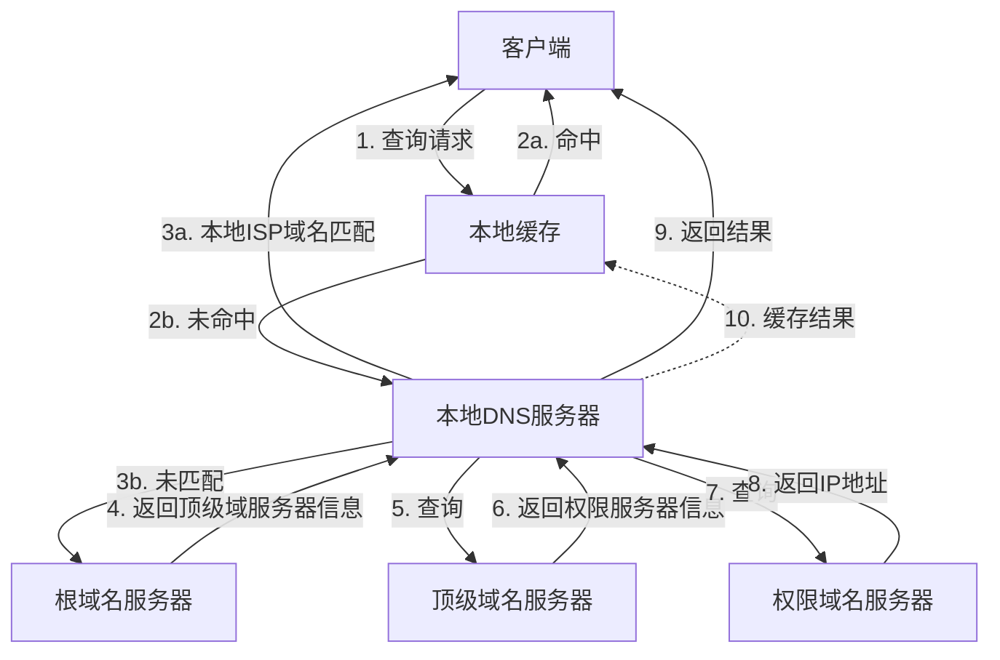

# 系统规划设计师重点题集

## 数据库篇

### 1. ⭐️关系代数运算
> 这道题涉及关系代数的基本运算，包括自然连接和投影运算，是数据库考试的重点内容。

**题目：** 给定关系模式R(A, B, C, D, E)、S(D, E, F, G)和π1,2,4,6(R⋈S)，经过自然连接和投影运算后的属性列数分别为（ ）。
- A. 9和4
- B. 7和4 ✅
- C. 9和7
- D. 7和7

**重点考察：**
1. 自然连接运算
2. 投影运算
3. 属性列的计算

**解题关键：**
1. 自然连接时注意：
   - 共同属性只保留一次
   - 最终列数 = 5 + 4 - 2 = 7

2. 投影运算时注意：
   - 以自然连接后的新表为基础
   - 序号从1开始数
   - π1,2,4,6表示选择4列

**图解步骤：**
```
第一步：找出共同属性
R(A,B,C,D,E)    S(D,E,F,G)
    ↓共同↓         ↓共同↓
    D和E           D和E

第二步：自然连接后的结果
A B C D E F G  (7列)
    ↑重复的D,E只保留一次↑

第三步：投影选择的列
1 2 3 4 5 6 7  (位置编号)
A B C D E F G  (属性名)
↓ ↓   ↓   ↓
选择1,2,4,6列得到：A,B,D,F (4列)
```

**易错点提醒：**
1. 不要忘记减去重复的属性列
2. 投影时要在自然连接结果上操作
3. 序号从1开始数，不是从0开始

**记忆方法：**
- 口诀："两表相连减重复，新表投影数序号"
- 画图法：每次都画出表格，标注位置编号

**相关知识点：**
- 自然连接(⋈)：合并具有相同属性的表
- 投影(π)：选择指定的列
- 关系代数的基本运算规则 

## 软件开发篇

### 1. ⭐️面向构件编程基础
> 这道题考察面向构件编程(COP)的基本支持特性，是软件开发方法论中的重要知识点。

**题目：** 面向构件的编程（Component Oriented Programming, COP）关注于如何支持建立面向构件的解决方案。面向构件的编程所需要的基本支持包括（ ）。
- A. 继承性、构件管理和绑定、构件标识、访问控制
- B. 封装性、信息隐藏、独立部署、模块安全性
- C. 多态性、模块封装性、后期绑定和装载、安全性 ✅
- D. 构件抽象、可替代性、类型安全性、事务管理

**重点考察：**
1. COP的基本特性
2. 构件编程的核心概念
3. 构件化开发的支持机制

**解题关键：**
1. 理解COP的本质特征：
   - 多态性：支持不同实现的互换
   - 模块封装性：保证构件的独立性
   - 后期绑定和装载：支持动态组装
   - 安全性：确保构件间安全交互

2. 区分不同选项的特点：
   - A偏重于管理层面
   - B偏重于模块化特性
   - C涵盖了构件编程的核心机制
   - D混入了一些非核心概念

**核心知识点：**
1. 多态性的作用：
   - 支持构件的可替换性
   - 实现接口的多种实现
   - 提高系统的灵活性

2. 模块封装性的意义：
   - 保证构件的独立性
   - 隐藏实现细节
   - 便于构件复用

3. 后期绑定和装载的重要性：
   - 支持动态组装
   - 实现运行时配置
   - 提高系统的可扩展性

4. 安全性保障：
   - 构件间安全交互
   - 访问控制
   - 资源保护

**易错点提醒：**
1. 不要混淆面向对象和面向构件：
   - 面向对象更注重类的设计
   - 面向构件更注重组件的组装

2. 注意区分基本支持和扩展特性：
   - 基本支持是必需的核心机制
   - 其他特性可能是可选的扩展

**记忆方法：**
1. "多封后安"口诀：
   - 多：多态性
   - 封：模块封装性
   - 后：后期绑定和装载
   - 安：安全性

2. 理解构件的特点：
   - 独立性（封装）
   - 可替换性（多态）
   - 动态性（后期绑定）
   - 可靠性（安全性）

**相关知识点：**
- 软件复用技术
- 构件库管理
- 构件接口规范
- 构件组装技术 

### 2. ⭐️系统移植工作阶段
> 这道题考察系统移植过程中的关键阶段，是软件开发中的重要知识点。

**题目：** 系统移植也是系统构建的一种实现方法，在移植工作中，（计划阶段）需要最终确定移植方法。
- A. 计划阶段
- B. 准备阶段
- C. 转换阶段
- D. 验证阶段

**正确答案：** A. 计划阶段

**重点考察：**
1. 系统移植的工作阶段
2. 各阶段的主要任务
3. 移植方法的确定时机

**解题关键：**
1. 系统移植的四个阶段：
   - 计划阶段：确定移植方法和策略
   - 准备阶段：准备移植环境和资源
   - 转换阶段：执行实际的移植工作
   - 验证阶段：测试验证移植结果

2. 计划阶段的重要性：
   - 是移植工作的第一阶段
   - 决定整个移植工作的方向
   - 影响后续阶段的工作开展

**核心知识点：**
1. 移植工作的阶段划分：
   - 计划阶段：方法确定和整体规划
   - 准备阶段：环境和资源准备
   - 转换阶段：具体实施和转换
   - 验证阶段：结果确认和测试

2. 各阶段的主要任务：
   - 计划阶段：
     * 确定移植方法
     * 制定移植策略
     * 评估移植风险
     * 规划项目进度
   
   - 准备阶段：
     * 准备硬件环境
     * 配置软件环境
     * 培训相关人员
     * 准备技术文档

   - 转换阶段：
     * 执行代码移植
     * 调整系统配置
     * 处理兼容性问题
     * 解决技术难点

   - 验证阶段：
     * 功能测试
     * 性能测试
     * 兼容性测试
     * 验收确认

**易错点提醒：**
1. 不要混淆各阶段的任务：
   - 计划阶段重在决策和规划
   - 准备阶段重在环境准备
   - 转换阶段重在具体实施
   - 验证阶段重在测试确认

2. 理解移植方法确定的时机：
   - 必须在计划阶段确定
   - 为后续工作提供指导
   - 影响整个项目的进行

**记忆方法：**
1. "四阶段"口诀：
   - "计划定方法"
   - "准备搭环境"
   - "转换做移植"
   - "验证保质量"

2. 阶段特点记忆：
   - 计划：决策性工作
   - 准备：基础性工作
   - 转换：执行性工作
   - 验证：确认性工作

**相关知识点：**
- 系统移植技术
- 项目管理方法
- 软件测试理论
- 系统集成实践

**防错提示：**
1. 移植方法必须在计划阶段确定
2. 各阶段工作有严格的先后顺序
3. 不同阶段的工作重点不同

### 3. ⭐️软件生存周期模型特点
> 这道题考察软件生存周期模型的特点，是软件工程中的重要知识点。

**题目：** 以下关于软件生存周期模型的叙述，正确的是（ ）。
- A. 在瀑布模型中，前一个阶段的错误和疏漏会隐蔽地带到后一个阶段 ✅
- B. 在任何情况下使用演化模型，都能在一定周期内由原型演化到最终产品
- C. 软件生存周期模型的主要目标是为了加快软件开发的速度
- D. 当一个软件系统的生存周期结束之后，它就进入到一个新的生存周期模型

**正确答案：** A. 在瀑布模型中，前一个阶段的错误和疏漏会隐蔽地带到后一个阶段

**重点考察：**
1. 软件生存周期模型的特点
2. 不同模型的优缺点
3. 模型选择的考虑因素

**解题关键：**
1. 瀑布模型的特点：
   - 阶段间顺序执行
   - 前后阶段有明确依赖
   - 错误容易传递和隐藏
   - 后期修改成本高

2. 其他选项的错误分析：
   - B错误：演化模型不一定能成功演化到最终产品
   - C错误：生存周期模型主要目标是规范开发过程，提高质量
   - D错误：系统生命周期结束就是终止，不会进入新的模型

**核心知识点：**
1. 软件生存周期模型的类型：
   - 瀑布模型：
     * 顺序开发
     * 阶段明确
     * 文档驱动
     * 适合需求稳定的项目

   - 演化模型：
     * 迭代开发
     * 逐步完善
     * 适合需求不明确的项目
     * 风险较高

   - 增量模型：
     * 分批交付
     * 逐步扩展
     * 适合分期建设的项目
     * 便于及时反馈

   - 螺旋模型：
     * 风险驱动
     * 原型验证
     * 适合大型复杂项目
     * 强调风险管理

2. 生存周期模型的目标：
   - 规范开发过程
   - 控制项目风险
   - 保证软件质量
   - 提高开发效率

**易错点提醒：**
1. 不要混淆不同模型的特点：
   - 瀑布模型强调顺序性
   - 演化模型强调迭代性
   - 增量模型强调分批性
   - 螺旋模型强调风险性

2. 理解生存周期的本质：
   - 是开发过程的抽象
   - 不同模型有不同适用场景
   - 选择要根据项目特点

**记忆方法：**
1. "四大模型"口诀：
   - "瀑布顺序要文档"
   - "演化迭代靠原型"
   - "增量分批早反馈"
   - "螺旋风险重管理"

2. 瀑布模型特点记忆：
   - 顺序性
   - 依赖性
   - 文档性
   - 错误传递性

**相关知识点：**
- 软件工程基础
- 项目管理方法
- 需求管理
- 风险控制

**防错提示：**
1. 注意区分不同模型的适用场景
2. 理解生存周期模型的真正目标
3. 不要混淆生命周期的结束和新周期的开始

## 面向对象设计篇

### 2. ⭐️最少知识原则（迪米特法则）
> 这道题考察面向对象设计中的重要原则之一：最少知识原则（Law of Demeter），也称为迪米特法则，是降低系统耦合度的重要设计原则。

**题目：** 最少知识原则（也称为迪米特法则）是面向对象设计原则之一，指一个软件实体应当尽可能少地与其他实体发生相互作用。这样，当一个实体被修改时，就会尽可能少地影响其他的实体。下列叙述中，"（ ）"不符合最少知识原则。
- A. 在类的划分上，应当尽量创建松耦合的类
- B. 在类的设计上，只要有可能，一个类型应当设计成不变类
- C. 在类的结构设计上，每个类都应当尽可能提高对其属性和方法的访问权限
- D. 在对其他类的引用上，一个对象对其他对象的引用应当降到最低

**正确答案：** C. 在类的结构设计上，每个类都应当尽可能提高对其属性和方法的访问权限

**重点考察：**
1. 最少知识原则的核心思想
2. 类之间的耦合度控制
3. 访问权限的合理设置

**解题关键：**
1. 理解最少知识原则的目标：
   - 降低系统耦合度
   - 减少类之间的依赖
   - 提高系统的可维护性

2. 分析选项与原则的符合度：
   - A符合：松耦合有助于减少相互作用
   - B符合：不变类可以减少状态变化带来的影响
   - C不符合：提高访问权限会增加耦合度
   - D符合：减少引用可以降低依赖关系

**核心知识点：**
1. 最少知识原则的含义：
   - 一个对象应该对其他对象有尽可能少的了解
   - 减少对象之间的相互依赖
   - 降低系统的耦合度

2. 实现方式：
   - 降低访问权限
   - 使用接口而不是具体实现
   - 减少对其他类的直接引用

3. 原则的好处：
   - 提高代码的可维护性
   - 降低修改带来的影响范围
   - 提高系统的稳定性

**易错点提醒：**
1. 不要混淆访问权限的设置：
   - 应该遵循最小权限原则
   - 不是越高越好，而是够用即可

2. 理解"最少知识"的真正含义：
   - 不是完全隔离
   - 而是必要的最小化交互

**记忆方法：**
1. "最少知识四原则"：
   - 松耦合（类的划分）
   - 不变性（类的设计）
   - 最小权限（访问控制）
   - 最少引用（对象关系）

2. 反向思考法：
   - 高权限 = 高耦合
   - 多依赖 = 难维护
   - 强关联 = 易传播

**相关知识点：**
- 面向对象设计原则
- 封装与信息隐藏
- 接口设计
- 依赖管理

**防错提示：**
1. 访问权限应该遵循最小权限原则
2. 类之间的交互应该通过接口进行
3. 避免创建不必要的依赖关系 

## 软件架构篇

### 1. ⭐️软件架构文档编写原则
> 这道题考察软件架构文档的编写原则，是软件架构设计中的重要知识点，关系到架构设计的有效传达和实施。

**题目：** 软件架构文档是对软件架构的正式描述，能够帮助与系统有关的开发人员更好地理解软件架构。软件架构文档的写作应该遵循一定的原则。以下关于软件架构文档写作原则的叙述中，错误的是（ ）。
- A. 架构文档应该从架构设计者的角度进行编写
- B. 应该保持架构文档的即时更新，但更新不要过于频繁
- C. 架构文档中的描述应该尽量避免不必要的重复
- D. 每次架构文档修改，都应该记录修改的原则

**正确答案：** A. 架构文档应该从架构设计者的角度进行编写

**重点考察：**
1. 软件架构文档的编写原则
2. 文档的受众和视角
3. 文档的维护和更新策略

**解题关键：**
1. 理解架构文档的目的：
   - 帮助相关人员理解架构
   - 指导系统实现
   - 便于架构维护和演进

2. 分析选项的合理性：
   - A错误：应从使用者角度编写，而非设计者角度
   - B正确：文档需要及时更新但要保持稳定性
   - C正确：避免重复可以提高文档质量和可维护性
   - D正确：记录修改原则有助于追踪和理解变更

**核心知识点：**
1. 架构文档的基本原则：
   - 以用户为中心
   - 清晰易懂
   - 及时更新
   - 避免冗余

2. 文档编写视角：
   - 从读者角度出发
   - 考虑不同角色需求
   - 使用通用术语
   - 提供必要解释

3. 文档维护要求：
   - 保持适度更新
   - 记录变更原因
   - 版本控制
   - 追踪管理

**易错点提醒：**
1. 不要从设计者视角编写：
   - 设计者视角可能过于专业
   - 可能忽略使用者需求
   - 不利于文档理解和使用

2. 注意更新频率的把握：
   - 及时更新但不过频
   - 保持文档的稳定性
   - 重要变更及时记录

**记忆方法：**
1. "文档四原则"：
   - 用户视角（而非设计者视角）
   - 适度更新（不过频）
   - 避免重复（保持简洁）
   - 记录变更（便于追踪）

2. 反向思考法：
   - 如果从设计者角度写会怎样？
   - 如果不记录修改原则会怎样？
   - 如果频繁更新会怎样？

**相关知识点：**
- 软件架构设计
- 技术文档写作
- 文档管理
- 版本控制

**防错提示：**
1. 架构文档是写给使用者看的，不是写给设计者自己看的
2. 文档更新要把握好频率，既要及时又要稳定
3. 修改要有记录，但不是每个细节都要记录 

### 2. ⭐️体系结构文档化输出
> 这道题考察体系结构文档化过程的主要输出物，是软件架构设计中的重要知识点，关系到系统分析和实现的衔接。

**题目：** 体系结构文档化有助于辅助系统分析人员和程序员去实现体系结构。体系结构文档化过程的主要输出包括（ ）。
- A. 体系结构规格说明、测试体系结构需求的质量设计说明书 ✅
- B. 质量属性说明书、体系结构描述
- C. 体系结构规格说明、软件功能需求说明
- D. 多视图体系结构模型、体系结构验证说明

**正确答案：** A. 体系结构规格说明、测试体系结构需求的质量设计说明书

**重点考察：**
1. 体系结构文档化的主要输出物
2. 体系结构文档的组成部分
3. 质量设计说明的重要性

**解题关键：**
1. 理解体系结构文档化的目的：
   - 指导系统实现
   - 确保架构质量
   - 便于团队理解和执行

2. 分析选项的完整性：
   - A正确：包含了规格说明和质量设计两个关键要素
   - B错误：质量属性说明书不是主要输出
   - C错误：功能需求说明不属于体系结构文档化输出
   - D错误：验证说明不是主要输出物

**核心知识点：**
1. 体系结构规格说明的内容：
   - 架构设计决策
   - 组件关系描述
   - 接口定义
   - 约束条件

2. 质量设计说明书的重要性：
   - 确保架构质量
   - 指导测试活动
   - 验证架构需求
   - 评估架构设计

3. 文档化输出的作用：
   - 指导开发实现
   - 保证架构质量
   - 便于团队协作
   - 支持系统维护

**易错点提醒：**
1. 不要混淆主要输出和次要文档：
   - 规格说明和质量设计是主要输出
   - 其他文档是辅助性质

2. 注意区分不同文档的用途：
   - 规格说明针对架构设计
   - 质量设计针对测试需求

**记忆方法：**
1. "两大输出"口诀：
   - "规格说明架构定"
   - "质量设计测试明"

2. 功能对应法：
   - 规格说明 → 设计实现
   - 质量设计 → 测试验证

**相关知识点：**
- 软件架构设计
- 质量保证
- 系统测试
- 文档管理

**防错提示：**
1. 记住体系结构文档化的两个主要输出
2. 不要将功能需求说明误认为是架构文档
3. 质量设计说明书主要用于测试体系结构需求 

### 3. ⭐️质量属性场景与架构策略
> 这道题考察软件架构中质量属性场景的识别和相应的架构策略选择，是软件架构设计中的重要知识点。

**题目：** 某公司欲开发一个在线交易网站，在架构设计阶段，公司的架构师识别出3个核心质量属性场景。其中：
1. "网站正常运行时，用户发起的交易请求应该在3秒内完成"主要与（性能）质量属性相关，通常可采用（资源调度）架构策略实现该属性；
2. "在线交易主站宕机后，能够在3秒内自动切换至备用站点并恢复正常运行"主要与（可用性）质量属性相关，通常可采用（心跳）架构策略实现该属性；
3. "系统应该具备一定的安全保护措施，从而能够抵挡恶意的入侵破坏行为，并对所有针对网站的攻击行为进行报警和记录"主要与（安全性）质量属性相关，通常可采用（追踪审计）架构策略实现该属性。

**重点考察：**
1. 质量属性场景的识别
2. 质量属性与架构策略的对应关系
3. 常见架构策略的应用场景

**解题关键：**
1. 性能场景分析：
   - 关键词：3秒内完成、交易请求
   - 对应策略：资源调度，确保资源合理分配
   - 目标：提高响应速度和处理效率

2. 可用性场景分析：
   - 关键词：宕机、自动切换、恢复运行
   - 对应策略：心跳检测，实现故障检测和切换
   - 目标：保证系统持续可用

3. 安全性场景分析：
   - 关键词：安全保护、抵挡入侵、报警记录
   - 对应策略：追踪审计，记录和监控安全事件
   - 目标：保护系统安全和追踪安全事件

**选项分析：**
1. 第一空（性能）：
   - A. 可用性：错误，虽然也关注响应时间，但主要是系统可用状态下的响应
   - B. 性能 ✓：正确，直接关注请求响应时间，是典型的性能属性场景
   - C. 易用性：错误，易用性关注用户使用体验，而不是系统响应时间
   - D. 可修改性：错误，可修改性关注系统变更的难易程度

2. 第二空（资源调度）：
   - A. 抽象接口：错误，这是实现可修改性的策略
   - B. 信息隐藏：错误，这是实现可修改性和可维护性的策略
   - C. 主动冗余：错误，这是实现可用性的一种策略，但不是最适合性能优化的
   - D. 资源调度 ✓：正确，通过合理分配系统资源来优化性能

3. 第三空（可用性）：
   - A. 可测试性：错误，可测试性关注系统测试的便利性
   - B. 易用性：错误，易用性关注用户使用体验
   - C. 可用性 ✓：正确，直接关注系统故障恢复和服务持续性
   - D. 互操作性：错误，互操作性关注系统间的协作能力

4. 第四空（心跳）：
   - A. 记录/回放：错误，这是实现可测试性的策略
   - B. 操作串行化：错误，这是实现并发控制的策略
   - C. 心跳 ✓：正确，通过定期发送心跳信息检测系统状态
   - D. 增加计算资源：错误，这是实现性能优化的策略

5. 第五空（安全性）：
   - A. 可用性：错误，虽然也涉及系统保护，但重点不是安全防护
   - B. 安全性 ✓：正确，直接关注系统的安全防护和攻击防范
   - C. 可测试性：错误，可测试性关注系统测试的便利性
   - D. 可修改性：错误，可修改性关注系统变更的难易程度

6. 第六空（追踪审计）：
   - A. 追踪审计 ✓：正确，通过记录和监控系统安全事件来保护系统
   - B. Ping/Echo：错误，这是实现可用性检测的策略
   - C. 选举：错误, 这是实现分布式系统一致性的策略
   - D. 维护现有接口：错误，这是实现可修改性的策略

**策略选择理由：**
1. 资源调度用于性能场景：
   - 能够动态调整系统资源分配
   - 优化处理能力和响应时间
   - 适合处理高并发交易请求

2. 心跳用于可用性场景：
   - 能够及时发现系统故障
   - 支持快速故障切换
   - 保证服务的持续可用

3. 追踪审计用于安全性场景：
   - 记录所有安全相关事件
   - 支持安全事件追溯
   - 有助于及时发现和处理安全威胁

**核心知识点：**
1. 质量属性场景的构成：
   - 触发条件（刺激）
   - 环境（上下文）
   - 响应要求
   - 响应度量

2. 常见架构策略：
   - 资源调度：性能优化
   - 心跳检测：可用性保证
   - 追踪审计：安全监控
   - 其他策略：冗余、负载均衡等

3. 策略选择原则：
   - 针对性：解决特定质量属性问题
   - 可行性：考虑实现成本和难度
   - 影响度：评估对其他属性的影响

**易错点提醒：**
1. 不要混淆不同质量属性：
   - 性能关注响应时间和吞吐量
   - 可用性关注系统可用时间和恢复能力
   - 安全性关注系统防护和监控能力

2. 策略选择要适合场景：
   - 资源调度适合性能优化
   - 心跳适合故障检测
   - 追踪审计适合安全监控

**记忆方法：**
1. "三大属性"口诀：
   - "性能求快用调度"
   - "可用防宕靠心跳"
   - "安全防护要追踪"

2. 场景对应法：
   - 响应时间 → 性能 → 资源调度
   - 故障恢复 → 可用性 → 心跳
   - 安全防护 → 安全性 → 追踪审计

**相关知识点：**
- 软件架构设计
- 质量属性理论
- 架构策略选择
- 系统性能优化
- 高可用设计
- 安全架构设计

**防错提示：**
1. 注意区分不同质量属性的特征
2. 理解每种架构策略的适用场景
3. 考虑策略之间可能的相互影响 

### 4. ⭐️架构风格选择
> 这道题考察软件架构风格的选择，特别是在游戏开发场景中的应用，是软件架构设计中的重要知识点。

**题目：** 某游戏公司欲开发一个大型多人即时战略游戏，游戏设计的目标之一是能够支持玩家自行创建战役地图，定义游戏对象的行为和对象之间的关系。针对该目标，公司应该采用（ ）架构风格最为合适。
- A. 管道-过滤器
- B. 隐式调用
- C. 主程序-子程序
- D. 解释器 ✅

**正确答案：** D. 解释器

**重点考察：**
1. 不同架构风格的特点和适用场景
2. 游戏开发中的架构设计考虑
3. 用户自定义功能的实现方式

**解题关键：**
1. 分析需求特点：
   - 需要支持用户自定义
   - 涉及动态行为定义
   - 需要解释执行用户定义的规则
   - 要求灵活性和可扩展性

2. 解释器风格的优势：
   - 支持动态规则解释
   - 便于扩展新的语法规则
   - 适合处理用户自定义脚本
   - 提供良好的灵活性

**核心知识点：**
1. 解释器架构风格：
   - 定义：将用户输入解释为可执行的指令
   - 特点：
     * 动态解释执行
     * 易于扩展
     * 支持自定义规则
     * 适合脚本处理

2. 其他架构风格分析：
   - 管道-过滤器：
     * 适合数据流处理
     * 不适合复杂交互
     * 难以处理动态规则

   - 隐式调用：
     * 适合事件驱动系统
     * 组件松耦合
     * 不适合规则定义

   - 主程序-子程序：
     * 结构简单清晰
     * 控制流程固定
     * 缺乏灵活性

3. 游戏架构设计考虑：
   - 可扩展性
   - 性能要求
   - 用户交互
   - 动态内容

**易错点提醒：**
1. 不要混淆架构风格的适用场景：
   - 管道-过滤器适合数据处理
   - 隐式调用适合事件系统
   - 主程序-子程序适合简单流程
   - 解释器适合动态规则处理

2. 理解游戏需求的特殊性：
   - 需要支持用户创造性
   - 要求系统具有高度灵活性
   - 需要动态解释执行能力

**记忆方法：**
1. "四大风格"口诀：
   - "管道过滤数据流"
   - "隐式调用靠事件"
   - "主子程序固定链"
   - "解释执行动态变"

2. 场景对应法：
   - 数据处理 → 管道-过滤器
   - 事件系统 → 隐式调用
   - 固定流程 → 主程序-子程序
   - 动态规则 → 解释器

**相关知识点：**
- 软件架构设计
- 游戏开发架构
- 脚本引擎设计
- 规则引擎实现

**防错提示：**
1. 注意理解题目中的关键需求
2. 分析每种架构风格的特点
3. 考虑实际应用场景的需要

## 项目管理篇

### ⭐️项目开发管理文档
> 这道题考察项目开发管理中不同类型文档的性质和作用，是项目管理中的重要知识点。

**题目：** 以下关于项目开发管理的叙述中，正确的是（ ）。
- A. 需求文档、设计文档属于项目管理和机构支撑过程域产生的文档
- B. 配置管理是指一个产品在其生命周期各个阶段所产生的各种形式和各种版本的文档、计算机程序、部件及数据的集合
- C. 项目时间管理中的过程包括活动定义、活动排序、活动的资源估算、活动历时估算、制定进度计划以及进度控制 ✅
- D. 操作员指南属于系统文档

**正确答案：** C. 项目时间管理中的过程包括活动定义、活动排序、活动的资源估算、活动历时估算、制定进度计划以及进度控制

**选项分析：**

1. A选项错误：
   - 错误原因：需求文档和设计文档属于技术过程域产生的文档，而不是项目管理和机构支撑过程域
   - 正确说法：
     * 需求文档属于需求开发过程的输出
     * 设计文档属于技术解决方案过程的输出
     * 项目管理过程域产生的是项目计划、跟踪等管理文档

2. B选项错误：
   - 错误原因：这是对配置项的描述，而不是配置管理的定义
   - 正确说法：
     * 配置管理是对系统配置项进行识别、控制、审计和状态记录的管理过程
     * 所描述的内容是配置项（Configuration Item）的定义
     * 配置管理包括：配置识别、配置控制、配置状态记录、配置审计等活动

3. C选项正确：
   - 完整描述了项目时间管理的六个主要过程：
     * 活动定义：确定具体工作内容
     * 活动排序：确定活动间的依赖关系
     * 活动的资源估算：确定所需资源
     * 活动历时估算：确定完成时间
     * 制定进度计划：制定项目时间表
     * 进度控制：监控和调整进度

4. D选项错误：
   - 错误原因：操作员指南属于用户文档，而不是系统文档
   - 正确说法：
     * 系统文档：描述系统的技术细节，如系统架构、数据库设计等
     * 用户文档：面向最终用户，包括操作手册、用户指南等
     * 操作员指南属于用户文档类别

**重点知识点：**

1. 软件文档分类：
   - 项目管理文档：计划、报告等
   - 技术文档：需求、设计等
   - 用户文档：手册、指南等
   - 系统文档：架构、接口等

2. 项目时间管理的六个过程：
   - 活动定义
   - 活动排序
   - 资源估算
   - 历时估算
   - 进度计划
   - 进度控制

3. 配置管理的核心概念：
   - 配置项：受控的项目产品
   - 配置管理：对配置项的管理过程
   - 版本控制：配置项的版本管理

**记忆技巧：**

1. 文档分类记忆法：
   - "管理看计划"（项目管理文档）
   - "技术重设计"（技术文档）
   - "用户要指南"（用户文档）
   - "系统记细节"（系统文档）

2. 时间管理六步法：
   - "定义排资时"（前四步）
   - "计划加控制"（后两步）

**防错提示：**

1. 区分不同类型文档：
   - 注意文档的目标读者
   - 理解文档的主要用途
   - 明确文档的归属过程

2. 理解配置管理：
   - 不要混淆配置管理和配置项
   - 配置管理是一个过程
   - 配置项是管理对象

3. 项目时间管理：
   - 记住六个完整步骤
   - 理解步骤的逻辑顺序
   - 注意每个步骤的具体内容

**相关知识点：**
- 软件开发过程
- 项目管理知识体系
- 文档管理
- 配置管理
- 时间管理 

## 网络技术篇

### ⭐️DNS查询与解析
> 这道题考察DNS系统的查询机制和解析过程，是网络技术中的重要知识点。

**题目：** 在客户机上运行nslookup查询某服务器名称时能解析出IP地址，查询IP地址时却不能解析出服务器名称，解决这一问题的方法是（ ）。
- A. 清除DNS缓存
- B. 刷新DNS缓存
- C. 为该服务器创建PTR记录 ✅
- D. 重启DNS服务

**重点考察：**
1. DNS记录类型及其用途
2. 正向解析和反向解析的区别
3. PTR记录的作用和配置

**解题关键：**
1. 问题分析：
   - 正向解析（域名→IP）成功
   - 反向解析（IP→域名）失败
   - 需要配置反向解析记录

2. PTR记录的作用：
   - 用于IP地址到域名的反向解析
   - 与A记录相对应
   - 在反向解析区域中配置

**核心知识点：**
1. DNS记录类型：
   - A记录：域名到IP的映射
   - PTR记录：IP到域名的映射
   - CNAME记录：域名别名
   - MX记录：邮件服务器
   - NS记录：域名服务器

2. DNS解析过程：
   - 正向解析：域名→IP
   - 反向解析：IP→域名
   - 递归查询
   - 迭代查询

3. DNS服务器类型：
   - 根域名服务器
   - 顶级域名服务器
   - 权限域名服务器
   - 本地域名服务器

**易错点提醒：**
1. 不要混淆解决方案：
   - 清除/刷新缓存不能解决反向解析问题
   - 重启服务不能解决配置缺失问题
   - 必须添加PTR记录才能实现反向解析

2. 理解PTR记录的特点：
   - 专门用于反向解析
   - 需要在反向解析区域配置
   - 与A记录是对应关系

**记忆方法：**
1. "解析方向"口诀：
   - "正向A记录域名找IP"
   - "反向PTR记录IP找域"
   - "缺失PTR无法反向寻"

2. 问题定位法：
   - 单向解析成功→配置缺失
   - 反向解析失败→缺PTR记录
   - 配置PTR→解决反向查询

**相关知识点：**
- DNS系统架构
- 域名解析机制
- DNS记录管理
- 域名服务配置

**防错提示：**
1. 注意区分正反向解析的配置要求
2. 理解PTR记录的特殊作用
3. 不要用一般性的重启或刷新来解决配置问题

**DNS查询流程图：**


**查询步骤说明：**
1. 客户端发起DNS查询请求
2. 检查本地缓存：
   - 命中则直接返回结果
   - 未命中则继续查询
3. 请求本地DNS服务器：
   - 本地域名直接解析
   - 非本地域名递归查询
4. 根域名服务器返回顶级域信息
5. 顶级域名服务器返回权限服务器信息
6. 权限服务器返回最终结果
7. 结果返回给客户端并缓存

**总结要点：**
1. DNS查询支持正向和反向解析
2. PTR记录是实现反向解析的关键
3. 配置正确的DNS记录很重要
4. 理解DNS查询的完整流程

### 2. ⭐️网络攻击方式分类
> 这道题考察网络安全中不同类型的攻击方式，是网络技术中的重要知识点。

**题目：** 下列攻击方式中，流量分析属于（ ）方式。
- A. 被动攻击
- B. 主动攻击
- C. 物理攻击
- D. 分发攻击

**正确答案：** A. 被动攻击

**重点考察：**
1. 网络攻击的基本分类
2. 不同攻击方式的特点
3. 流量分析攻击的性质

**解题关键：**
1. 理解被动攻击的特点：
   - 不改变系统数据和运行状态
   - 主要进行信息收集和监听
   - 难以被检测到
   - 不直接破坏系统

2. 流量分析的特征：
   - 监听网络通信
   - 分析通信模式
   - 不干扰正常通信
   - 属于典型的被动攻击

**核心知识点：**
1. 网络攻击分类：
   - 被动攻击：
     * 流量分析
     * 通信监听
     * 数据窃听
   
   - 主动攻击：
     * 拒绝服务
     * 身份伪造
     * 重放攻击
     * 数据篡改

   - 物理攻击：
     * 硬件破坏
     * 设备盗窃
     * 线路切断

   - 分发攻击：
     * 病毒传播
     * 木马分发
     * 恶意代码散布

2. 被动攻击的特点：
   - 不直接破坏系统
   - 难以被发现
   - 以信息收集为主
   - 为主动攻击做准备

**易错点提醒：**
1. 不要混淆攻击类型：
   - 被动攻击不改变系统状态
   - 主动攻击会影响系统运行
   - 物理攻击针对硬件设施
   - 分发攻击传播恶意程序

2. 理解流量分析的本质：
   - 属于监听行为
   - 不干扰通信过程
   - 难以被检测到

**记忆方法：**
1. "四类攻击"口诀：
   - "被动只看不动手"
   - "主动直接来破坏"
   - "物理硬件要当心"
   - "分发扩散要防范"

2. 被动攻击特征记忆：
   - 监听为主
   - 无干扰
   - 难发现
   - 重收集

**相关知识点：**
- 网络安全基础
- 攻击防御技术
- 安全监测方法
- 流量分析技术

**防错提示：**
1. 注意区分攻击的主动性和被动性
2. 理解流量分析的监听本质
3. 不要混淆不同类型攻击的特点

## 软件测试篇

### ⭐️软件测试工具分类
> 这道题考察软件测试工具的分类和应用场景，是软件测试中的重要知识点。

**题目：** 以下关于软件测试工具的叙述，错误的是（ ）。
- A. 静态测试工具可用于对软件需求、结构设计、详细设计和代码进行评审、走查和审查
- B. 静态测试工具可对软件的复杂度分析、数据流分析、控制流分析和接口分析提供支持
- C. 动态测试工具可用于软件的覆盖分析和性能分析
- D. 动态测试工具不支持软件的仿真测试和变异测试 ✅

**正确答案：** D. 动态测试工具不支持软件的仿真测试和变异测试

**答案解析：**
1. 选项A正确：
   - 静态测试工具确实可以用于软件开发全生命周期的评审工作
   - 包括需求评审、设计评审和代码评审
   - 这是静态测试工具的基本功能

2. 选项B正确：
   - 静态测试工具支持多种静态分析功能
   - 可以分析程序的复杂度、数据流和控制流
   - 这些分析不需要程序执行

3. 选项C正确：
   - 动态测试工具可以进行覆盖分析
   - 可以进行性能分析
   - 这些都是在程序运行时进行的分析

4. 选项D错误：
   - 动态测试工具实际上支持仿真测试
   - 也支持变异测试
   - 这些都是动态测试的重要功能
   - 题目中的说法与事实相反

**选项分析：**
1. 仿真测试：
   - 是动态测试的重要方法
   - 用于模拟真实环境
   - 动态测试工具必须支持

2. 变异测试：
   - 通过修改程序产生变体
   - 检验测试用例的有效性
   - 也是动态测试的重要组成部分

**重点考察：**
1. 静态测试工具的功能和应用场景
2. 动态测试工具的功能和应用场景
3. 不同测试工具的特点和区别

**解题关键：**
1. 静态测试工具特点：
   - 不需要执行程序
   - 主要用于代码审查和分析
   - 可以进行多种静态分析

2. 动态测试工具特点：
   - 需要执行程序
   - 支持运行时分析
   - 包括多种动态测试方法

**核心知识点：**
1. 静态测试工具功能：
   - 代码评审和审查
   - 复杂度分析
   - 数据流分析
   - 控制流分析
   - 接口分析

2. 动态测试工具功能：
   - 覆盖分析
   - 性能分析
   - 仿真测试
   - 变异测试
   - 调试跟踪

3. 测试工具分类：
   - 静态分析工具
   - 动态分析工具
   - 测试管理工具
   - 缺陷管理工具

**易错点提醒：**
1. 不要混淆静态和动态测试工具的功能：
   - 静态工具不需要运行程序
   - 动态工具需要程序执行

2. 动态测试工具的支持范围：
   - 支持仿真测试
   - 支持变异测试
   - 题目中的说法是错误的

**记忆方法：**
1. "静态动态分类法"：
   - "静态看代码不用跑"
   - "动态必须要执行"
   - "静态查错动态追"

2. 功能对应法：
   - 静态：评审、分析、审查
   - 动态：执行、跟踪、测试

**相关知识点：**
- 软件测试方法
- 测试用例设计
- 测试策略制定
- 测试工具选择

**防错提示：**
1. 注意区分静态和动态测试的本质区别
2. 理解各种测试工具的适用场景
3. 记住动态测试工具支持的功能范围