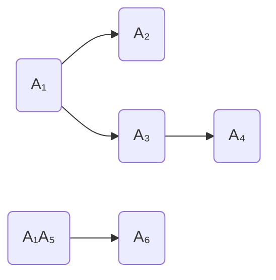
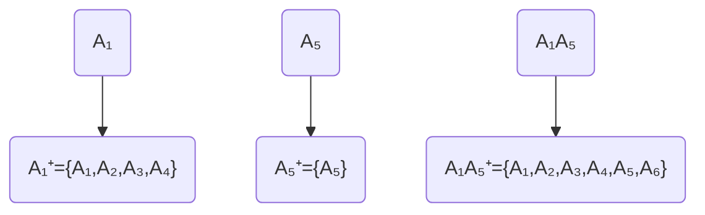
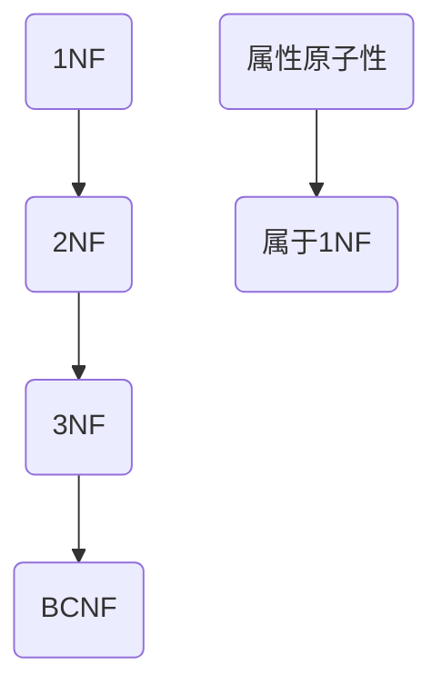
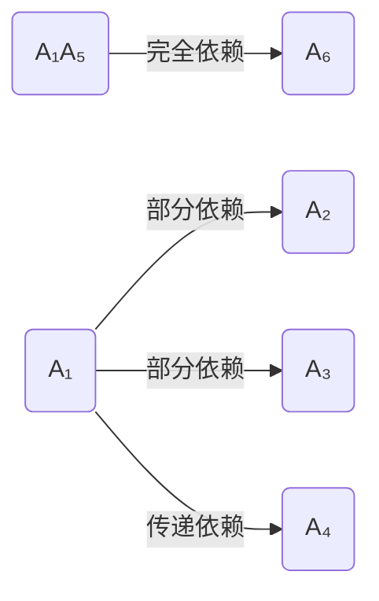
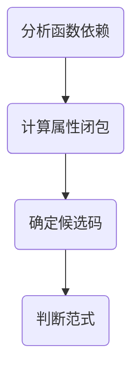
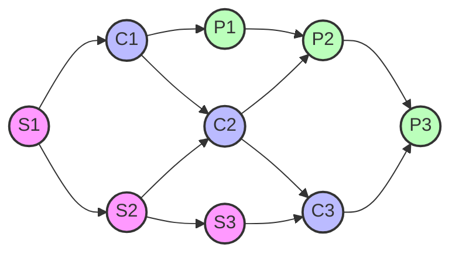
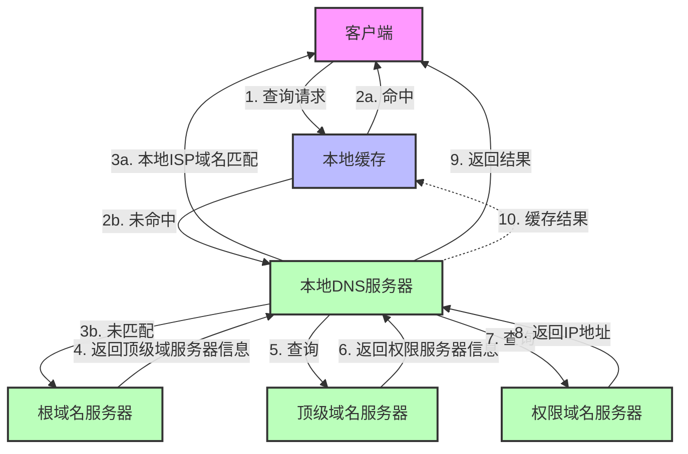

# 系统规划设计师错题集

## 信息化基础知识

### 1. 电子政务应用模式
**题目：** 电子政务的主要应用模式中不包括（ ）。
- A. 政府对政府（Government To Government）
- B. 政府对客户（Government To Customer）
- C. 政府对公务员（Government To Employee）
- D. 政府对企业（Government To Business）

**正确答案：** B. 政府对客户（Government To Customer）

**我的答案：** 错选其他选项

**解析：**
1. 电子政务的标准应用模式包括：
   - G2G（政府对政府）：政府部门间的协作
   - G2E（政府对公务员）：内部管理
   - G2B（政府对企业）：企业服务
   - G2P/G2C（政府对公众/公民）：公共服务

2. 错误原因：
   - "客户"（Customer）是商业领域用语
   - 在政务领域应使用"公民"（Citizen）或"公众"（Public）
   - G2C在这里指Government to Customer而非Government to Citizen

**知识点：**
1. 电子政务标准术语的使用规范
2. 政务领域与商业领域用语的区别
3. 电子政务的四种主要应用模式及其特点

**防错提示：**
- 注意区分政务领域和商业领域的专业术语
- 政府面向普通民众的服务用"公民"或"公众"，不用"客户"
- 记住标准的电子政务应用模式缩写：G2G、G2E、G2B、G2P/G2C(Citizen) 

## 数据库知识

### 1. 关系代数运算
**题目：** 给定关系模式R(A, B, C, D, E)、S(D, E, F, G)和π1,2,4,6(R⋈S)，经过自然连接和投影运算后的属性列数分别为（ ）。
- A. 9和4
- B. 7和4
- C. 9和7
- D. 7和7

**正确答案：** B. 7和4

**解析：**
1. 自然连接(R⋈S)分析：
   - R有5个属性：A, B, C, D, E
   - S有4个属性：D, E, F, G
   - 共同属性：D, E（2个）
   - 自然连接结果：7个属性（5+4-2=7）

2. 投影运算π1,2,4,6分析：
   - 自然连接后属性顺序：A, B, C, D, E, F, G
   - π1,2,4,6选择4个属性：第1列(A)、第2列(B)、第4列(D)、第6列(F)
   - 最终结果为4列

**知识点：**
1. 自然连接运算规则：结果列数 = R列数 + S列数 - 共同属性数
2. 投影运算规则：结果列数等于指定的属性数
3. 属性的排列顺序

**防错提示：**
- 自然连接时记得减去重复的属性列
- 投影运算的下标是从1开始计数
- 画图辅助理解属性的对应关系 

### 1. 关系模式和函数依赖
**题目：** 给定关系模式R（U, F），其中：属性集U={A₁, A₂, A₃, A₄, A₅, A₆}，函数依赖集F={A₁→A₂, A₁→A₃, A₃→A₄, A₁A₅→A₆}。关系模式R的候选码为（ ），由于R存在非主属性对码的部分函数依赖，所以R属于（ ）。

**第一空正确答案：** C. A₁A₅

**我的答案：** A. A₁A₃

**第二空正确答案：** A. 1NF

**图解分析：**

1. 函数依赖关系图：


图例说明：
- A₁, A₅: 主属性（候选码的组成部分）
- A₂, A₃, A₄, A₆: 非主属性
- 箭头：表示函数依赖关系

2. 属性闭包计算：


3. 范式判断流程：


4. 依赖类型分析：


5. 分析步骤：


**图解要点说明：**
1. 函数依赖图清晰展示了属性间的依赖关系
2. 属性闭包计算展示了如何确定候选码
3. 范式判断流程图展示了判定过程
4. 依赖类型分析图帮助识别不同类型的函数依赖
5. 分析步骤总结图展示了完整的解题思路

通过这些图解，我们可以清晰地看到：
- A₁A₅是候选码，因为它能推导出所有其他属性
- 存在部分函数依赖（A₁→A₂, A₁→A₃）
- 存在传递函数依赖（A₁→A₃→A₄）
- 由于存在非主属性对码的部分函数依赖，所以关系模式属于1NF

**解析：**
1. 候选码分析：
   - 步骤1：分析函数依赖关系
     * A₁ → A₂（直接依赖）
     * A₁ → A₃（直接依赖）
     * A₃ → A₄（传递依赖：A₁ → A₃ → A₄）
     * A₁A₅ → A₆（复合依赖）
   
   - 步骤2：确定属性闭包
     * A₁⁺ = {A₁, A₂, A₃, A₄}
     * A₅⁺ = {A₅}
     * (A₁A₅)⁺ = {A₁, A₂, A₃, A₄, A₅, A₆}
   
   - 步骤3：验证最小性
     * A₁不能单独决定所有属性（缺少A₅, A₆）
     * A₅不能单独决定任何其他属性
     * A₁A₅能决定所有属性且是最小的

2. 范式判断：
   - 步骤1：确定候选码和主属性
     * 候选码：A₁A₅
     * 主属性：A₁, A₅
     * 非主属性：A₂, A₃, A₄, A₆
   
   - 步骤2：分析函数依赖类型
     * 完全函数依赖：A₁A₅ → A₆
     * 部分函数依赖：
       - A₁ → A₂（非主属性A₂对码的部分依赖）
       - A₁ → A₃（非主属性A₃对码的部分依赖）
     * 传递函数依赖：A₁ → A₃ → A₄
   
   - 步骤3：判断范式等级
     * 满足1NF：所有属性都是原子的
     * 不满足2NF：存在非主属性对码的部分函数依赖
     * 不满足3NF：存在非主属性对码的传递函数依赖
     * 不满足BCNF：存在非主属性对码的依赖

**知识点：**
1. 候选码的确定方法：
   - 属性闭包计算
   - 最小超码原则
   - 完整依赖分析
   - 传递依赖识别

2. 范式的判断标准：
   - 1NF：属性不可分
   - 2NF：消除非主属性对码的部分函数依赖
   - 3NF：消除非主属性对码的传递函数依赖
   - BCNF：所有函数依赖的决定因素都是候选码

**易错点提醒：**
1. 候选码判断：
   - 必须能推导出所有属性
   - 必须是最小的属性组合
   - 要考虑复合属性的依赖关系
   - 注意传递依赖的影响

2. 范式判断：
   - 先确定主属性和非主属性
   - 仔细分析各类函数依赖
   - 逐级判断范式条件
   - 注意依赖类型的判断

**记忆技巧：**
1. "候选码分析三步法"：
   - "画依赖图"（可视化依赖关系）
   - "算属性闭包"（确定可推导的属性）
   - "验证最小性"（确保是最小超码）

2. "范式判断四步法"：
   - "找主属性"（确定候选码）
   - "辨依赖"（分析依赖类型）
   - "逐级判"（从低到高判断）
   - "记违规"（记录不满足的条件）

**防错提示：**
1. 确定候选码时：
   - 检查是否遗漏了某些依赖关系
   - 验证是否真的能推导出所有属性
   - 确认是否满足最小性要求

2. 判断范式时：
   - 正确区分主属性和非主属性
   - 准确识别各类函数依赖
   - 注意是否存在隐含的依赖关系
   - 从最低范式开始逐级判断

## 面向对象设计

### 1. 面向对象设计中的类型
**题目：** 在面向对象设计中，（ ）可以实现界面控制、外部接口和环境隔离。（ ）作为完成用例业务的责任承担者，协调、控制其他类共同完成用例规定的功能或行为。

**第一空正确答案：** C. 边界类
**第二空正确答案：** B. 控制类

**知识点：**
1. 面向对象设计中的三种类型：
   - 边界类（Boundary Class）：负责界面控制和外部交互
   - 控制类（Control Class）：负责业务流程控制和协调
   - 实体类（Entity Class）：负责业务数据的存储和管理

2. 各类型的主要职责：
   - 边界类：
     * 实现用户界面
     * 处理外部系统接口
     * 实现环境隔离
   
   - 控制类：
     * 负责业务流程控制
     * 协调其他类的工作
     * 实现用例规定的功能
   
   - 实体类：
     * 存储业务数据
     * 实现业务规则
     * 提供数据服务

**易错点分析：**
1. 容易混淆边界类和控制类的职责：
   - 边界类主要关注"外部交互"
   - 控制类主要关注"内部协调"

2. 容易忽视类之间的协作关系：
   - 边界类通常与控制类协作
   - 控制类协调实体类和边界类

**记忆技巧：**
1. "边界类管边界"：
   - 边（边界类）：负责外部交互
   - 控（控制类）：负责内部控制
   - 实（实体类）：负责数据实现

2. 三类角色比喻：
   - 边界类 = 前台接待（负责接待外部访客）
   - 控制类 = 项目经理（负责协调内部工作）
   - 实体类 = 档案管理员（负责管理核心数据）

**防错提示：**
1. 看到"界面控制"、"外部接口"、"环境隔离"就要想到边界类
2. 看到"协调"、"控制"、"完成用例"就要想到控制类
3. 注意区分"交互控制"和"业务控制"的区别 

## 项目管理

### 1. 项目管理工具
**题目：** 活动定义是项目时间管理中的过程之一，（ ）是进行活动定义时通常使用的一种工具。

**正确答案：** C. 工作分解结构（WBS）

**我的答案：** A. Gantt图

**知识点：**
1. 项目管理中的主要工具：
   - WBS（工作分解结构）：用于活动定义和范围管理
   - Gantt图：用于进度计划和控制
   - PERT图：用于网络计划和关键路径分析
   - 活动图：用于流程和活动的可视化表示

2. 各工具的主要用途：
   - WBS：
     * 将项目分解为可管理的工作包
     * 定义项目活动和任务
     * 建立工作层次结构
   
   - Gantt图：
     * 显示项目进度计划
     * 跟踪任务完成情况
     * 展示任务之间的依赖关系
   
   - PERT图：
     * 展示活动之间的依赖关系
     * 计算关键路径
     * 估算项目完成时间

**易错点分析：**
1. 容易混淆工具的使用场景：
   - WBS用于"定义什么要做"
   - Gantt图用于"展示何时做"
   - PERT图用于"分析如何做"

2. 活动定义阶段的重点：
   - 是确定"做什么"而不是"何时做"
   - 需要分解工作而不是排定进度

**记忆技巧：**
1. "工具用途口诀"：
   - "WBS分解活动要做啥"
   - "甘特进度看时间"
   - "PERT网络找路径"

2. 阶段对应法：
   - 定义阶段 → WBS
   - 计划阶段 → Gantt图
   - 分析阶段 → PERT图

**防错提示：**
1. 活动定义是确定工作内容的过程，应该使用WBS
2. Gantt图是在已经定义好活动之后才使用的工具
3. 不要把进度计划工具和活动定义工具混淆 

### 1. ⭐️项目进度和费用计算
> 这道题考察项目管理中的进度计划和费用计算，涉及关键路径分析和资源优化。

**题目：** 某工程包括A、B、C、D四个作业，其衔接关系、正常进度下所需天数和所需直接费用，赶工进度下所需的最少天数和每天需要增加的直接费用见下表。该工程的间接费用为每天5万元。据此，可以估算出完成该工程最少需要费用（106）万元，以此最低费用完成该工程需要（7）天。

| 作业 | 紧前作业 | 正常进度 |  | 赶工进度 |  |
|------|----------|----------|--|----------|--|
|      |          | 所需天数 | 共需直接费用/万元 | 最少天数 | 每天需增加直接费用/万元 |
| A    | ---      | 3        | 10                | 1        | 4                       |
| B    | A        | 7        | 15                | 3        | 2                       |
| C    | A        | 4        | 12                | 2        | 4                       |
| D    | C        | 5        | 18                | 2        | 2                       |

**正确答案：** 
- 最少费用：106万元
- 完成天数：7天

**重点考察：**
1. 项目进度计划的制定
2. 关键路径的识别
3. 费用优化计算

**解题关键：**
1. 绘制项目网络图：
   ```mermaid
   graph LR
   A[A:3天] --> B[B:7天]
   A --> C[C:4天]
   C --> D[D:5天]
   ```

2. 计算关键路径：
   - 路径1：A→B = 3+7 = 10天
   - 路径2：A→C→D = 3+4+5 = 12天
   - 关键路径为A→C→D（12天）

3. 赶工分析：
   - A可压缩2天（3→1天）
   - C可压缩2天（4→2天）
   - D可压缩3天（5→2天）

**费用计算过程：**
1. 正常工期费用：
   - 直接费用：10+15+12+18 = 55万元
   - 工期12天，间接费用：12×5 = 60万元
   - 总费用：55+60 = 115万元

2. 最优赶工方案：
   - A压缩2天：增加8万元
   - C压缩2天：增加8万元
   - D压缩1天：增加2万元
   - 总压缩5天，达到7天工期
   - 直接费用增加：18万元
   - 间接费用节省：25万元（5天×5万元）
   - 最终总费用：106万元

**易错点提醒：**
1. 关键路径识别：
   - 要考虑所有可能路径
   - 选择最长路径作为关键路径

2. 赶工优化：
   - 优先压缩关键路径上的活动
   - 考虑压缩成本与收益的平衡

3. 费用计算：
   - 不要忘记间接费用
   - 注意赶工带来的费用增加

**记忆方法：**
1. "三步法"计算：
   - 第一步：画网络图找关键路径
   - 第二步：计算正常工期费用
   - 第三步：优化赶工方案

2. "费用平衡"原则：
   - 压缩工期增加直接费用
   - 缩短工期节省间接费用
   - 寻找总费用最低点

**相关知识点：**
- 项目网络图
- 关键路径法（CPM）
- 工期优化
- 成本控制
- 资源平衡

**防错提示：**
1. 计算关键路径时要考虑所有可能路径
2. 赶工时要考虑成本效益
3. 不要忘记计算间接费用的变化

## 操作系统

### 1. 并发控制与进程调度
**题目：** 某计算机系统中有一个CPU、一台扫描仪和一台打印机。现有三个图像任务，每个任务有三个程序段：扫描Si、图像处理Ci和打印Pi (i=1, 2, 3)。下图为三个任务各程序段并发执行的前趋图，其中，（ ）可并行执行，（ ）的直接制约，（ ）的间接制约。



**图例说明：**
- 粉色节点(S): 扫描操作，使用扫描仪
- 蓝色节点(C): 图像处理，使用CPU
- 绿色节点(P): 打印操作，使用打印机
- 箭头：表示执行顺序和依赖关系

**详细答案分析：**

#### 第一空：可并行执行的程序段
正确答案：A. "C1S2"，"P1C2S3"，"P2C3"

为什么选A：
1. "C1S2"可以并行，因为：
   - C1使用CPU，S2使用扫描仪，使用不同资源
   - S2只依赖S1完成，不依赖C1
   - 此时S1已完成，满足前置条件

2. "P1C2S3"可以并行，因为：
   - P1使用打印机，C2使用CPU，S3使用扫描仪
   - 三者使用不同的硬件资源
   - 各自的前置条件都满足（P1依赖C1，C2依赖S2，S3依赖S2）

3. "P2C3"可以并行，因为：
   - P2使用打印机，C3使用CPU，资源不冲突
   - P2的前置条件是C2完成
   - C3的前置条件是S3完成

为什么排除其他选项：
- B选项："S2C2P2"不能并行，因为它们是同一任务的连续步骤
- C选项："S1C1P1"不能并行，因为它们有直接依赖关系
- D选项："S1S2S3"不能并行，因为它们都需要使用同一个扫描仪

#### 第二空：直接制约关系
正确答案：C. C1和P1受到S1、C2和P2受到S2、C3和P3受到S3

为什么选C：
1. 直接制约指有直接箭头连接的关系：
   - S1→C1：直接箭头连接
   - S1→P1：通过C1的直接连接
   - S2→C2和P2：同样的直接依赖关系
   - S3→C3和P3：同样的直接依赖关系

2. 这些关系都是在同一任务内部的顺序依赖：
   - 任务1：S1→C1→P1
   - 任务2：S2→C2→P2
   - 任务3：S3→C3→P3

为什么排除其他选项：
- A选项：混淆了直接制约和间接制约
- B选项：颠倒了制约关系的方向
- D选项：描述的是不存在的依赖关系

#### 第三空：间接制约关系
正确答案：B. S2和S3受到S1、C2和C3受到C1、P2和P3受到P1

为什么选B：
1. S2和S3受到S1间接制约：
   - S1→S2→S3形成了一条路径
   - 因为只有一台扫描仪，必须串行使用
   - S1必须先完成，才能执行S2，然后才能执行S3

2. C2和C3受到C1间接制约：
   - C1→C2→C3形成了一条路径
   - 只有一个CPU，必须串行处理
   - C1必须先完成，才能执行C2，然后才能执行C3

3. P2和P3受到P1间接制约：
   - P1→P2→P3形成了一条路径
   - 只有一台打印机，必须串行打印
   - P1必须先完成，才能执行P2，然后才能执行P3

为什么排除其他选项：
- A选项：描述的是直接制约关系
- C选项：制约关系方向错误
- D选项：混淆了任务内的直接依赖关系

**总结要点：**
1. 判断并行执行时要检查：
   - 资源是否冲突（不同类型的操作可以并行）
   - 是否满足前置条件
   - 是否存在直接或间接依赖

2. 判断直接制约时要看：
   - 是否有直接的箭头连接
   - 是否在同一任务流程内

3. 判断间接制约时要看：
   - 是否存在通过其他节点的路径
   - 是否使用同一类资源
   - 整体的执行顺序关系 

### 2. 实时操作系统外部事件处理
**题目：** 实时操作系统中，外部事件必须（ ）。
- A. 一个时间片内处理
- B. 一个周期时间内处理
- C. 一个机器周期内处理
- D. 被控对象允许的时间内处理

**正确答案：** D. 被控对象允许的时间内处理

**我的答案：** A. 一个时间片内处理

**解析：**
1. 实时操作系统的特点：
   - 强调时间约束
   - 响应时间确定性
   - 以被控对象的需求为准
   - 保证实时性要求

2. 外部事件处理的要求：
   - 必须在被控对象允许的时间内完成
   - 不是固定的时间片或周期
   - 根据具体应用场景确定
   - 满足实时性约束

**知识点：**
1. 实时操作系统的基本概念：
   - 实时性要求
   - 确定性响应
   - 可预测性
   - 任务调度

2. 外部事件处理机制：
   - 事件响应时间
   - 处理截止时间
   - 优先级管理
   - 资源分配

**易错点提醒：**
1. 不要将处理时间与固定的系统参数混淆：
   - 时间片是分时系统的概念
   - 周期时间是处理器相关的参数
   - 机器周期是硬件层面的概念

2. 实时系统的关键是满足应用需求：
   - 以被控对象的要求为准
   - 不同应用有不同的时间约束
   - 处理时间要满足实际需求

**记忆技巧：**
1. "实时系统特点"口诀：
   - "实时响应看需求"
   - "对象要求定标准"
   - "不是固定死时间"
   - "灵活应对保实时"

**防错提示：**
1. 注意区分不同的时间概念
2. 理解实时系统的本质需求
3. 记住以被控对象的要求为准

## 知识产权

### 1. 软件知识产权保护
**题目：** 赵某购买了一款有注册商标的应用App，擅自复制成光盘出售，其行为是侵犯（ ）的行为。

**正确答案：** B. 软件著作权

**我的答案：** A. 注册商标专用权

**解析：**
1. 本题涉及的行为特征：
   - 购买正版App后复制
   - 制作光盘
   - 用于销售

2. 知识产权分类：
   - 软件著作权：保护软件本身的代码、结构、内容
   - 商标专用权：保护商品的标识、品牌
   - 专利权：保护技术创新
   - 所有权：保护有形载体

3. 错误原因分析：
   - 混淆了商标权和著作权的保护范围
   - 复制和销售软件侵犯的是软件著作权
   - 商标权只保护商标标识的使用权

**知识点：**
1. 软件的知识产权保护体系：
   - 著作权：保护软件的表达形式
   - 专利权：保护软件的技术方案
   - 商标权：保护软件的商业标识
   - 商业秘密：保护未公开的技术信息

2. 软件著作权的保护范围：
   - 软件代码
   - 软件文档
   - 界面设计
   - 操作流程

3. 侵权行为的判定：
   - 未经授权复制
   - 未经许可传播
   - 违法销售
   - 破解保护措施

**记忆技巧：**
1. "三权区分"：
   - 著作权保护内容
   - 商标权保护标识
   - 专利权保护技术

2. 侵权行为对应：
   - 复制传播 → 著作权
   - 仿冒标识 → 商标权
   - 抄袭技术 → 专利权

**防错提示：**
1. 注意区分不同权利的保护范围：
   - 复制软件侵犯著作权
   - 仿冒商标侵犯商标权
   - 抄袭技术侵犯专利权

2. 判断侵权类型时要看：
   - 侵权对象是什么
   - 侵权行为的性质
   - 侵犯的具体权利 

### 2. 软件著作权归属
**题目：** 谭某是CZB物流公司的科技系统管理员。任职期间，谭某根据公司的业务要求开发了"报关业务系统"，并由公司使用，随后谭某向国家版权局申请了计算机软件著作权登记，并取得了《计算机软件著作登记证书》。证书明确软件名称为"报关业务系统V1.0"，著作权人为谭某。以下说法正确的是（ ）。

**正确答案：** B. 报关业务系统V1.0的著作权属于CZB物流公司

**我的答案：** A. 报关业务系统V1.0的著作权属于谭某

**解析：**
1. 职务作品的著作权归属原则：
   - 在职期间完成的与本职工作相关的作品属于职务作品
   - 职务作品的著作权归属于单位
   - 作者享有署名权等人身权

2. 本题关键点分析：
   - 谭某是公司员工，开发是其工作职责
   - 系统是根据公司业务要求开发
   - 系统由公司使用
   - 这符合职务作品的所有特征

3. 错误原因分析：
   - 混淆了著作权登记证书上的著作权人与实际著作权归属
   - 未正确理解职务作品的著作权归属规则
   - 忽视了开发行为发生的背景和条件

**知识点：**
1. 职务作品的认定条件：
   - 在职期间完成
   - 履行本职工作
   - 利用单位资源
   - 单位业务范围内

2. 职务作品的权利归属：
   - 著作权归属单位
   - 作者享有署名权
   - 可能享有奖励或报酬
   - 单位享有使用和处分权

**记忆技巧：**
1. "职务作品三要素"：
   - "工作期间做"
   - "本职范围内"
   - "单位资源用"

2. "权利归属分清楚"：
   - "著作权归单位"
   - "署名权归个人"
   - "使用权归公司"

**防错提示：**
1. 注意区分著作权登记与著作权归属
2. 理解职务作品的认定标准
3. 明确单位与个人的权利界限

## 软件设计

### 1. 模块化设计原则
**题目：** 关于模块化设计，（ ）是错误的。

**正确答案：** A. 模块是指执行某一特定任务的数据结构和程序代码

**解析：**
1. 选项分析：
   - A选项错误：模块不仅包含数据结构和程序代码，还包括接口定义等
   - B选项正确：接口和功能定义确实属于模块自身的内部特性
   - C选项正确：模块化的目标就是实现高内聚、低耦合
   - D选项正确：每个模块完成相对独立的子功能，简化模块间关系

2. 模块的正确定义：
   - 模块是系统的功能单位
   - 包含接口定义、功能实现、数据结构等
   - 具有相对的独立性
   - 与其他模块通过接口交互

**知识点：**
1. 模块的构成要素：
   - 接口定义
   - 功能实现
   - 数据结构
   - 程序代码
   - 内部算法

2. 模块化设计原则：
   - 高内聚：模块内部功能相关性强
   - 低耦合：模块之间依赖关系弱
   - 信息隐藏：隐藏实现细节
   - 接口规范：定义清晰的交互方式

3. 模块化设计目标：
   - 提高代码重用性
   - 降低系统复杂度
   - 便于维护和修改
   - 支持团队协作

**记忆技巧：**
1. 模块的"五要素"：
   - 接口（对外交互）
   - 功能（实现目标）
   - 数据（信息存储）
   - 代码（具体实现）
   - 算法（处理逻辑）

2. 设计原则口诀：
   - "高内聚低耦合是原则"
   - "接口清晰细节藏"
   - "独立功能要简单"

**防错提示：**
1. 不要把模块等同于代码片段：
   - 模块是功能单位，不仅仅是代码
   - 模块包含多个组成部分
   - 接口定义很重要

2. 判断模块设计的关键：
   - 功能的独立性
   - 接口的规范性
   - 内聚与耦合度 

### 2. 软件开发模型
**题目：** 螺旋模型在（ ）的基础上扩展而成。
- A. 瀑布模型
- B. 增量模型
- C. 快速模型
- D. 面向对象模型

**正确答案：** C. 快速模型

**我的答案：** 错选其他选项

**解析：**
1. 螺旋模型的特点：
   - 在快速原型模型基础上发展而来
   - 结合了原型模型和瀑布模型的特点
   - 加入了风险分析环节
   - 采用循环迭代的方式

2. 螺旋模型的主要环节：
   - 计划制定
   - 风险分析
   - 工程实现
   - 客户评估

3. 其他模型对比：
   - 瀑布模型：线性顺序开发
   - 增量模型：渐进式开发
   - 快速模型：原型化开发
   - 面向对象模型：对象化设计

**知识点：**
1. 软件开发模型的类型：
   - 瀑布模型
   - 增量模型
   - 快速原型模型
   - 螺旋模型
   - 面向对象模型

2. 螺旋模型的优势：
   - 强调风险管理
   - 适合大型复杂项目
   - 支持用户反馈
   - 灵活性强

3. 选择开发模型的考虑因素：
   - 项目规模和复杂度
   - 风险程度
   - 用户参与度
   - 团队经验

**记忆技巧：**
1. 螺旋模型 = 快速原型 + 风险分析
2. 四个关键词：
   - 迭代（开发方式）
   - 风险（核心特点）
   - 原型（基础模型）
   - 评估（过程控制）

**防错提示：**
1. 不要混淆模型的发展关系：
   - 螺旋模型是基于快速原型模型
   - 不是基于瀑布模型或增量模型

2. 记住螺旋模型的特色：
   - 最显著特点是风险分析
   - 源自快速原型的思想

**总结要点：**
1. 螺旋模型是基于快速原型模型
2. 加入了风险分析环节
3. 采用循环迭代的方式 

### 3. 自顶向下开发方法
**题目：** 以下关于自顶向下开发方法的叙述中，正确的是（ ）。
- A. 自顶向下过程因为单元测试而比较耗费时间
- B. 自顶向下过程可以更快地发现系统性能方面的问题
- C. 相对于自底向上方法，自顶向下方法可以更快地得到系统的演示原型
- D. 在自顶向下的设计中，如发现了一个错误，通常是因为底层模块没有满足其规格说明（因为高层模块已经被测试过了）

**正确答案：** C. 相对于自底向上方法，自顶向下方法可以更快地得到系统的演示原型

**我的答案：** 错选 A. 自顶向下过程因为单元测试而比较耗费时间

**解析：**
1. 自顶向下开发方法的特点：
   - 从系统整体功能开始设计
   - 逐步细化和分解
   - 先实现主要功能，后实现细节
   - 可以快速得到系统框架

2. 自顶向下方法的优势：
   - 有利于整体把握系统结构
   - 能快速展示系统原型
   - 便于及早发现设计问题
   - 符合人的思维方式

3. 与自底向上方法的对比：
   - 自顶向下：先整体后局部
   - 自底向上：先局部后整体
   - 自顶向下更容易得到早期原型
   - 自底向上更注重底层实现

**知识点：**
1. 开发方法的选择：
   - 项目特点
   - 团队经验
   - 时间要求
   - 质量要求

2. 自顶向下方法的应用场景：
   - 需要快速原型的项目
   - 整体架构重要的系统
   - 需求不太明确的项目
   - 团队经验丰富的情况

**记忆技巧：**
1. "自顶向下三特点"：
   - 整体优先
   - 逐步细化
   - 快速原型

2. "两种方法对比"：
   - 顶向下：整体架构优先
   - 底向上：具体实现优先

**防错提示：**
1. 不要误解单元测试：
   - 自顶向下并不会因单元测试而特别耗时
   - 单元测试是必要的质量保证手段

2. 关于错误发现：
   - 错误可能出现在任何层次
   - 不能认为高层模块测试过就一定正确

**总结要点：**
1. 自顶向下方法适合快速展示系统原型
2. 有利于整体把握系统结构
3. 不会因单元测试而特别耗时
4. 错误可能出现在任何层次

## 系统集成

### 1. 集成平台服务
**题目：** 集成平台是支持企业信息集成的支撑环境，包括硬件、软件、软件工具和系统。集成平台的基本功能中，（ ）实现不同数据库系统之间的数据交换、互操作、分布数据管理和共享信息模型定义；（ ）能够为应用提供数据交换和访问操作，使各种不同的系统能够相互协作。

第一空：
- A. 数据通信服务
- B. 信息集成服务
- C. 应用集成服务
- D. 操作集成服务

第二空：
- A. 数据通信服务
- B. 信息集成服务
- C. 应用集成服务
- D. 操作集成服务

**正确答案：** 
- 第一空：B. 信息集成服务
- 第二空：C. 应用集成服务

**我的答案：** 
- 第一空：错选 A. 数据通信服务
- 第二空：错选 D. 操作集成服务

**解析：**
1. 集成平台的四种基本服务：
   - 信息集成服务：负责数据交换、互操作和共享
   - 应用集成服务：提供应用间的互操作能力
   - 数据通信服务：提供底层的数据传输
   - 操作集成服务：提供统一的操作界面

2. 各服务的主要功能：
   - 信息集成服务：
     * 实现不同数据库系统间的数据交换
     * 管理分布式数据
     * 定义共享信息模型
   
   - 应用集成服务：
     * 提供应用间的数据交换
     * 支持应用间的访问操作
     * 实现系统间的协作

**知识点：**
1. 集成平台的构成：
   - 硬件环境
   - 软件环境
   - 工具支持
   - 系统支持

2. 集成服务的层次：
   - 数据层：数据通信服务
   - 信息层：信息集成服务
   - 应用层：应用集成服务
   - 表示层：操作集成服务

**记忆技巧：**
1. 服务分层记忆：
   - "通信在底层"（数据通信）
   - "信息管数据"（信息集成）
   - "应用重协作"（应用集成）
   - "操作在表面"（操作集成）

2. 功能对应：
   - 数据库交互 → 信息集成
   - 应用互操作 → 应用集成

**防错提示：**
1. 区分服务层次：
   - 数据通信是最底层服务
   - 不要混淆信息集成和数据通信

2. 理解服务职责：
   - 信息集成关注数据层面的整合
   - 应用集成关注功能层面的协作

**总结要点：**
1. 集成平台是支持企业信息集成的支撑环境
2. 包括硬件、软件、软件工具和系统
3. 集成平台的基本功能包括数据交换、互操作、分布数据管理和共享信息模型定义 

### 2. 企业信息集成类型
**题目：** 企业信息集成按照组织范围分为企业内部的信息集成和外部的信息集成。在企业内部的信息集成中，（ ）实现了不同系统之间的互操作，使得不同系统之间能够实现数据和方法的共享；（ ）实现了不同应用系统之间的连接、协调运作和信息共享。

第一空：
- A. 技术平台集成
- B. 数据集成
- C. 应用系统集成
- D. 业务过程集成

第二空：
- A. 技术平台集成
- B. 数据集成
- C. 应用系统集成
- D. 业务过程集成

**正确答案：** 
- 第一空：C. 应用系统集成
- 第二空：D. 业务过程集成

**我的答案：** 
- 第一空：错选 D. 业务过程集成
- 第二空：错选 C. 应用系统集成

**解析：**
1. 企业信息集成的层次：
   - 技术平台集成：基础设施层面的集成
   - 数据集成：数据层面的集成
   - 应用系统集成：应用层面的集成
   - 业务过程集成：业务层面的集成

2. 各层次的主要功能：
   - 应用系统集成：
     * 实现系统间互操作
     * 支持数据和方法共享
     * 提供系统间通信机制
   
   - 业务过程集成：
     * 实现应用系统间连接
     * 协调业务流程
     * 支持信息共享和业务协同

**知识点：**
1. 企业信息集成的分类：
   - 按组织范围：内部集成和外部集成
   - 按集成层次：平台、数据、应用、业务
   - 按集成方式：点对点、中心式、总线式

2. 集成层次的特点：
   - 从底层到顶层逐级深入
   - 每层都有特定的职责
   - 层次间相互依赖

**记忆技巧：**
1. "四层集成"口诀：
   - "平台打基础"
   - "数据来共享"
   - "应用互操作"
   - "业务全协同"

2. 区分应用集成和业务集成：
   - 应用集成：系统间互操作
   - 业务集成：流程间协同

**防错提示：**
1. 注意区分集成层次：
   - 应用系统集成关注系统间的互操作
   - 业务过程集成关注业务流程的协调

2. 理解集成的递进关系：
   - 应用集成是业务集成的基础
   - 业务集成是更高层次的集成

**总结要点：**
1. 企业信息集成分为内部集成和外部集成
2. 应用系统集成实现系统间互操作和共享
3. 业务过程集成实现流程协调和业务协同
4. 不同层次的集成各有侧重点 

## 网络技术

### 1. 域名服务器
**题目：** 以下关于域名服务器的叙述，错误的是（ ）。
- A. 本地缓存域名服务不需要域名数据库
- B. 顶级域名服务器是最高层次的域名服务器
- C. 本地域名服务器可以采用递归查询和迭代查询两种查询方式
- D. 权限服务器负责将其管辖区内的主机域名转换为该主机的IP地址

**正确答案：** B. 顶级域名服务器是最高层次的域名服务器

**我的答案：** 错选 D. 权限服务器负责将其管辖区内的主机域名转换为该主机的IP地址

**解析：**
1. 域名服务器的层次结构（从高到低）：
   - 根域名服务器：DNS系统的最高层，是整个DNS系统的起点
   - 顶级域名服务器：负责管理顶级域名（如.com、.org等）
   - 权限域名服务器：管理特定区域的域名解析
   - 本地域名服务器：为本地网络提供域名解析服务

2. 选项分析：
   - A正确：本地缓存确实不需要域名数据库，只需要缓存
   - B错误：根域名服务器才是最高层次的服务器，顶级域名服务器是第二层
   - C正确：本地服务器可以使用递归和迭代两种查询方式
   - D正确：权限服务器确实负责域名到IP的转换

3. 各类服务器的主要功能：
   - 根域名服务器：
     * DNS系统的最高层
     * 管理顶级域名服务器的信息
     * 将查询请求转发到相应的顶级域名服务器
   
   - 顶级域名服务器：
     * 管理二级域名服务器的信息
     * 负责特定顶级域（如.com、.org）
     * 不是最高层次

**知识点：**
1. DNS系统的层次结构：
   - 根域名服务器（最高层）
   - 顶级域名服务器（第二层）
   - 权限域名服务器
   - 本地域名服务器

2. DNS查询方式：
   - 递归查询：服务器替客户端完成查询
   - 迭代查询：服务器返回下一步查询建议

**记忆技巧：**
1. "DNS层次结构"口诀：
   - "根在最顶端"
   - "顶级第二层"
   - "权限管辖区"
   - "本地解析忙"

2. 区分服务器职责：
   - 根服务器：最高层，管理顶级服务器
   - 顶级服务器：第二层，管理二级域名
   - 权限服务器：负责具体区域解析
   - 本地服务器：提供本地解析服务

**防错提示：**
1. 注意层次关系：
   - 根域名服务器是最高层
   - 顶级域名服务器是第二层
   - 不要混淆两者的层次关系

2. 理解各级服务器的职责：
   - 每一级都有其特定的管理范围
   - 层次结构是严格的自上而下

**总结要点：**
1. 根域名服务器是DNS系统的最高层
2. 顶级域名服务器是第二层
3. DNS系统是严格的层次结构
4. 每级服务器都有明确的职责范围 

**DNS查询流程图：**


**查询步骤说明：**
1. 客户端发起DNS查询请求
2. 首先检查本地缓存：
   - 如果命中，直接返回结果
   - 如果未命中，继续下一步
3. 请求发送到本地DNS服务器：
   - 如果是本地ISP域名，直接解析返回
   - 如果不是，继续向根服务器查询
4. 根域名服务器返回顶级域服务器信息
5. 本地DNS服务器查询顶级域名服务器
6. 顶级域名服务器返回权限服务器信息
7. 本地DNS服务器查询权限域名服务器
8. 权限域名服务器返回最终的IP地址
9. 结果返回给客户端
10. 结果被缓存到本地缓存中

**查询方式：**
1. 递归查询：本地DNS服务器替客户端完成整个查询过程
2. 迭代查询：每个DNS服务器只返回下一步应查询的服务器信息

**性能优化：**
1. 本地缓存加速：
   - 保存最近解析的结果
   - 减少重复查询
   - 提高响应速度

2. 本地DNS服务器优势：
   - 离用户较近
   - 了解本地ISP情况
   - 可以快速响应

**总结要点：**
1. 本地缓存可以减少重复查询
2. 本地DNS服务器可以快速响应
3. 递归查询和迭代查询各有优势
4. 本地DNS服务器是重要的解析节点 

### 2. 核心层交换机特性
**题目：** 核心层交换机应该实现多种功能，下面选项中，不属于核心层特性的是（ ）。
- A. 高速连接
- B. 冗余设计
- C. 策略路由
- D. 较少的设备连接

**正确答案：** C. 策略路由

**我的答案：** D. 较少的设备连接

**解析：**
1. 核心层交换机的主要特性：
   - 高速连接：保证网络骨干的高速数据传输
   - 冗余设计：确保网络的可靠性和容错性
   - 较少的设备连接：减少复杂度，提高性能
   - 简单的配置：专注于快速数据转发

2. 策略路由不属于核心层特性的原因：
   - 策略路由主要在网络边缘实现
   - 核心层注重高速转发而非复杂的路由策略
   - 在核心层实现策略路由会影响转发性能
   - 策略路由功能应该在汇聚层或接入层实现

**知识点：**
1. 网络分层设计：
   - 核心层：高速骨干传输
   - 汇聚层：策略控制和路由
   - 接入层：用户接入和策略执行

2. 核心层设计原则：
   - 高性能优先
   - 简单可靠
   - 避免复杂功能
   - 专注数据转发

3. 各层功能划分：
   - 核心层：快速转发
   - 汇聚层：路由策略
   - 接入层：访问控制

**记忆技巧：**
1. 核心层特性口诀：
   - "高速连接保性能"
   - "冗余设计保可靠"
   - "设备精简更高效"
   - "简单配置好维护"

2. 分层功能记忆：
   - 核心层："快"字当头
   - 汇聚层：策略为主
   - 接入层：控制为主

**防错提示：**
1. 不要混淆各层功能：
   - 核心层主要负责快速转发
   - 复杂的策略和控制应在其他层实现

2. 记住核心层的设计理念：
   - 简单高效
   - 避免复杂功能
   - 专注性能和可靠性

**总结要点：**
1. 核心层交换机强调高速和可靠性
2. 策略路由等复杂功能不适合在核心层实现
3. 较少的设备连接是核心层的重要特性
4. 简单的配置有助于维护和故障排除 

## 软件架构篇

### 1. ⭐️质量属性场景与架构策略
**题目：** 某公司欲开发一个网上商城系统，在架构设计阶段，公司的架构师识别出3个核心质量属性场景。其中：
1. "系统主站断电后，能够在2分钟内自动切换到备用站点，并恢复正常运行"主要与（可用性）质量属性相关，通常可采用（主动冗余）架构策略实现该属性；
2. "在并发用户数不超过1000人时，用户的交易请求应该在0.5s内完成"主要与（性能）质量属性相关，通常可采用（资源调度）架构策略实现该属性；
3. "系统应该能够抵挡恶意用户的入侵行为，并进行报警和记录"主要与（安全性）质量属性相关，通常可采用（追踪审计）架构策略实现该属性。

**第一空正确答案：** B. 可用性

**第二空正确答案：** A. 主动冗余

**解析：**
1. 场景一分析（可用性）：
   - 关键词：断电、自动切换、恢复运行
   - 质量属性：可用性（系统持续服务的能力）
   - 架构策略：主动冗余（通过备用系统保证服务）
   - 响应要求：2分钟内恢复

2. 场景二分析（性能）：
   - 关键词：并发用户、响应时间
   - 质量属性：性能（系统响应能力）
   - 架构策略：资源调度（优化资源分配）
   - 响应要求：0.5s内完成

3. 场景三分析（安全性）：
   - 关键词：抵挡入侵、报警记录
   - 质量属性：安全性（系统防护能力）
   - 架构策略：追踪审计（监控和记录）
   - 响应要求：实时防护和记录

**核心知识点：**
1. 质量属性场景的构成：
   - 触发条件（如：断电、用户请求）
   - 环境（如：正常运行时）
   - 响应（如：切换到备用站点）
   - 响应度量（如：2分钟内）

2. 主要质量属性：
   - 可用性：系统持续提供服务的能力
   - 性能：系统响应和处理能力
   - 安全性：系统防护和保护能力

3. 常用架构策略：
   - 主动冗余：用于提高可用性
   - 资源调度：用于优化性能
   - 追踪审计：用于加强安全性

**易错点提醒：**
1. 质量属性识别：
   - 注意场景描述中的关键词
   - 理解质量属性的本质特征
   - 不要混淆不同质量属性

2. 策略选择：
   - 策略要与质量属性匹配
   - 考虑场景的具体需求
   - 注意策略的适用范围

**记忆技巧：**
1. "三大属性"口诀：
   - "可用保证不间断"
   - "性能保证响应快"
   - "安全保证有防护"

2. "策略对应"口诀：
   - "可用靠冗余"
   - "性能靠调度"
   - "安全靠审计"

**相关知识点：**
- 软件架构设计
- 质量属性理论
- 架构策略选择
- 系统可用性设计
- 性能优化
- 安全架构

**防错提示：**
1. 仔细分析场景描述中的关键词
2. 理解质量属性和架构策略的对应关系
3. 注意区分不同质量属性的特征 

## 面向对象设计篇

### ⭐️用例关系
**题目：** 用例（use case）用来描述系统对事件做出响应时所采取的行动。用例之间是具有相关性的。在一个会员管理系统中，会员注册时可以采用电话和邮件两种方式。用例"会员注册"和"电话注册"、"邮件注册"之间是（ ）关系。
- A. 包含（include）
- B. 扩展（extend）
- C. 泛化（generalize）✅
- D. 依赖（depends on）

**正确答案：** C. 泛化（generalize）

**我的答案：** 错选其他选项

**解析：**
1. 用例关系类型分析：
   - 包含关系（include）：表示一个用例必须包含另一个用例的行为
   - 扩展关系（extend）：表示一个用例可以扩展另一个用例的行为
   - 泛化关系（generalize）：表示一个用例是另一个用例的特殊形式
   - 依赖关系（depends on）：表示一个用例依赖于另一个用例的结果

2. 本题场景分析：
   - "电话注册"和"邮件注册"是"会员注册"的具体方式
   - 它们是"会员注册"的特殊形式
   - 它们继承了"会员注册"的基本行为
   - 这种"一般-特殊"的关系正是泛化关系的体现

**核心知识点：**
1. 用例关系的四种类型：
   - 包含关系：必要的组成部分
   - 扩展关系：可选的功能扩展
   - 泛化关系：特殊化的实现
   - 依赖关系：功能上的依赖

2. 泛化关系的特点：
   - 表示"是一种"的关系
   - 子用例继承父用例的行为
   - 子用例可以有自己的特殊行为
   - 符合面向对象的继承概念

3. 用例关系的使用场景：
   - 包含：复用公共功能
   - 扩展：添加可选功能
   - 泛化：实现特殊化处理
   - 依赖：建立功能依赖

**易错点提醒：**
1. 不要混淆包含和泛化：
   - 包含是必要的组成关系
   - 泛化是一般与特殊的关系

2. 注意区分扩展和泛化：
   - 扩展是可选的功能添加
   - 泛化是必要的特殊化实现

**记忆技巧：**
1. "四大关系"口诀：
   - "包含必须要完成"
   - "扩展可选来添加"
   - "泛化特殊来实现"
   - "依赖结果要用到"

2. 场景对应法：
   - 看到"必须包含"→包含关系
   - 看到"可以扩展"→扩展关系
   - 看到"是一种"→泛化关系
   - 看到"需要用到"→依赖关系

**相关知识点：**
- 面向对象设计
- UML用例图
- 用例建模
- 需求分析

**防错提示：**
1. 注意理解题目中的关键词和场景描述
2. 分析用例之间的实际关系类型
3. 不要机械记忆，要理解各种关系的本质特征 

**典型例子：**
1. 泛化关系（generalize）示例：
   - 场景：网上支付系统
   - 父用例：支付订单
   - 子用例：微信支付、支付宝支付、银行卡支付
   - 解释：每种具体的支付方式都是"支付订单"的一种特殊形式，继承了基本的支付流程，但有自己的特定实现

2. 包含关系（include）示例：
   - 场景：电商系统
   - 主用例：下订单
   - 被包含用例：验证用户身份、检查库存
   - 解释：每次下订单必须包含验证用户身份和检查库存这两个步骤，缺一不可

3. 扩展关系（extend）示例：
   - 场景：邮件系统
   - 基础用例：发送邮件
   - 扩展用例：添加附件、设置优先级、定时发送
   - 解释：发送邮件可以选择性地添加这些扩展功能，但不是必需的

4. 依赖关系（depends on）示例：
   - 场景：在线考试系统
   - 依赖方用例：查看成绩
   - 被依赖用例：完成考试
   - 解释：只有在完成考试后，才能查看成绩，查看成绩依赖于完成考试的结果

**关系对比：**
1. 泛化 vs 包含：
   - 泛化：父子关系，"是一种"的关系
   - 包含：整体部分关系，"必须包含"的关系

2. 泛化 vs 扩展：
   - 泛化：必要的特殊化，子用例必须实现父用例的行为
   - 扩展：可选的功能添加，基础用例可以独立存在

3. 包含 vs 扩展：
   - 包含：必需的组成部分，每次都要执行
   - 扩展：可选的附加功能，根据条件决定是否执行

4. 依赖 vs 包含：
   - 依赖：执行顺序的关系，前后相依
   - 包含：组成关系，同时发生

**实际应用提示：**
1. 选择泛化关系时：
   - 寻找"是一种"的关系
   - 确保子用例是父用例的特例
   - 子用例必须完全替代父用例

2. 选择包含关系时：
   - 寻找必需的功能片段
   - 考虑复用的可能性
   - 确保是每次都需要的步骤

3. 选择扩展关系时：
   - 寻找可选的功能点
   - 考虑条件触发的场景
   - 确保基础用例可独立运行

4. 选择依赖关系时：
   - 寻找前后依赖的行为
   - 考虑结果依赖的情况
   - 确保执行顺序的正确性

**总结要点：**
1. 用例关系是面向对象设计中的重要概念
2. 用例关系有四种类型：包含、扩展、泛化和依赖
3. 每种关系都有其特定的应用场景和特点
4. 理解用例关系有助于设计高质量的软件系统 

## 电子政务篇

### ⭐️电子政务应用模式
> 这道题考察电子政务的标准应用模式，是信息化基础知识中的重要知识点。

**题目：** 人口信息采集处理和利用业务属于（G2G），营业执照发放属于（G2B），户籍管理属于（G2C），参加政府工程交接属于（B2G）。

**重点考察：**
1. 电子政务的四种标准应用模式
2. 不同业务场景的模式识别
3. 政务服务对象的分类

**解题关键：**
1. 人口信息采集处理和利用业务（G2G）：
   - 涉及政府部门之间的信息共享和协作
   - 属于政府对政府的服务模式
   - 目的是提高行政效率和决策质量

2. 营业执照发放（G2B）：
   - 政府向企业提供的行政审批服务
   - 属于政府对企业的服务模式
   - 体现政府对企业的管理和服务职能

3. 户籍管理（G2C）：
   - 政府向公民提供的基本公共服务
   - 属于政府对公民的服务模式
   - 直接面向个人的政务服务

4. 参加政府工程交接（B2G）：
   - 企业参与政府项目的业务活动
   - 属于企业对政府的服务模式
   - 体现企业为政府提供服务的关系

**核心知识点：**
1. 电子政务的标准应用模式：
   - G2G（Government to Government）：政府对政府
   - G2B（Government to Business）：政府对企业
   - G2C（Government to Citizen）：政府对公民
   - B2G（Business to Government）：企业对政府

2. 各模式的特点：
   - G2G：部门间协作和信息共享
   - G2B：行政审批和企业服务
   - G2C：公共服务和民生服务
   - B2G：政府采购和项目合作

3. 业务分类原则：
   - 服务提供方和接受方的关系
   - 业务的性质和目的
   - 服务对象的类型

**易错点提醒：**
1. 注意区分服务的方向：
   - 谁是服务提供方
   - 谁是服务接受方
   - 服务的具体内容

2. 理解业务本质：
   - 不要只看表面现象
   - 要分析业务的实际性质
   - 考虑服务的最终对象

**记忆方法：**
1. "四大模式"口诀：
   - "政府互动G对G"
   - "企业服务G对B"
   - "百姓服务G对C"
   - "企业参与B对G"

2. 场景对应法：
   - 部门协作 → G2G
   - 企业审批 → G2B
   - 民生服务 → G2C
   - 政府采购 → B2G

**相关知识点：**
- 电子政务系统
- 政务信息化
- 公共服务平台
- 政企合作模式

**防错提示：**
1. 分析业务场景时要看清主体
2. 注意区分服务的提供方和接受方
3. 理解业务的本质属性和目的

**总结要点：**
1. 电子政务应用模式是政府信息化中的重要概念
2. 电子政务应用模式包括G2G、G2B、G2C、B2G四种标准模式
3. 每种模式都有其特定的业务场景和特点
4. 理解电子政务应用模式有助于设计高效的政务系统 

**典型业务场景与特点：**

1. G2G（政府对政府）模式
- 典型业务场景：
  * 跨部门公文流转（如：部委之间的文件传递）
  * 联合执法办案（如：公安、工商、税务联合行动）
  * 应急指挥调度（如：自然灾害时的部门协调）
  * 财政资金调拨（如：中央对地方的转移支付）
- 特点：
  * 强调部门协同
  * 信息高度共享
  * 流程规范严格
  * 安全级别高

2. G2B（政府对企业）模式
- 典型业务场景：
  * 企业工商注册（如：营业执照办理）
  * 税务申报缴纳（如：企业所得税申报）
  * 行政许可审批（如：建筑施工许可）
  * 政府采购招标（如：政府项目招投标）
- 特点：
  * 注重效率和便捷
  * 标准化服务
  * 全流程监管
  * 公开透明

3. G2C（政府对公民）模式
- 典型业务场景：
  * 居民身份证办理
  * 社会保障服务（如：医保报销）
  * 不动产登记（如：房产证办理）
  * 出入境管理（如：护照签证）
- 特点：
  * 服务亲民便民
  * 流程简单直观
  * 覆盖面广
  * 注重用户体验

4. B2G（企业对政府）模式
- 典型业务场景：
  * 政府采购供应（如：办公设备供应）
  * 工程项目承建（如：市政工程施工）
  * 技术服务支持（如：系统维护服务）
  * 第三方评估（如：环境影响评估）
- 特点：
  * 规范化合作
  * 质量要求高
  * 过程可追溯
  * 强调责任落实

**各模式的关键区别：**
1. 服务方向：
   - G2G：横向和纵向的政府部门协作
   - G2B：政府服务企业发展
   - G2C：政府服务民生需求
   - B2G：企业支持政府运作

2. 业务特征：
   - G2G：强调协同效率
   - G2B：注重规范管理
   - G2C：突出服务导向
   - B2G：重视合规监管

**实际应用中的整合：**
1. 一站式服务大厅：
   - 集成G2B和G2C服务
   - 统一窗口受理
   - 后台分类处理
   - 协同多部门办理

2. 政务服务平台：
   - 整合各类服务资源
   - 提供多渠道访问
   - 支持跨部门业务
   - 实现全程电子化

**记忆技巧：**
1. "四个场景"法：
   - G2G想部门（部门间协作）
   - G2B想企业（企业办事）
   - G2C想百姓（民生服务）
   - B2G想采购（企业供应）

2. "特点口诀"：
   - "政府协同保效率"（G2G）
   - "企业办事求规范"（G2B）
   - "百姓服务要便民"（G2C）
   - "企业支持重合规"（B2G）

## 软件设计篇

### ⭐️处理流程设计工具
**题目：** 处理流程设计是系统设计的重要内容。以下关于处理流程设计工具的叙述中，不正确的是（ ）。
- A. 程序流程图（PFD）用于描述系统中每个模块的输入、输出和数据加工
- B. N-S图容易表示嵌套关系和层次关系，并具有强烈的结构化特征
- C. IPO图的主体是处理过程说明，可以采用流程图、判定树/表等来进行描述
- D. 问题分析图（PAD）包含5种基本控制结构，并允许递归使用

**正确答案：** A. 程序流程图（PFD）用于描述系统中每个模块的输入、输出和数据加工

**我的答案：** 错选其他选项

**解析：**
1. 程序流程图（PFD）的特点：
   - 主要用于描述程序的处理逻辑和控制流程
   - 展示数据流向和处理步骤
   - 使用标准符号表示不同操作
   - 不是用来描述模块的输入输出（这是IPO图的功能）

2. 错误原因分析：
   - 混淆了PFD和IPO图的用途
   - PFD重点是描述处理流程，而不是模块接口
   - 描述模块输入输出是IPO图的功能

**核心知识点：**
1. 程序流程图（PFD）：
   - 描述程序的处理逻辑
   - 展示控制流程
   - 表示算法和处理步骤
   - 不关注模块接口定义

2. IPO图：
   - 描述模块的输入和输出
   - 定义模块接口
   - 说明模块功能
   - 不详细描述处理过程

3. N-S图：
   - 强调结构化程序设计
   - 清晰表示嵌套和层次关系
   - 避免交叉和跳转

4. PAD图：
   - 包含5种基本控制结构
   - 支持递归使用
   - 便于表示程序结构

**易错点提醒：**
1. 不要混淆不同工具的用途：
   - PFD：描述处理流程和控制逻辑
   - IPO：描述模块接口和功能
   - N-S：表示程序结构
   - PAD：表示控制结构

2. 理解每种工具的特点：
   - PFD重点是流程和控制
   - IPO重点是接口定义
   - N-S重点是结构化
   - PAD重点是控制结构

**记忆方法：**
1. "四工具特点"口诀：
   - "PFD重流程"（不是接口）
   - "IPO定接口"（不是流程）
   - "N-S显层次"
   - "PAD控制好"

2. 工具用途对应：
   - 需要描述处理流程 → 用PFD
   - 需要定义模块接口 → 用IPO
   - 需要表示程序结构 → 用N-S
   - 需要表示控制结构 → 用PAD

**相关知识点：**
- 系统设计方法
- 程序设计工具
- 结构化设计
- 模块化设计

**防错提示：**
1. PFD主要用于描述处理流程，不是描述模块接口
2. 描述模块的输入输出应该使用IPO图
3. 根据实际需求选择合适的工具

### 4. 软件架构风格
**题目：** 软件架构风格是描述某一特定应用领域中系统组织方式的惯用模式。架构风格定义了一类架构所共有的特征，主要包括架构定义、架构词汇表和架构（约束）。
- A. 规则
- B. 风格
- C. 约束
- D. 模式

**正确答案：** C. 约束

**解析：**
1. 软件架构风格的组成要素：
   - 架构定义：描述架构的基本特征和组织方式
   - 架构词汇表：定义架构中使用的术语和概念
   - 架构约束：规定架构必须遵循的规则和限制

2. 架构风格的重要性：
   - 提供标准化的设计模式
   - 便于系统设计和开发
   - 保证架构质量和一致性
   - 提高系统可维护性

**知识点：**
1. 软件架构风格的定义：
   - 是特定领域的系统组织模式
   - 代表了成熟的设计经验
   - 具有共同的特征和规则

2. 架构风格的三要素：
   - 架构定义：说明架构的基本特征
   - 架构词汇表：统一术语和概念
   - 架构约束：规定必须遵循的规则

**记忆技巧：**
1. "三要素"口诀：
   - "定义说特征"
   - "词汇明概念"
   - "约束定规则"

2. 理解架构风格的本质：
   - 是设计经验的总结
   - 是规范化的模式
   - 是质量保证的手段

**防错提示：**
1. 注意区分三要素的作用：
   - 定义是描述特征
   - 词汇是统一概念
   - 约束是规定规则

2. 理解约束的重要性：
   - 约束确保架构质量
   - 约束规范设计行为
   - 约束维护一致性

## 软件架构

### 1. 4+1架构视图模型
**题目：** 体系结构模型的多视图表示是从不同的视角描述特定系统的体系结构。著名的4+1模型支持从（ ）描述系统体系结构。
- A. 逻辑视图、开发视图、物理视图、进程视图、统一的场景
- B. 逻辑视图、开发视图、物理视图、模块视图、统一的场景
- C. 逻辑视图、开发视图、构件视图、进程视图、统一的场景
- D. 领域视图、开发视图、构件视图、进程视图、统一的场景

**正确答案：** A. 逻辑视图、开发视图、物理视图、进程视图、统一的场景

**我的答案：** B. 逻辑视图、开发视图、物理视图、模块视图、统一的场景

**解析：**
1. 4+1视图模型的组成：
   - 逻辑视图：描述系统的功能需求和服务
   - 开发视图：描述系统的软件模块组织
   - 物理视图：描述系统的硬件拓扑结构
   - 进程视图：描述系统的并发和同步特征
   - "+1"场景：统一和验证其他四个视图

2. 各视图的主要关注点：
   - 逻辑视图：功能分解和对象模型
   - 开发视图：代码组织和依赖关系
   - 物理视图：部署和硬件映射
   - 进程视图：性能、并发和可扩展性
   - 场景：用例和需求验证

**知识点：**
1. 4+1模型的基本概念：
   - 多视角描述
   - 关注点分离
   - 视图间的关系
   - 架构完整性

2. 各视图的用途：
   - 逻辑视图：面向最终用户
   - 开发视图：面向程序员
   - 物理视图：面向系统工程师
   - 进程视图：面向系统集成人员
   - 场景：连接和验证其他视图

**易错点提醒：**
1. 不要混淆不同的视图：
   - 模块视图不是4+1模型的组成部分
   - 构件视图也不属于标准4+1模型
   - 领域视图不在此模型中

2. 理解"4+1"的含义：
   - 4个主要视图
   - 1个用于统一的场景视图
   - 场景视图贯穿其他视图

**记忆技巧：**
1. "4+1视图"口诀：
   - "逻辑开发物理进"（四个主视图）
   - "场景统一来验证"（+1视图）

2. 视图对应法：
   - 逻辑→功能
   - 开发→代码
   - 物理→硬件
   - 进程→并发
   - 场景→用例

**防错提示：**
1. 记住标准的4+1模型组成
2. 不要将其他架构视图混入
3. 理解每个视图的具体用途

### 2. 企业战略数据模型分类
**题目：** 企业战略数据模型可分为两种类型：（ ）描述日常事务处理中的数据及其关系；（ ）描述企业管理决策者所需信息及其关系。

**第一空正确答案：** B. 数据库模型

**第二空正确答案：** C. 数据仓库模型

**我的答案：** 
- 第一空：C. 数据仓库模型
- 第二空：D. 组织架构模型

**解析：**
1. 企业战略数据模型的两种类型：
   - 数据库模型：面向日常业务处理
   - 数据仓库模型：面向管理决策分析

2. 数据库模型特点：
   - 处理日常事务数据
   - 关注业务操作层面
   - 支持实时交易处理
   - 数据频繁更新

3. 数据仓库模型特点：
   - 支持管理决策需求
   - 面向主题的集成
   - 数据相对稳定
   - 历史数据分析

**易错点分析：**
1. 容易混淆两种模型的用途：
   - 数据库模型针对日常操作
   - 数据仓库模型针对决策分析

2. 注意区分模型特点：
   - 数据库：实时性、原子性、规范化
   - 数据仓库：集成性、历史性、分析性

**记忆技巧：**
1. "两模型用途口诀"：
   - "数据库做日常事"
   - "仓库管决策分析"

2. 特点对应法：
   - 日常事务 → 数据库模型
   - 决策分析 → 数据仓库模型

**相关知识点：**
- 数据库系统设计
- 数据仓库技术
- 企业信息系统架构
- 决策支持系统

**防错提示：**
1. 不要混淆数据库和数据仓库的应用场景
2. 理解两种模型的核心特点和主要用途
3. 注意组织架构模型不属于战略数据模型

### 3. 建筑物综合布线垂直子系统
**题目：** 建筑物综合布线系统中的垂直子系统是指（ ）。

**正确答案：** C. 各楼层设备之间的互连系统

**我的答案：** B. 楼层接线间的配线架和线缆系统

**解析：**
1. 综合布线系统的子系统划分：
   - 工作区子系统：终端到信息插座
   - 水平子系统：信息插座到配线架
   - 垂直子系统：各楼层设备间互连
   - 设备间子系统：主配线架与设备
   - 管理子系统：配线架和连接器件
   - 建筑群子系统：建筑物间连接

2. 垂直子系统的特点：
   - 连接不同楼层的设备
   - 实现垂直方向的通信
   - 通常采用光纤或双绞线
   - 支持主干网络连接

3. 各选项分析：
   - A选项：描述的是水平子系统
   - B选项：仅描述了部分设备，不完整
   - C选项：正确描述了垂直子系统
   - D选项：描述的是建筑群子系统

**易错点分析：**
1. 容易混淆不同子系统的功能：
   - 垂直子系统：楼层间互连
   - 水平子系统：楼层内连接
   - 建筑群子系统：建筑物间连接

2. 注意区分系统边界：
   - 垂直子系统仅限于单个建筑物内
   - 不包括建筑物之间的连接
   - 不局限于配线架和线缆

**记忆技巧：**
1. "布线系统分类口诀"：
   - "水平楼内走"
   - "垂直楼层通"
   - "建筑群间连"

2. 功能对应法：
   - 楼层间通信 → 垂直子系统
   - 楼层内通信 → 水平子系统
   - 建筑间通信 → 建筑群子系统

**相关知识点：**
- 综合布线系统架构
- 网络物理层设计
- 通信系统规划
- 布线系统标准

**防错提示：**
1. 理解垂直子系统的核心功能是楼层间互连
2. 不要将配线架和线缆系统等同于整个垂直子系统
3. 注意区分建筑物内部和建筑物之间的通信系统

### 4. E-R图设计中的冲突类型
**题目：** 某企业开发信息管理系统平台进行E-R图设计，人力部门定义的是员工实体具有属性：员工号、姓名、性别、出生日期、联系方式和部门，培训部门定义的培训师实体具有属性：培训师号、姓名和职称，其中职称=（初级培训师，中级培训师，高级培训师），这种情况属于（ ）。在合并E-R图时，解决这一冲突的方法是（ ）。

**第一空正确答案：** B. 结构冲突

**我的答案：** A. 属性冲突

**第二空正确答案：** C. 员工实体中加入职称属性，删除培训师实体

**我的答案：** D. 将培训师实体所有属性并入员工实体，删除培训师实体

**解析：**
1. 冲突类型分析：
   - 这是一个结构冲突的典型案例
   - 培训师实际上是员工的一种特殊类型
   - 两个部门从不同角度对同一概念进行了建模
   - 导致了实体定义的重复和不一致

2. 冲突解决方案分析：
   - 正确方案：在员工实体中增加职称属性，删除重复的培训师实体
   - 这样可以：
     * 保持数据模型的简洁性
     * 避免数据冗余
     * 维护实体完整性
     * 支持未来的扩展需求

**知识点：**
1. E-R图设计中的冲突类型：
   - 属性冲突：同一属性的不同表示
   - 结构冲突：同一概念的不同结构表示
   - 命名冲突：同一概念的不同命名
   - 实体冲突：同一实体的不同表示

2. 结构冲突的特征：
   - 同一概念有多种表示方式
   - 不同部门从不同角度建模
   - 造成数据结构的重复
   - 影响数据一致性

3. 冲突解决原则：
   - 保持模型简洁性
   - 避免数据冗余
   - 确保数据完整性
   - 支持业务扩展

**易错点提醒：**
1. 不要混淆不同类型的冲突：
   - 属性冲突是同一属性的不同表示
   - 结构冲突是同一概念的不同结构化表示
   - 本题中培训师是员工的特例，属于结构冲突

2. 解决方案的选择：
   - 要考虑数据模型的简洁性
   - 要避免不必要的数据冗余
   - 要保证数据的完整性和一致性

**记忆技巧：**
1. "冲突类型"口诀：
   - "属性不同表示法"
   - "结构重复要合并"
   - "命名混乱需统一"
   - "实体重复要整合"

2. 结构冲突识别法：
   - 看是否存在概念重复
   - 看是否存在特例关系
   - 看是否可以合并简化

**相关知识点：**
- E-R模型设计
- 数据库概念设计
- 实体关系建模
- 数据一致性维护

**防错提示：**
1. 注意识别冲突的本质特征
2. 选择最简洁有效的解决方案
3. 考虑方案对未来扩展的影响

### 5. E-R图设计中的冲突类型判断
**题目：** 如何判断E-R图设计中的冲突类型？

**解析：**
1. 四种主要冲突类型及其判断方法：

   A. 属性冲突：
   - 判断特征：同一属性在不同地方的表示方式不同
   - 典型案例：
     * 同一个"性别"属性，一处用"男/女"，另一处用"1/2"
     * 同一个"日期"属性，一处用"YYYY-MM-DD"，另一处用"MM/DD/YYYY"
   - 关键词：属性值、表示方式、数据格式

   B. 结构冲突：
   - 判断特征：同一个概念用不同的结构方式表示
   - 典型案例：
     * 一处将"培训师"作为独立实体，另一处作为"员工"的特殊类型
     * 一处用单个实体表示，另一处用多个实体关联表示
   - 关键词：实体结构、表示方式、特殊类型、子类型

   C. 命名冲突：
   - 判断特征：同一个概念使用不同的名称
   - 典型案例：
     * "客户"和"顾客"表示同一概念
     * "职工号"和"员工编号"表示同一属性
   - 关键词：同义词、不同名称、相同含义

   D. 实体冲突：
   - 判断特征：同一实体在不同视图中的表示不一致
   - 典型案例：
     * 一处将"部门"作为实体，另一处作为属性
     * 一处将"地址"作为实体属性，另一处作为独立实体
   - 关键词：实体定义、属性归属、表示方式

2. 判断步骤：
   - 第一步：识别关键特征
     * 观察冲突发生的对象（属性、实体、名称等）
     * 确定不一致的具体表现形式
   
   - 第二步：匹配冲突类型
     * 属性值表示不同 → 属性冲突
     * 结构组织不同 → 结构冲突
     * 命名不同但含义相同 → 命名冲突
     * 实体表示方式不同 → 实体冲突

   - 第三步：验证判断
     * 检查是否符合该类型的典型特征
     * 排除其他类型的可能性

3. 易混淆点分析：
   - 属性冲突 vs 命名冲突：
     * 属性冲突关注值的表示方式
     * 命名冲突关注概念的称谓
   
   - 结构冲突 vs 实体冲突：
     * 结构冲突关注概念的组织方式
     * 实体冲突关注实体的表示形式

**记忆技巧：**
1. "四冲突特征口诀"：
   - "属性冲突看格式"
   - "结构冲突看组织"
   - "命名冲突看称谓"
   - "实体冲突看表示"

2. 判断方法口诀：
   - "先看对象是什么"
   - "再看不同在哪里"
   - "对号入座找类型"
   - "最后验证要细心"

**防错提示：**
1. 不要仅看表面现象：
   - 深入分析冲突的本质
   - 考虑设计的整体结构
   - 理解业务的实际需求

2. 注意冲突的组合性：
   - 可能同时存在多种冲突
   - 要找出主要的冲突类型
   - 解决方案要综合考虑

**相关知识点：**
- E-R模型设计原则
- 数据库概念设计方法
- 数据一致性要求
- 模型整合技术

**实际应用建议：**
1. 在进行E-R图设计时：
   - 提前规范命名规则
   - 统一属性的表示方式
   - 明确实体的定义标准
   - 规范化结构设计方法

2. 在处理冲突时：
   - 优先解决结构性冲突
   - 统一规范化处理
   - 保持模型的简洁性
   - 考虑未来的扩展性

## 中间件技术

### 1. ESB与SOA架构
**题目：** （ESB）是由中间件技术实现并支持SOA的一组基础架构，它提供了一种基础设施，其优势在于（消除了服务请求者与服务提供者之间的直接链接）。

第一空选项分析：
- A. ESB（Enterprise Service Bus，企业服务总线）✓
  * 正确选项
  * 是一种中间件技术的实现
  * 专门用于支持SOA架构
  * 提供服务之间的通信和集成基础设施

- B. MOM（Message-Oriented Middleware，面向消息的中间件）
  * 错误选项
  * 虽然也是中间件技术，但主要关注消息传递
  * 不是专门为SOA设计的架构基础设施
  * 功能范围较ESB更窄

- C. ORB（Object Request Broker，对象请求代理）
  * 错误选项
  * 主要用于分布式对象之间的通信
  * 属于CORBA架构的核心组件
  * 不是专门支持SOA的基础架构

- D. RPC（Remote Procedure Call，远程过程调用）
  * 错误选项
  * 是一种远程调用技术
  * 只提供点对点的远程调用功能
  * 不具备SOA所需的服务治理能力

第二空选项分析：
- A. 支持了服务请求者与服务提供者之间的直接通信
  * 错误选项
  * 与ESB的设计目标相反
  * ESB恰恰是要避免直接通信
  * 直接通信会导致强耦合

- B. 增强了服务请求者与服务提供者之间的耦合度
  * 错误选项
  * 与ESB的核心价值相反
  * ESB的目标是降低耦合度
  * 高耦合度不利于系统维护和扩展

- C. 消除了服务请求者与服务提供者之间的直接链接 ✓
  * 正确选项
  * 符合ESB的设计目标
  * 通过中间层实现服务解耦
  * 提高了系统的灵活性和可维护性

- D. 消除了服务请求者与服务提供者之间的关系
  * 错误选项（我的选择）
  * 说法过于绝对
  * ESB只是消除直接链接，而不是消除关系
  * 业务关系依然存在，只是通过ESB间接实现

**错误原因分析：**
1. 第一空选择正确，理解了ESB的本质特征
2. 第二空选择错误的原因：
   - 混淆了"链接"和"关系"的概念
   - "关系"是业务层面的概念，不应该被消除
   - "链接"是技术层面的直接依赖，应该被ESB解耦
   - ESB的目标是实现松耦合，而不是完全没有关系

**知识点：**
1. ESB的基本概念：
   - 企业服务总线
   - 中间件技术
   - SOA支持设施
   - 集成平台

2. ESB的核心功能：
   - 服务路由
   - 消息转换
   - 协议转换
   - 服务编排

3. ESB在SOA中的作用：
   - 服务解耦
   - 消息中介
   - 服务管理
   - 服务监控

**记忆技巧：**
1. "ESB特点"口诀：
   - "中间件来实现"
   - "服务总线来支撑"
   - "解耦不是断关系"
   - "只是去掉直接链"

2. ESB功能记忆：
   - 路由（服务定位）
   - 转换（格式适配）
   - 编排（流程组合）
   - 监控（服务管理）

**防错提示：**
1. 注意区分"消除链接"和"消除关系"：
   - 消除链接是指去除直接依赖
   - 消除关系是不正确的说法
   - 服务间的业务关系依然存在

2. 理解ESB的本质作用：
   - 是服务之间的中介者
   - 提供间接通信机制
   - 实现服务的松耦合
   - 不影响业务关系

**相关知识点：**
- SOA架构设计
- 中间件技术
- 服务集成
- 企业应用集成

### 2. TCP端口号作用
**题目：** TCP端口号的作用是（ ）。

**正确答案：** D. 对应用层进程的寻址

**我的答案：** A. 流量控制

**解析：**
1. TCP端口号的主要功能：
   - 用于标识应用层的进程
   - 实现进程间的通信
   - 确保数据包能够到达正确的应用程序
   - 支持多个应用程序同时使用网络服务

2. 错误选项分析：
   - A. 流量控制：这是TCP协议的功能，而不是端口号的作用
   - B. ACL过滤：这是网络安全控制的功能
   - C. 建立连接：这是TCP三次握手的功能

**知识点：**
1. TCP端口号的特点：
   - 16位整数，范围0-65535
   - 用于区分不同的应用进程
   - 分为熟知端口、注册端口和动态端口

2. 端口号的分类：
   - 熟知端口：0-1023，分配给常用服务
   - 注册端口：1024-49151，分配给用户进程或应用程序
   - 动态端口：49152-65535，动态分配使用

**记忆技巧：**
1. "端口作用"口诀：
   - "端口寻址找进程"
   - "不管流量不过滤"
   - "只为应用来服务"

**防错提示：**
1. 不要混淆TCP的功能和端口号的作用
2. 端口号主要用于应用层进程的寻址
3. 流量控制是TCP协议的功能，而不是端口号的作用

## 网络技术

### 3. TCP端口号作用
**题目：** TCP端口号的作用是（ ）。

**正确答案：** D. 对应用层进程的寻址

**我的答案：** A. 流量控制

**解析：**
1. TCP端口号的主要功能：
   - 用于标识应用层的进程
   - 实现进程间的通信
   - 确保数据包能够到达正确的应用程序
   - 支持多个应用程序同时使用网络服务

2. 错误选项分析：
   - A. 流量控制：这是TCP协议的功能，而不是端口号的作用
   - B. ACL过滤：这是网络安全控制的功能
   - C. 建立连接：这是TCP三次握手的功能

**知识点：**
1. TCP端口号的特点：
   - 16位整数，范围0-65535
   - 用于区分不同的应用进程
   - 分为熟知端口、注册端口和动态端口

2. 端口号的分类：
   - 熟知端口：0-1023，分配给常用服务
   - 注册端口：1024-49151，分配给用户进程或应用程序
   - 动态端口：49152-65535，动态分配使用

**记忆技巧：**
1. "端口作用"口诀：
   - "端口寻址找进程"
   - "不管流量不过滤"
   - "只为应用来服务"

**防错提示：**
1. 不要混淆TCP的功能和端口号的作用
2. 端口号主要用于应用层进程的寻址
3. 流量控制是TCP协议的功能，而不是端口号的作用

## 需求分析

### 1. 需求陈述原则
**题目：** 以下关于需求陈述的描述中，（ ）是不正确的。
- A. 每一项需求都必须完整、准确地描述即将要开发的功能
- B. 需求必须能够在系统及其运行环境的能力和约束条件内实现
- C. 每一项需求记录的功能都必须是用户的真正的需要
- D. 在良好的需求陈述中，所有需求都应被视为同等重要

**正确答案：** D. 在良好的需求陈述中，所有需求都应被视为同等重要

**我的答案：** C. 每一项需求记录的功能都必须是用户的真正的需要

**解析：**
1. 需求陈述的基本原则：
   - 需求描述要完整准确
   - 需求必须可实现
   - 需求应满足用户真实需要
   - 需求应有优先级区分

2. 错误选项分析：
   - D选项错误，因为：
     * 需求之间存在重要性差异
     * 需要进行优先级排序
     * 有助于合理分配资源
     * 便于项目规划和实施

3. 其他选项分析：
   - A选项正确：需求描述的完整性和准确性是基本要求
   - B选项正确：需求必须考虑系统约束和环境限制
   - C选项正确：需求必须反映用户的真实需要

**知识点：**
1. 需求陈述的原则：
   - 完整性：描述完整
   - 准确性：表述准确
   - 可实现性：考虑约束
   - 必要性：满足真需求
   - 优先级：区分重要性

2. 需求优先级的重要性：
   - 合理分配资源
   - 把握开发重点
   - 控制项目风险
   - 满足关键需求

**记忆技巧：**
1. "需求五原则"口诀：
   - "完整准确要描述"
   - "约束条件要考虑"
   - "真实需要要满足"
   - "轻重缓急要分清"

2. 需求优先级记忆：
   - 必要性（Must）
   - 重要性（Should）
   - 可选性（Could）
   - 将来性（Would）

**防错提示：**
1. 需求不是平等的，要区分优先级
2. 优先级有助于项目管理和资源分配
3. 需求分级是项目成功的重要因素

**相关知识点：**
- 需求工程
- 需求管理
- 项目规划
- 资源分配

## 计算机系统性能评价

### 1. 计算机评价与数据库性能指标
**题目：** 对计算机评价的主要性能指标有时钟频率、（数据处理速率）、运算精度和内存容量等。对数据库管理系统评价的主要性能指标有（最大连接数）、数据库所允许的索引数量和最大并发事务处理能力等。

**正确答案：** 
- 第一空：数据处理速率
- 第二空：最大连接数

**我的答案：** 
- 第一空：端口吞吐量
- 第二空：支持协议和标准

**解析：**
1. 计算机评价的主要性能指标：
   - 时钟频率：CPU的基本工作频率
   - 数据处理速率：系统处理数据的能力
   - 运算精度：计算的准确性
   - 内存容量：系统的存储能力

2. 数据库管理系统的主要性能指标：
   - 最大连接数：系统能够支持的最大并发连接数
   - 索引数量：可以创建的最大索引数
   - 并发事务处理能力：同时处理事务的能力

**易错点分析：**
1. 不要混淆数据处理速率和端口吞吐量：
   - 数据处理速率是系统整体的数据处理能力
   - 端口吞吐量是网络接口的性能指标

2. 数据库性能指标要关注核心能力：
   - 最大连接数是关键性能指标
   - 支持的协议和标准是功能特性，不是主要性能指标

**知识点：**
1. 计算机系统性能评价指标：
   - 处理能力指标
   - 存储能力指标
   - 运算能力指标
   - 响应时间指标

2. 数据库系统性能指标：
   - 并发处理能力
   - 数据存储能力
   - 查询响应能力
   - 系统扩展能力

**记忆技巧：**
1. 计算机性能"四大指标"：
   - "频率定速度"
   - "处理看效率"
   - "精度保准确"
   - "容量够用否"

2. 数据库性能要点：
   - "连接数量要够用"
   - "索引支持要充足"
   - "并发处理要给力"

**防错提示：**
1. 注意区分性能指标和功能特性
2. 理解每个指标的实际含义
3. 关注系统的核心性能要求

## 数据挖掘

### 1. 数据挖掘任务类型
**题目：** 数据挖掘是从数据库的大量数据中揭示出隐含的、先前未知的并有潜在价值的信息的非平凡过程，主要任务有（ ）。
- A. 聚类分析、联机分析、信息检索等
- B. 信息检索、聚类分析、分类分析等
- C. 聚类分析、分类分析、关联规则挖掘等 ✓
- D. 分类分析、联机分析、关联规则挖掘等

**正确答案：** C. 聚类分析、分类分析、关联规则挖掘等

**我的答案：** B. 信息检索、聚类分析、分类分析等

**解析：**
1. 数据挖掘的主要任务：
   - 聚类分析：将相似的对象归为同一类
   - 分类分析：根据已知类别的数据训练模型进行分类
   - 关联规则挖掘：发现数据项之间的关联关系

2. 错误选项分析：
   - A选项：联机分析属于数据分析方法，不是数据挖掘的主要任务
   - B选项：信息检索是数据获取方法，不是数据挖掘任务
   - D选项：联机分析不属于数据挖掘的主要任务

**知识点：**
1. 数据挖掘的定义：
   - 从大量数据中发现隐含信息
   - 寻找有潜在价值的模式
   - 是一个非平凡的过程
   - 强调发现未知信息

2. 主要任务类型：
   - 聚类分析：无监督学习，发现数据的自然分组
   - 分类分析：有监督学习，预测数据的类别
   - 关联规则：发现数据项之间的关联关系

3. 各任务的特点：
   - 聚类分析：不需要预先知道类别
   - 分类分析：需要有训练数据
   - 关联规则：发现项目间的关系

**易错点分析：**
1. 不要混淆数据挖掘任务和数据处理方法：
   - 信息检索是数据获取方法
   - 联机分析是数据分析方法
   - 数据挖掘任务关注模式发现

2. 理解各任务的本质：
   - 聚类是自动分组
   - 分类是模式识别
   - 关联是关系发现

**记忆技巧：**
1. "三大任务"口诀：
   - "聚类自动来分组"
   - "分类模式要识别"
   - "关联规则找关系"

2. 区分方法：
   - 聚类：无监督，找相似
   - 分类：有监督，定类别
   - 关联：找关系，挖规则

**防错提示：**
1. 注意区分数据挖掘任务和其他数据处理方法
2. 理解每种任务的具体目标和应用场景
3. 不要将数据获取和分析方法误认为是挖掘任务

**相关知识点：**
- 数据挖掘技术
- 机器学习方法
- 模式识别
- 知识发现过程

## 软件开发方法

### 1. 快速迭代式原型开发
**题目：** 快速迭代式的原型开发能够有效控制成本，（ ）是指在开发过程中逐步改进和细化原型直至产生出目标系统。
- A. 可视化原型开发
- B. 抛弃式原型开发
- C. 演化式原型开发 ✓
- D. 增量式原型开发

**正确答案：** C. 演化式原型开发

**我的答案：** D. 增量式原型开发

**解析：**
1. 原型开发的类型：
   - 演化式原型开发：通过不断改进原型最终形成系统
   - 抛弃式原型开发：原型只用于需求验证，不作为最终系统
   - 增量式开发：分批次交付功能
   - 可视化原型：关注界面和交互设计

2. 演化式原型开发的特点：
   - 原型逐步演变为最终系统
   - 持续改进和细化
   - 用户参与度高
   - 适合需求不明确的项目

**知识点：**
1. 原型开发方法的分类：
   - 演化式：原型逐步成为系统
   - 抛弃式：原型仅用于验证
   - 增量式：分批次开发交付
   - 可视化：关注界面设计

2. 演化式原型开发的优势：
   - 快速获得用户反馈
   - 降低开发风险
   - 提高用户满意度
   - 适应需求变化

3. 原型开发的应用场景：
   - 需求不明确的项目
   - 用户参与度高的项目
   - 界面交互复杂的系统
   - 创新性较强的产品

**易错点分析：**
1. 不要混淆不同类型的原型开发：
   - 演化式：原型演变为系统
   - 增量式：分批次开发功能
   - 两者在开发方式和目标上有区别

2. 理解"逐步改进和细化"的含义：
   - 这是演化式原型开发的核心特征
   - 不是简单的功能累加
   - 强调持续改进和优化

**记忆技巧：**
1. "原型开发四类型"口诀：
   - "演化改进变成品"
   - "抛弃验证即抛弃"
   - "增量分批来交付"
   - "可视专注好界面"

2. 特点对应法：
   - 逐步改进 → 演化式
   - 需求验证 → 抛弃式
   - 分批交付 → 增量式
   - 界面设计 → 可视化

**防错提示：**
1. 注意区分演化式和增量式的区别
2. 理解"逐步改进"的实质含义
3. 不要将功能累加误认为是演化

**相关知识点：**
- 软件开发方法论
- 原型开发技术
- 需求工程
- 迭代开发模型

## 计算机组成原理

### 1. CISC和RISC指令系统对比
**题目：** 给定关系模式R（U, F），其中：属性集U={A₁, A₂, A₃, A₄, A₅, A₆}，函数依赖集F={A₁→A₂, A₁→A₃, A₃→A₄, A₁A₅→A₆}。关系模式R的候选码为（A₁A₅），由于R存在非主属性对码的部分函数依赖，所以R属于（1NF）。

**正确答案：** 
- 第一空：A₁A₅
- 第二空：1NF

**我的答案：** 
- 第一空：A₁A₃
- 第二空：1NF

**图解分析：**

1. 函数依赖关系图：


图例说明：
- A₁, A₅: 主属性（候选码的组成部分）
- A₂, A₃, A₄, A₆: 非主属性
- 箭头：表示函数依赖关系

2. 属性闭包计算：


3. 范式判断流程：


4. 依赖类型分析：


5. 分析步骤：


**图解要点说明：**
1. 函数依赖图清晰展示了属性间的依赖关系
2. 属性闭包计算展示了如何确定候选码
3. 范式判断流程图展示了判定过程
4. 依赖类型分析图帮助识别不同类型的函数依赖
5. 分析步骤总结图展示了完整的解题思路

通过这些图解，我们可以清晰地看到：
- A₁A₅是候选码，因为它能推导出所有其他属性
- 存在部分函数依赖（A₁→A₂, A₁→A₃）
- 存在传递函数依赖（A₁→A₃→A₄）
- 由于存在非主属性对码的部分函数依赖，所以关系模式属于1NF

**解析：**
1. 候选码分析：
   - 步骤1：分析函数依赖关系
     * A₁ → A₂（直接依赖）
     * A₁ → A₃（直接依赖）
     * A₃ → A₄（传递依赖：A₁ → A₃ → A₄）
     * A₁A₅ → A₆（复合依赖）
   
   - 步骤2：确定属性闭包
     * A₁⁺ = {A₁, A₂, A₃, A₄}
     * A₅⁺ = {A₅}
     * (A₁A₅)⁺ = {A₁, A₂, A₃, A₄, A₅, A₆}
   
   - 步骤3：验证最小性
     * A₁不能单独决定所有属性（缺少A₅, A₆）
     * A₅不能单独决定任何其他属性
     * A₁A₅能决定所有属性且是最小的

2. 范式判断：
   - 步骤1：确定候选码和主属性
     * 候选码：A₁A₅
     * 主属性：A₁, A₅
     * 非主属性：A₂, A₃, A₄, A₆
   
   - 步骤2：分析函数依赖类型
     * 完全函数依赖：A₁A₅ → A₆
     * 部分函数依赖：
       - A₁ → A₂（非主属性A₂对码的部分依赖）
       - A₁ → A₃（非主属性A₃对码的部分依赖）
     * 传递函数依赖：A₁ → A₃ → A₄
   
   - 步骤3：判断范式等级
     * 满足1NF：所有属性都是原子的
     * 不满足2NF：存在非主属性对码的部分函数依赖
     * 不满足3NF：存在非主属性对码的传递函数依赖
     * 不满足BCNF：存在非主属性对码的依赖

**知识点：**
1. 候选码的确定方法：
   - 属性闭包计算
   - 最小超码原则
   - 完整依赖分析
   - 传递依赖识别

2. 范式的判断标准：
   - 1NF：属性不可分
   - 2NF：消除非主属性对码的部分函数依赖
   - 3NF：消除非主属性对码的传递函数依赖
   - BCNF：所有函数依赖的决定因素都是候选码

**易错点提醒：**
1. 候选码判断：
   - 必须能推导出所有属性
   - 必须是最小的属性组合
   - 要考虑复合属性的依赖关系
   - 注意传递依赖的影响

2. 范式判断：
   - 先确定主属性和非主属性
   - 仔细分析各类函数依赖
   - 逐级判断范式条件
   - 注意依赖类型的判断

**记忆技巧：**
1. "候选码分析三步法"：
   - "画依赖图"（可视化依赖关系）
   - "算属性闭包"（确定可推导的属性）
   - "验证最小性"（确保是最小超码）

2. "范式判断四步法"：
   - "找主属性"（确定候选码）
   - "辨依赖"（分析依赖类型）
   - "逐级判"（从低到高判断）
   - "记违规"（记录不满足的条件）

**防错提示：**
1. 确定候选码时：
   - 检查是否遗漏了某些依赖关系
   - 验证是否真的能推导出所有属性
   - 确认是否满足最小性要求

2. 判断范式时：
   - 正确区分主属性和非主属性
   - 准确识别各类函数依赖
   - 注意是否存在隐含的依赖关系
   - 从最低范式开始逐级判断

### 2. CISC和RISC指令系统对比
**题目：** 下图展示了CISC和RISC指令系统的对比：

| 指令系统类型 | 指令 | 寻址方式 | 实现方式 | 其它 |
|------------|------|----------|----------|------|
| CISC（复杂）| 数量多，使用频率差别大，可变长格式 | 支持多种 | 微程序控制技术（微码）| 研制周期长 |
| RISC（精简）| 数量少，使用频率接近，定长格式，只有Load/Store操作内存 | 支持方式少 | 增加了通用寄存器，硬布线控制为主；适合采用流水线 | 优化编译，有效支持高级语言 |

**知识点：**
1. CISC和RISC的基本特征：
   - CISC：指令系统复杂，功能强大
   - RISC：指令系统精简，执行效率高

2. 主要区别：
   - 指令特征：
     * CISC：数量多，长度可变
     * RISC：数量少，定长格式
   
   - 寻址方式：
     * CISC：支持多种寻址方式
     * RISC：寻址方式较少
   
   - 实现方式：
     * CISC：微程序控制
     * RISC：硬布线控制为主

3. 其他特点：
   - CISC：研制周期长
   - RISC：优化编译，支持高级语言

**记忆技巧：**
1. "CISC特点"口诀：
   - "指令多而复杂"
   - "寻址方式多样"
   - "微码来控制"
   - "周期要更长"

2. "RISC特点"口诀：
   - "指令少而简单"
   - "寻址方式少"
   - "硬布线为主"
   - "编译来优化"

**防错提示：**
1. 注意区分两种指令系统的本质区别
2. 理解各自的优缺点和适用场景
3. 记住RISC只有Load/Store操作内存的特点

**相关知识点：**
- 计算机组成原理
- 指令系统设计
- 控制器实现
- 编译优化技术