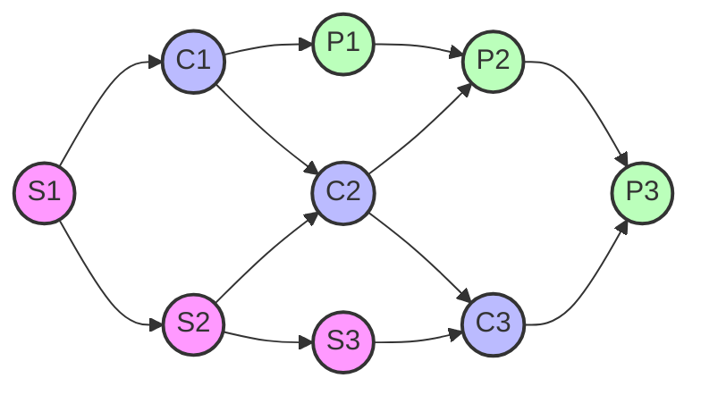

# 系统规划设计师错题集

## 信息化基础知识

### 1. 电子政务应用模式
**题目：** 电子政务的主要应用模式中不包括（ ）。
- A. 政府对政府（Government To Government）
- B. 政府对客户（Government To Customer）
- C. 政府对公务员（Government To Employee）
- D. 政府对企业（Government To Business）

**正确答案：** B

**我的答案：** 错选其他选项

**解析：**
1. 电子政务的标准应用模式包括：
   - G2G（政府对政府）：政府部门间的协作
   - G2E（政府对公务员）：内部管理
   - G2B（政府对企业）：企业服务
   - G2P/G2C（政府对公众/公民）：公共服务

2. 错误原因：
   - "客户"（Customer）是商业领域用语
   - 在政务领域应使用"公民"（Citizen）或"公众"（Public）
   - G2C在这里指Government to Customer而非Government to Citizen

**知识点：**
1. 电子政务标准术语的使用规范
2. 政务领域与商业领域用语的区别
3. 电子政务的四种主要应用模式及其特点

**防错提示：**
- 注意区分政务领域和商业领域的专业术语
- 政府面向普通民众的服务用"公民"或"公众"，不用"客户"
- 记住标准的电子政务应用模式缩写：G2G、G2E、G2B、G2P/G2C(Citizen) 

## 数据库知识

### 1. 关系代数运算
**题目：** 给定关系模式R(A, B, C, D, E)、S(D, E, F, G)和π1,2,4,6(R⋈S)，经过自然连接和投影运算后的属性列数分别为（ ）。
- A. 9和4
- B. 7和4
- C. 9和7
- D. 7和7

**正确答案：** B

**解析：**
1. 自然连接(R⋈S)分析：
   - R有5个属性：A, B, C, D, E
   - S有4个属性：D, E, F, G
   - 共同属性：D, E（2个）
   - 自然连接结果：7个属性（5+4-2=7）

2. 投影运算π1,2,4,6分析：
   - 自然连接后属性顺序：A, B, C, D, E, F, G
   - π1,2,4,6选择4个属性：第1列(A)、第2列(B)、第4列(D)、第6列(F)
   - 最终结果为4列

**知识点：**
1. 自然连接运算规则：结果列数 = R列数 + S列数 - 共同属性数
2. 投影运算规则：结果列数等于指定的属性数
3. 属性的排列顺序

**防错提示：**
- 自然连接时记得减去重复的属性列
- 投影运算的下标是从1开始计数
- 画图辅助理解属性的对应关系 

## 面向对象设计

### 1. 面向对象设计中的类型
**题目：** 在面向对象设计中，（ ）可以实现界面控制、外部接口和环境隔离。（ ）作为完成用例业务的责任承担者，协调、控制其他类共同完成用例规定的功能或行为。

**第一空正确答案：** C. 边界类
**第二空正确答案：** B. 控制类

**知识点：**
1. 面向对象设计中的三种类型：
   - 边界类（Boundary Class）：负责界面控制和外部交互
   - 控制类（Control Class）：负责业务流程控制和协调
   - 实体类（Entity Class）：负责业务数据的存储和管理

2. 各类型的主要职责：
   - 边界类：
     * 实现用户界面
     * 处理外部系统接口
     * 实现环境隔离
   
   - 控制类：
     * 负责业务流程控制
     * 协调其他类的工作
     * 实现用例规定的功能
   
   - 实体类：
     * 存储业务数据
     * 实现业务规则
     * 提供数据服务

**易错点分析：**
1. 容易混淆边界类和控制类的职责：
   - 边界类主要关注"外部交互"
   - 控制类主要关注"内部协调"

2. 容易忽视类之间的协作关系：
   - 边界类通常与控制类协作
   - 控制类协调实体类和边界类

**记忆技巧：**
1. "边界类管边界"：
   - 边（边界类）：负责外部交互
   - 控（控制类）：负责内部控制
   - 实（实体类）：负责数据实现

2. 三类角色比喻：
   - 边界类 = 前台接待（负责接待外部访客）
   - 控制类 = 项目经理（负责协调内部工作）
   - 实体类 = 档案管理员（负责管理核心数据）

**防错提示：**
1. 看到"界面控制"、"外部接口"、"环境隔离"就要想到边界类
2. 看到"协调"、"控制"、"完成用例"就要想到控制类
3. 注意区分"交互控制"和"业务控制"的区别 

## 项目管理

### 1. 项目管理工具
**题目：** 活动定义是项目时间管理中的过程之一，（ ）是进行活动定义时通常使用的一种工具。

**正确答案：** C. 工作分解结构（WBS）

**我的答案：** A. Gantt图

**知识点：**
1. 项目管理中的主要工具：
   - WBS（工作分解结构）：用于活动定义和范围管理
   - Gantt图：用于进度计划和控制
   - PERT图：用于网络计划和关键路径分析
   - 活动图：用于流程和活动的可视化表示

2. 各工具的主要用途：
   - WBS：
     * 将项目分解为可管理的工作包
     * 定义项目活动和任务
     * 建立工作层次结构
   
   - Gantt图：
     * 显示项目进度计划
     * 跟踪任务完成情况
     * 展示任务之间的依赖关系
   
   - PERT图：
     * 展示活动之间的依赖关系
     * 计算关键路径
     * 估算项目完成时间

**易错点分析：**
1. 容易混淆工具的使用场景：
   - WBS用于"定义什么要做"
   - Gantt图用于"展示何时做"
   - PERT图用于"分析如何做"

2. 活动定义阶段的重点：
   - 是确定"做什么"而不是"何时做"
   - 需要分解工作而不是排定进度

**记忆技巧：**
1. "工具用途口诀"：
   - "WBS分解活动要做啥"
   - "甘特进度看时间"
   - "PERT网络找路径"

2. 阶段对应法：
   - 定义阶段 → WBS
   - 计划阶段 → Gantt图
   - 分析阶段 → PERT图

**防错提示：**
1. 活动定义是确定工作内容的过程，应该使用WBS
2. Gantt图是在已经定义好活动之后才使用的工具
3. 不要把进度计划工具和活动定义工具混淆 

## 操作系统

### 1. 并发控制与进程调度
**题目：** 某计算机系统中有一个CPU、一台扫描仪和一台打印机。现有三个图像任务，每个任务有三个程序段：扫描Si、图像处理Ci和打印Pi (i=1, 2, 3)。下图为三个任务各程序段并发执行的前趋图，其中，（ ）可并行执行，（ ）的直接制约，（ ）的间接制约。

**图例说明：**
- 粉色节点(S): 扫描操作，使用扫描仪
- 蓝色节点(C): 图像处理，使用CPU
- 绿色节点(P): 打印操作，使用打印机
- 箭头：表示执行顺序和依赖关系

**详细答案分析：**

#### 第一空：可并行执行的程序段
正确答案：A. "C1S2"，"P1C2S3"，"P2C3"

为什么选A：
1. "C1S2"可以并行，因为：
   - C1使用CPU，S2使用扫描仪，使用不同资源
   - S2只依赖S1完成，不依赖C1
   - 此时S1已完成，满足前置条件

2. "P1C2S3"可以并行，因为：
   - P1使用打印机，C2使用CPU，S3使用扫描仪
   - 三者使用不同的硬件资源
   - 各自的前置条件都满足（P1依赖C1，C2依赖S2，S3依赖S2）

3. "P2C3"可以并行，因为：
   - P2使用打印机，C3使用CPU，资源不冲突
   - P2的前置条件是C2完成
   - C3的前置条件是S3完成

为什么排除其他选项：
- B选项："S2C2P2"不能并行，因为它们是同一任务的连续步骤
- C选项："S1C1P1"不能并行，因为它们有直接依赖关系
- D选项："S1S2S3"不能并行，因为它们都需要使用同一个扫描仪

#### 第二空：直接制约关系
正确答案：C. C1和P1受到S1、C2和P2受到S2、C3和P3受到S3

为什么选C：
1. 直接制约指有直接箭头连接的关系：
   - S1→C1：直接箭头连接
   - S1→P1：通过C1的直接连接
   - S2→C2和P2：同样的直接依赖关系
   - S3→C3和P3：同样的直接依赖关系

2. 这些关系都是在同一任务内部的顺序依赖：
   - 任务1：S1→C1→P1
   - 任务2：S2→C2→P2
   - 任务3：S3→C3→P3

为什么排除其他选项：
- A选项：混淆了直接制约和间接制约
- B选项：颠倒了制约关系的方向
- D选项：描述的是不存在的依赖关系

#### 第三空：间接制约关系
正确答案：B. S2和S3受到S1、C2和C3受到C1、P2和P3受到P1

为什么选B：
1. S2和S3受到S1间接制约：
   - S1→S2→S3形成了一条路径
   - 因为只有一台扫描仪，必须串行使用
   - S1必须先完成，才能执行S2，然后才能执行S3

2. C2和C3受到C1间接制约：
   - C1→C2→C3形成了一条路径
   - 只有一个CPU，必须串行处理
   - C1必须先完成，才能执行C2，然后才能执行C3

3. P2和P3受到P1间接制约：
   - P1→P2→P3形成了一条路径
   - 只有一台打印机，必须串行打印
   - P1必须先完成，才能执行P2，然后才能执行P3

为什么排除其他选项：
- A选项：描述的是直接制约关系
- C选项：制约关系方向错误
- D选项：混淆了任务内的直接依赖关系

**总结要点：**
1. 判断并行执行时要检查：
   - 资源是否冲突（不同类型的操作可以并行）
   - 是否满足前置条件
   - 是否存在直接或间接依赖

2. 判断直接制约时要看：
   - 是否有直接的箭头连接
   - 是否在同一任务流程内

3. 判断间接制约时要看：
   - 是否存在通过其他节点的路径
   - 是否使用同一类资源
   - 整体的执行顺序关系 

## 知识产权

### 1. 软件知识产权保护
**题目：** 赵某购买了一款有注册商标的应用App，擅自复制成光盘出售，其行为是侵犯（ ）的行为。

**正确答案：** B. 软件著作权

**我的答案：** A. 注册商标专用权

**解析：**
1. 本题涉及的行为特征：
   - 购买正版App后复制
   - 制作光盘
   - 用于销售

2. 知识产权分类：
   - 软件著作权：保护软件本身的代码、结构、内容
   - 商标专用权：保护商品的标识、品牌
   - 专利权：保护技术创新
   - 所有权：保护有形载体

3. 错误原因分析：
   - 混淆了商标权和著作权的保护范围
   - 复制和销售软件侵犯的是软件著作权
   - 商标权只保护商标标识的使用权

**知识点：**
1. 软件的知识产权保护体系：
   - 著作权：保护软件的表达形式
   - 专利权：保护软件的技术方案
   - 商标权：保护软件的商业标识
   - 商业秘密：保护未公开的技术信息

2. 软件著作权的保护范围：
   - 软件代码
   - 软件文档
   - 界面设计
   - 操作流程

3. 侵权行为的判定：
   - 未经授权复制
   - 未经许可传播
   - 违法销售
   - 破解保护措施

**记忆技巧：**
1. "三权区分"：
   - 著作权保护内容
   - 商标权保护标识
   - 专利权保护技术

2. 侵权行为对应：
   - 复制传播 → 著作权
   - 仿冒标识 → 商标权
   - 抄袭技术 → 专利权

**防错提示：**
1. 注意区分不同权利的保护范围：
   - 复制软件侵犯著作权
   - 仿冒商标侵犯商标权
   - 抄袭技术侵犯专利权

2. 判断侵权类型时要看：
   - 侵权对象是什么
   - 侵权行为的性质
   - 侵犯的具体权利 

## 软件设计

### 1. 模块化设计原则
**题目：** 关于模块化设计，（ ）是错误的。

**正确答案：** A. 模块是指执行某一特定任务的数据结构和程序代码

**解析：**
1. 选项分析：
   - A选项错误：模块不仅包含数据结构和程序代码，还包括接口定义等
   - B选项正确：接口和功能定义确实属于模块自身的内部特性
   - C选项正确：模块化的目标就是实现高内聚、低耦合
   - D选项正确：每个模块完成相对独立的子功能，简化模块间关系

2. 模块的正确定义：
   - 模块是系统的功能单位
   - 包含接口定义、功能实现、数据结构等
   - 具有相对的独立性
   - 与其他模块通过接口交互

**知识点：**
1. 模块的构成要素：
   - 接口定义
   - 功能实现
   - 数据结构
   - 程序代码
   - 内部算法

2. 模块化设计原则：
   - 高内聚：模块内部功能相关性强
   - 低耦合：模块之间依赖关系弱
   - 信息隐藏：隐藏实现细节
   - 接口规范：定义清晰的交互方式

3. 模块化设计目标：
   - 提高代码重用性
   - 降低系统复杂度
   - 便于维护和修改
   - 支持团队协作

**记忆技巧：**
1. 模块的"五要素"：
   - 接口（对外交互）
   - 功能（实现目标）
   - 数据（信息存储）
   - 代码（具体实现）
   - 算法（处理逻辑）

2. 设计原则口诀：
   - "高内聚低耦合是原则"
   - "接口清晰细节藏"
   - "独立功能要简单"

**防错提示：**
1. 不要把模块等同于代码片段：
   - 模块是功能单位，不仅仅是代码
   - 模块包含多个组成部分
   - 接口定义很重要

2. 判断模块设计的关键：
   - 功能的独立性
   - 接口的规范性
   - 内聚与耦合度 