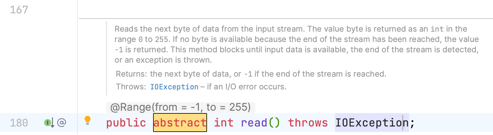
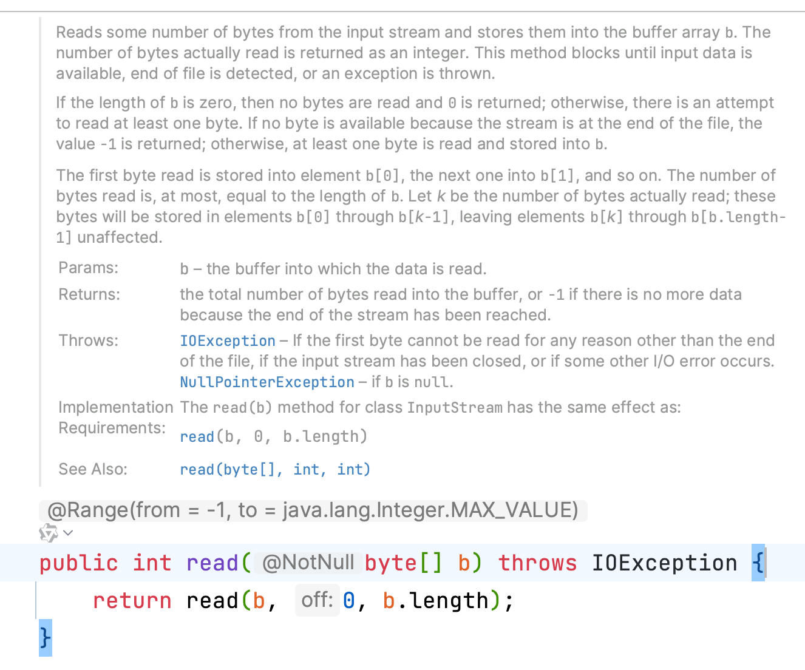
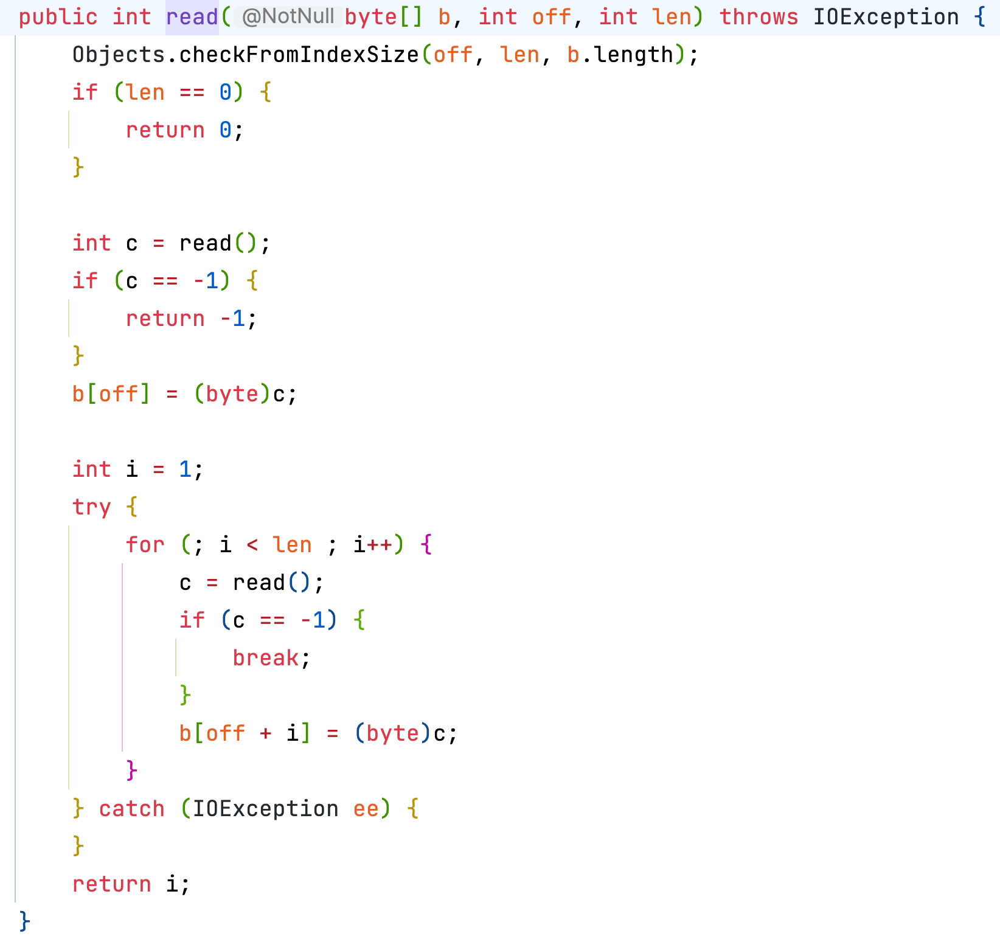
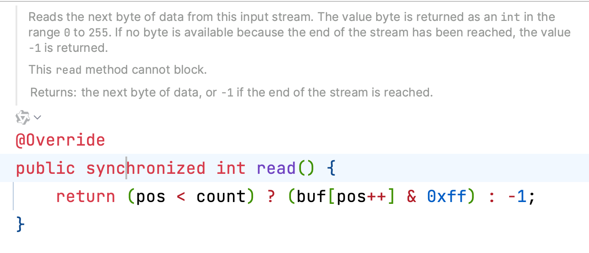
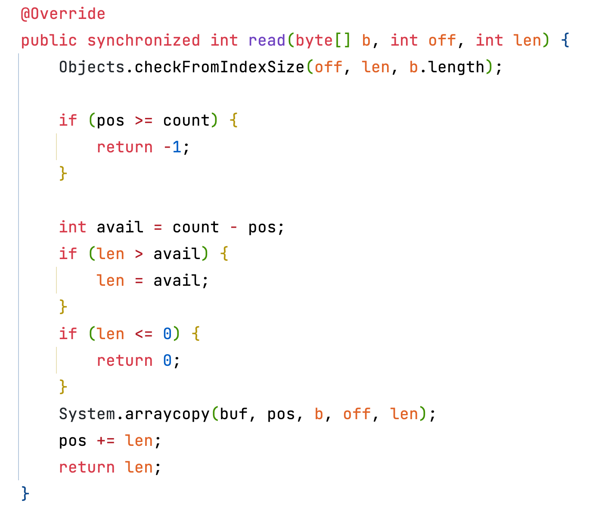

# 【设计模式】模板方法模式

## 目录

[1. 目录](#目录)

[2. 概述](#概述)

[3. 核心思想](#核心思想)

[4. Java标准库中的应用](#java标准库中的应用)

- [4.1 InputStream类示例](#inputstream类示例)

- - [- 核心抽象方法](#核心抽象方法)

- - [- 模板方法实现](#模板方法实现)

- [4.4 具体实现示例](#具体实现示例)

- - [- ByteArrayInputStream](#bytearrayinputstream)

- [4.6 使用示例](#使用示例)

[5. 实践建议](#实践建议)

- [5.1 适用场景](#适用场景)

- [5.2 设计要点](#设计要点)

- [5.3 注意事项](#注意事项)

[6. 与其他模式的关系](#与其他模式的关系)

[7. 总结](#总结)


## 概述

模板方法模式是一种行为型设计模式，它在父类中定义了一个算法的骨架，允许子类在不修改结构的情况下重写特定步骤。这种模式主要用于：
1. 复用代码
2. 固定算法框架
3. 控制子类扩展

## 核心思想

- **复用通用逻辑**：将公共部分定义在父类中
- **定制特殊行为**：子类根据需要实现或重写特定方法
- **保持结构稳定**：算法的整体结构不变，只允许修改特定步骤

## Java标准库中的应用

### InputStream类示例

`java.io.InputStream` 是一个典型的模板方法模式应用。它是所有字节输入流的抽象基类，提供了读取数据的框架。

#### 核心抽象方法



这个抽象的 `read()` 方法定义了单字节读取的接口：
- 返回 0-255 表示读取的字节值
- 返回 -1 表示已到达流末尾

#### 模板方法实现





`read(byte[] b, int off, int len)` 方法展示了典型的模板方法模式：
1. 定义了读取多个字节的算法框架
2. 内部使用抽象的 `read()` 方法
3. 子类只需实现单字节读取，即可获得完整的读取功能

### 具体实现示例

#### FileInputStream

文件输入流的实现：


通过native方法实现底层文件读取。

#### ByteArrayInputStream

内存字节数组输入流的实现：





直接从内存字节数组读取数据。

### 使用示例

```java
// 使用ByteArrayInputStream的示例
byte[] bytes = {1, 2, 3, 4, 5};
InputStream inputStream = new ByteArrayInputStream(bytes);

int data = inputStream.read(); // 读取第一个字节，值为1
while(data != -1) {
    // 处理数据...
    data = inputStream.read(); // 继续读取下一个字节
}
inputStream.close(); // 关闭流
```

## 实践建议

### 适用场景
- 算法的整体步骤固定，但某些步骤的实现可能变化
- 多个类有相似的功能，但细节不同
- 需要控制子类扩展的部分

### 设计要点
- 抽象类中定义算法骨架
- 明确区分必须实现和可选实现的方法
- 考虑使用钩子方法来增加灵活性

### 注意事项
- 避免模板方法过于复杂
- 清晰文档说明每个抽象方法的职责
- 合理使用final关键字防止核心算法被破坏

## 与其他模式的关系

- **策略模式**：模板方法通常和策略模式配合使用
  - 模板方法：定义算法框架
  - 策略模式：实现可变部分

- **工厂模式**：可以使用工厂模式来创建具体的模板实现类

## 总结

模板方法模式是一种强大的代码复用机制，它：
1. 提供了一种代码复用的基础框架
2. 允许在不改变算法结构的情况下定制行为
3. 通过继承来实现，比组合方式更轻量

在实际应用中，模板方法模式常常与其他设计模式（如策略模式、工厂模式）结合使用，以实现更灵活的设计。
