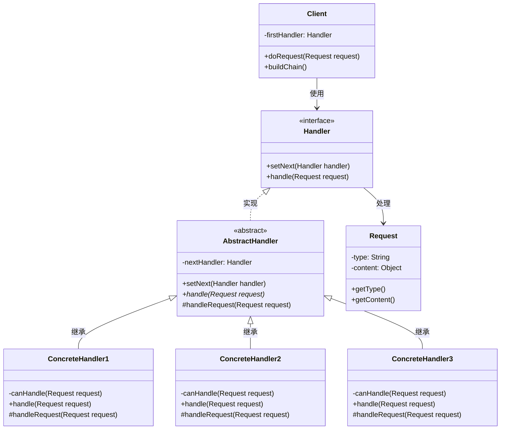
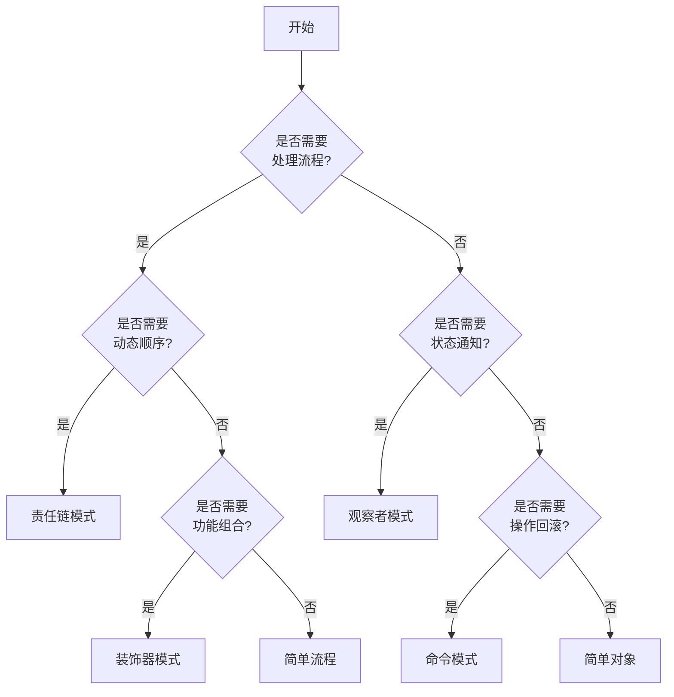
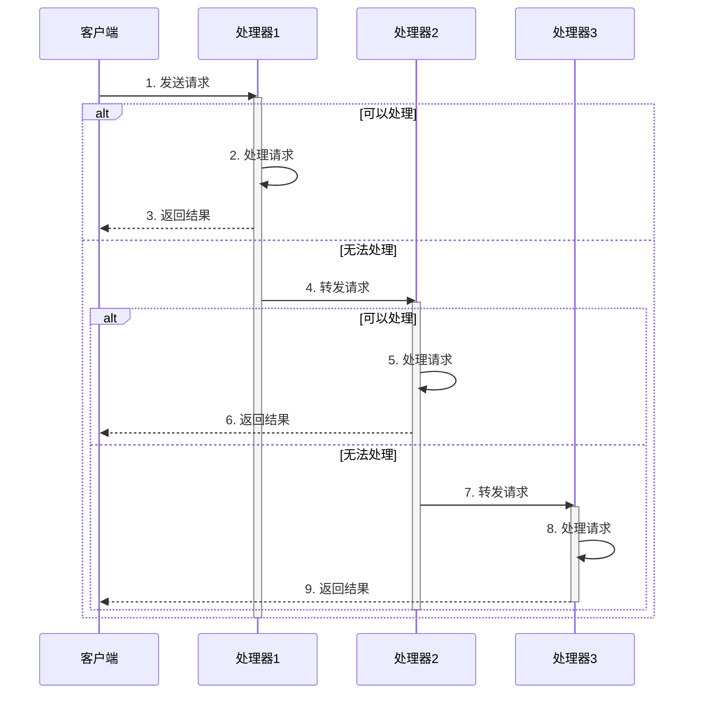
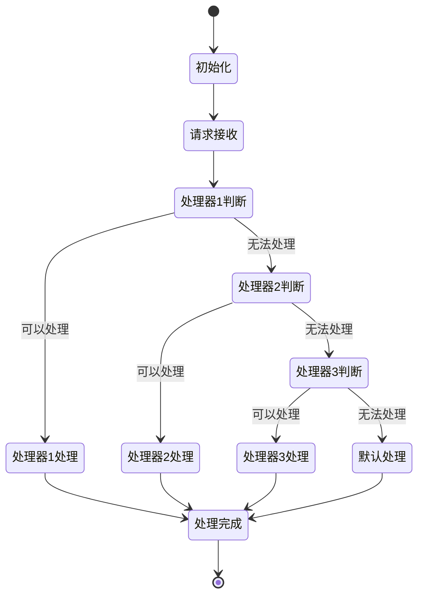
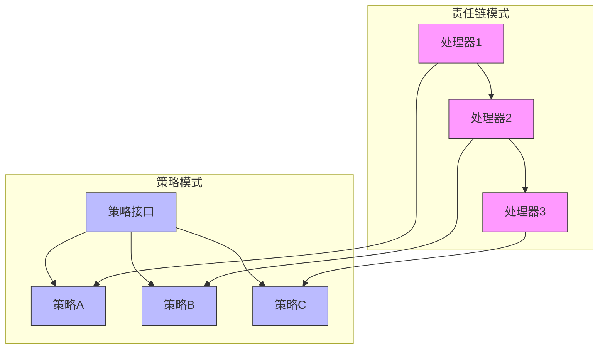
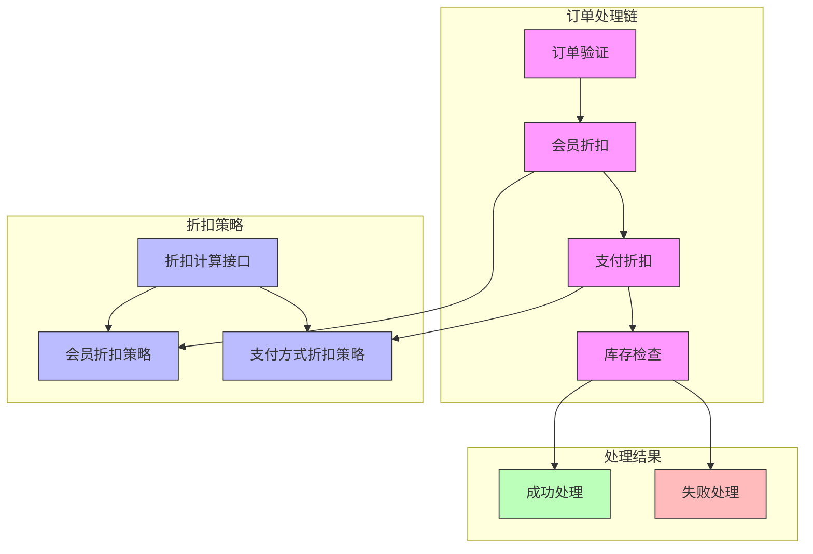
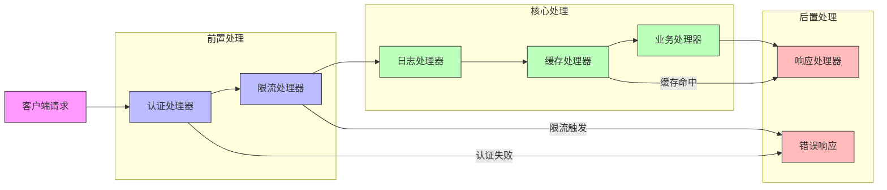

# 责任链模式详解

## 目录
- [一、什么是责任链模式？](#一什么是责任链模式)
  - [核心思想](#核心思想)
  - [应用场景](#应用场景)
  - [类图结构](#类图结构)
- [二、责任链模式的特点](#二责任链模式的特点)
  - [优点](#优点)
  - [缺点](#缺点)
- [三、责任链模式和策略模式结合的意义](#三责任链模式和策略模式结合的意义)
  - [责任链模式的作用](#责任链模式的作用)
  - [策略模式的作用](#策略模式的作用)
  - [结合两者的优势](#结合两者的优势)
- [四、实际应用示例](#四实际应用示例)
  - [1. 日志处理系统](#1-日志处理系统)
  - [2. 请假审批流程](#2-请假审批流程)
  - [3. 订单处理系统（责任链模式 + 策略模式）](#3-订单处理系统责任链模式--策略模式)
  - [4. API网关处理链](#4-api网关处理链)
- [五、最佳实践](#五最佳实践)
  - [1. 设计原则](#1-设计原则)
  - [2. 注意事项](#2-注意事项)
- [六、与其他模式的关系](#六与其他模式的关系)
  - [1. 责任链模式 vs 命令模式](#1-责任链模式-vs-命令模式)
  - [2. 责任链模式 vs 装饰器模式](#2-责任链模式-vs-装饰器模式)
  - [3. 责任链模式 vs 观察者模式](#3-责任链模式-vs-观察者模式)
  - [模式选择指南](#模式选择指南)
  - [混合使用场景](#混合使用场景)
  - [设计模式选择决策树](#设计模式选择决策树)
- [总结](#总结)
  - [1. 实践要点](#1-实践要点)
  - [2. 常见问题与解决方案](#2-常见问题与解决方案)
  - [3. 最佳实践检查清单](#3-最佳实践检查清单)
  - [4. 进阶使用技巧](#4-进阶使用技巧)
  - [5. 未来展望](#5-未来展望)

## 一、什么是责任链模式？

责任链模式（Chain of Responsibility Pattern）是一种行为设计模式，它允许将请求沿着一个处理链传递，直到链中的某个对象处理它。这种模式使得发送者无需知道哪个对象将处理请求，所有的处理对象都可以尝试处理请求或将请求传递给链上的下一个对象。

### 核心思想
- 将请求的发送者与接收者解耦
- 通过让多个对象组成一条链
- 使得请求沿着链传递，直到被处理

### 应用场景

1. **请求的分级处理**
   - 员工请假审批流程（组长→经理→总监→总经理）
   - 系统日志分级处理（Debug→Info→Warning→Error）
   - 消息通知的多级发送（邮件→短信→微信→电话）

2. **过滤器链**
   - Web 应用的请求过滤（认证→授权→日志→性能监控）
   - 数据清洗流程（格式验证→内容过滤→敏感词处理）
   - 图片处理链（裁剪→压缩→水印→格式转换）

3. **异常处理链**
   - 多级异常捕获处理
   - 降级策略处理
   - 补偿机制处理

### 类图结构



类图说明：
1. `Handler`：定义处理请求的接口
   - `setNext`：设置下一个处理器
   - `handle`：处理请求的方法

2. `AbstractHandler`：提供处理器的基本实现
   - 维护对下一个处理器的引用
   - 实现链的组装逻辑
   - 提供模板方法 handleRequest 供子类实现具体处理逻辑

3. `ConcreteHandler`：具体处理器
   - 实现实际的处理逻辑
   - 决定是处理请求还是传递给下一个
   - 包含处理条件判断方法 canHandle

4. `Request`：请求对象
   - 封装请求的类型和内容
   - 提供获取请求信息的方法

5. `Client`：客户端
   - 组装责任链
   - 向链上的第一个处理器发送请求
   - 负责构建和初始化责任链

## 二、责任链模式的特点

1. **解耦请求发出者和处理者**
   - 请求的发送者不需要知道具体的处理者
   - 增强了系统的灵活性和扩展性
   - 避免了请求发送者与接收者之间的耦合关系

2. **动态组合处理逻辑**
   - 可以根据需要动态改变链的结构
   - 添加或移除处理者更加灵活
   - 支持运行时动态调整处理顺序

3. **职责单一**
   - 每个处理器只关注自己的处理逻辑
   - 每个处理器职责明确，便于维护
   - 符合单一职责原则
   - 便于进行单元测试

4. **可扩展性**
   - 新增处理器只需实现统一接口
   - 不需要修改现有代码，符合开闭原则
   - 可以灵活地新增或删除处理器

5. **清晰的流程**
   - 请求处理过程清晰可见
   - 便于理解和维护
   - 方便进行流程的监控和管理

### 优点

1. **降低耦合度**
   - 请求发送者和接收者解耦
   - 处理器之间互不依赖
   - 链中的处理器可以独立变化

2. **简化对象间的关系**
   - 避免多重条件判断
   - 每个处理器只需关注自己的处理逻辑
   - 责任链简化了对象之间的相互调用关系

3. **增强了给对象指派职责的灵活性**
   - 可以动态地改变链内的成员或者调动它们的次序
   - 允许动态地新增或者删除责任
   - 便于各类责任的分配和组合

4. **责任分担**
   - 每个处理器承担自己的责任
   - 可以将复杂的处理过程分解成多个独立的处理步骤
   - 有利于代码的复用和维护

### 缺点

1. **性能问题**
   - 请求可能需要遍历整个链才能得到处理
   - 责任链过长会影响性能
   - 需要合理控制责任链的长度

2. **请求可能无人处理**
   - 可能出现某个请求得不到处理的情况
   - 需要设置合适的默认处理器
   - 建议在链尾添加保底的处理器

3. **调试不便**
   - 责任链过长时，调试排错较为困难
   - 需要添加适当的日志记录
   - 建议实现请求处理过程的可视化

4. **不易观察运行时特征**
   - 责任链的构建和执行过程比较隐蔽
   - 需要额外的监控机制
   - 建议添加链路追踪功能

## 三、责任链模式和策略模式结合的意义

### 责任链模式的作用
- 用于动态处理请求
- 将多个处理逻辑串联起来
- 实现请求的分级处理
- 支持处理器的动态组合

### 策略模式的作用
- 用于封装一组算法
- 在运行时动态选择需要的算法
- 实现算法的可替换性
- 支持新算法的快速添加

### 结合两者的优势

1. **灵活的处理流程**
   - 责任链定义处理流程
   - 策略模式定义具体算法
   - 两种模式互相补充

2. **高度的可定制性**
   - 可以动态调整处理流程
   - 可以动态切换处理策略
   - 支持复杂业务场景

3. **良好的扩展性**
   - 新增处理器方便
   - 新增策略算法简单
   - 不影响现有代码

4. **更好的代码组织**
   - 处理流程清晰
   - 算法封装完整
   - 职责划分明确

## 四、实际应用示例

### 1. 日志处理系统

```java
/**
 * 日志级别枚举
 * 定义了系统支持的不同日志级别，从低到高分别是：INFO、DEBUG、WARNING、ERROR
 */
public enum LogLevel {
    INFO(1),    // 普通信息日志
    DEBUG(2),   // 调试信息日志
    WARNING(3), // 警告信息日志
    ERROR(4);   // 错误信息日志
    
    private int level; // 日志级别的数值表示
    
    /**
     * 构造函数
     * @param level 日志级别的数值
     */
    LogLevel(int level) {
        this.level = level;
    }
    
    /**
     * 获取日志级别的数值
     * @return 日志级别数值
     */
    public int getLevel() {
        return level;
    }
}

/**
 * 日志处理器抽象类
 * 定义了日志处理器的基本行为和责任链的组装方法
 */
public abstract class LogHandler {
    protected LogLevel level;        // 当前处理器的日志级别
    protected LogHandler nextHandler; // 责任链中的下一个处理器
    
    /**
     * 构造函数
     * @param level 处理器的日志级别
     */
    public LogHandler(LogLevel level) {
        this.level = level;
    }
    
    /**
     * 设置责任链中的下一个处理器
     * @param handler 下一个处理器
     * @return 返回下一个处理器，便于链式调用
     */
    public LogHandler setNext(LogHandler handler) {
        this.nextHandler = handler;
        return handler;
    }
    
    /**
     * 处理日志的方法
     * 如果日志级别满足要求，则进行处理
     * 如果存在下一个处理器，则将日志传递给下一个处理器
     * 
     * @param message 日志消息
     * @param messageLevel 日志级别
     */
    public void handleLog(String message, LogLevel messageLevel) {
        // 判断是否需要处理该级别的日志
        if (messageLevel.getLevel() >= this.level.getLevel()) {
            write(message);
        }
        
        // 传递给下一个处理器
        if (nextHandler != null) {
            nextHandler.handleLog(message, messageLevel);
        }
    }
    
    /**
     * 抽象方法：实际的日志写入操作
     * 由具体的处理器实现类来定义具体的日志写入方式
     * 
     * @param message 要写入的日志消息
     */
    protected abstract void write(String message);
}

/**
 * 控制台日志处理器
 * 将日志输出到控制台
 */
public class ConsoleLogHandler extends LogHandler {
    /**
     * 构造函数
     * @param level 处理器的日志级别
     */
    public ConsoleLogHandler(LogLevel level) {
        super(level);
    }
    
    @Override
    protected void write(String message) {
        System.out.println("Console::Logger: " + message);
    }
}

/**
 * 文件日志处理器
 * 将日志写入文件
 */
public class FileLogHandler extends LogHandler {
    /**
     * 构造函数
     * @param level 处理器的日志级别
     */
    public FileLogHandler(LogLevel level) {
        super(level);
    }
    
    @Override
    protected void write(String message) {
        // 实际应用中这里应该将日志写入文件
        System.out.println("File::Logger: " + message);
    }
}

/**
 * 邮件日志处理器
 * 将日志通过邮件发送
 */
public class EmailLogHandler extends LogHandler {
    /**
     * 构造函数
     * @param level 处理器的日志级别
     */
    public EmailLogHandler(LogLevel level) {
        super(level);
    }
    
    @Override
    protected void write(String message) {
        // 实际应用中这里应该发送邮件
        System.out.println("Email::Logger: " + message);
    }
}

/**
 * 日志处理系统的客户端示例
 * 展示如何组装和使用日志处理责任链
 */
public class LoggerClient {
    public static void main(String[] args) {
        // 1. 创建不同的日志处理器
        LogHandler consoleLogger = new ConsoleLogHandler(LogLevel.INFO);    // 处理所有级别的日志
        LogHandler fileLogger = new FileLogHandler(LogLevel.DEBUG);         // 处理DEBUG及以上级别的日志
        LogHandler emailLogger = new EmailLogHandler(LogLevel.ERROR);       // 只处理ERROR级别的日志
        
        // 2. 组装责任链
        consoleLogger.setNext(fileLogger).setNext(emailLogger);
        
        // 3. 测试不同级别的日志
        // 3.1 测试INFO级别（会输出到控制台）
        consoleLogger.handleLog("普通信息日志", LogLevel.INFO);
        
        // 3.2 测试DEBUG级别（会输出到控制台和文件）
        consoleLogger.handleLog("调试信息日志", LogLevel.DEBUG);
        
        // 3.3 测试ERROR级别（会输出到控制台、文件和邮件）
        consoleLogger.handleLog("错误信息日志", LogLevel.ERROR);
    }
}
```

### 2. 请假审批流程

```java
/**
 * 请假申请实体类
 * 封装请假申请的基本信息，包括员工姓名、请假天数和请假原因
 */
public class LeaveRequest {
    private String employeeName;  // 申请人姓名
    private int leaveDays;       // 请假天数
    private String reason;       // 请假原因
    
    /**
     * 构造函数
     * @param employeeName 员工姓名
     * @param leaveDays 请假天数
     * @param reason 请假原因
     */
    public LeaveRequest(String employeeName, int leaveDays, String reason) {
        this.employeeName = employeeName;
        this.leaveDays = leaveDays;
        this.reason = reason;
    }
    
    // getter方法
    public String getEmployeeName() {
        return employeeName;
    }
    
    public int getLeaveDays() {
        return leaveDays;
    }
    
    public String getReason() {
        return reason;
    }
}

/**
 * 审批处理器抽象类
 * 定义了请假审批的基本行为和责任链的组装方法
 */
public abstract class ApproveHandler {
    protected ApproveHandler nextHandler;  // 责任链中的下一个处理器
    protected int maxDays;                 // 当前处理器的最大审批天数
    
    /**
     * 构造函数
     * @param maxDays 当前处理级别可以审批的最大天数
     */
    public ApproveHandler(int maxDays) {
        this.maxDays = maxDays;
    }
    
    /**
     * 设置责任链中的下一个处理器
     * @param nextHandler 下一个处理器
     */
    public void setNextHandler(ApproveHandler nextHandler) {
        this.nextHandler = nextHandler;
    }
    
    /**
     * 处理请假申请
     * 如果请假天数在当前处理器的权限范围内，则直接审批
     * 否则将请求转发给下一个处理器
     * 
     * @param request 请假申请
     */
    public void handleRequest(LeaveRequest request) {
        if (request.getLeaveDays() <= maxDays) {
            // 在当前处理器的权限范围内，直接审批
            approve(request);
        } else if (nextHandler != null) {
            // 超出当前处理器的权限范围，转发给下一个处理器
            nextHandler.handleRequest(request);
        } else {
            // 没有下一个处理器且超出权限范围，则拒绝请求
            System.out.println("请假天数过多，无法审批");
        }
    }
    
    /**
     * 抽象方法：实际的审批操作
     * 由具体的处理器实现类来定义具体的审批逻辑
     * 
     * @param request 请假申请
     */
    protected abstract void approve(LeaveRequest request);
}

/**
 * 团队领导审批处理器
 * 可以处理3天以内的请假申请
 */
public class TeamLeader extends ApproveHandler {
    /**
     * 构造函数
     * 设置团队领导的审批权限为3天
     */
    public TeamLeader() {
        super(3); // 3天以内的请假申请
    }
    
    @Override
    protected void approve(LeaveRequest request) {
        System.out.println("团队领导审批通过：" + request.getEmployeeName() + 
                          "请假" + request.getLeaveDays() + "天，原因：" + request.getReason());
    }
}

/**
 * 部门经理审批处理器
 * 可以处理7天以内的请假申请
 */
public class Manager extends ApproveHandler {
    /**
     * 构造函数
     * 设置部门经理的审批权限为7天
     */
    public Manager() {
        super(7); // 7天以内的请假申请
    }
    
    @Override
    protected void approve(LeaveRequest request) {
        System.out.println("部门经理审批通过：" + request.getEmployeeName() + 
                          "请假" + request.getLeaveDays() + "天，原因：" + request.getReason());
    }
}

/**
 * 总监审批处理器
 * 可以处理15天以内的请假申请
 */
public class Director extends ApproveHandler {
    /**
     * 构造函数
     * 设置总监的审批权限为15天
     */
    public Director() {
        super(15); // 15天以内的请假申请
    }
    
    @Override
    protected void approve(LeaveRequest request) {
        System.out.println("总监审批通过：" + request.getEmployeeName() + 
                          "请假" + request.getLeaveDays() + "天，原因：" + request.getReason());
    }
}

/**
 * 请假审批系统测试类
 * 展示如何组装和使用请假审批责任链
 */
public class LeaveApprovalTest {
    public static void main(String[] args) {
        // 1. 创建各级审批处理器
        ApproveHandler teamLeader = new TeamLeader();
        ApproveHandler manager = new Manager();
        ApproveHandler director = new Director();
        
        // 2. 组装责任链
        // 团队领导 -> 部门经理 -> 总监
        teamLeader.setNextHandler(manager);
        manager.setNextHandler(director);
        
        // 3. 创建测试用的请假申请
        LeaveRequest request1 = new LeaveRequest("张三", 2, "事假");  // 由团队领导审批
        LeaveRequest request2 = new LeaveRequest("李四", 5, "病假");  // 由部门经理审批
        LeaveRequest request3 = new LeaveRequest("王五", 10, "婚假"); // 由总监审批
        
        // 4. 处理请假申请
        System.out.println("===处理第一个请假申请===");
        teamLeader.handleRequest(request1);
        
        System.out.println("\n===处理第二个请假申请===");
        teamLeader.handleRequest(request2);
        
        System.out.println("\n===处理第三个请假申请===");
        teamLeader.handleRequest(request3);
    }
}
```

### 3. 订单处理系统（责任链模式 + 策略模式）

```java
/**
 * 订单实体类
 * 封装订单的基本信息，包括订单ID、金额、支付方式和会员类型
 * 
 * @author Your Name
 * @version 1.0
 * @since 2024-01-01
 */
public class Order {
    private String orderId;      // 订单唯一标识，用于在系统中唯一确定一个订单
    private double amount;       // 订单金额，表示订单的实际支付金额
    private String paymentType;  // 支付方式，可选值：ALIPAY（支付宝）/WECHAT（微信）/CREDIT_CARD（信用卡）
    private String memberType;   // 会员类型，可选值：GOLD（金牌）/SILVER（银牌）/NORMAL（普通）
    
    /**
     * 订单构造函数
     * 创建一个新的订单实例，初始化订单的基本信息
     *
     * @param orderId 订单ID，必须唯一
     * @param amount 订单金额，必须大于0
     * @param paymentType 支付方式，不能为空
     * @param memberType 会员类型，不能为空
     * @throws IllegalArgumentException 如果参数不合法则抛出异常
     */
    public Order(String orderId, double amount, String paymentType, String memberType) {
        // 参数校验
        if (orderId == null || orderId.trim().isEmpty()) {
            throw new IllegalArgumentException("订单ID不能为空");
        }
        if (amount <= 0) {
            throw new IllegalArgumentException("订单金额必须大于0");
        }
        if (paymentType == null || memberType == null) {
            throw new IllegalArgumentException("支付方式和会员类型不能为空");
        }
        
        this.orderId = orderId;
        this.amount = amount;
        this.paymentType = paymentType;
        this.memberType = memberType;
    }
    
    // ... 其他代码保持不变 ...
}

/**
 * 折扣策略接口
 * 定义计算折扣的标准行为，所有具体的折扣策略都必须实现此接口
 * 
 * @author Your Name
 * @version 1.0
 * @since 2024-01-01
 */
public interface DiscountStrategy {
    /**
     * 计算折扣
     * 根据订单信息计算适用的折扣率
     *
     * @param order 需要计算折扣的订单对象，不能为null
     * @return 折扣率，范围在0.0到1.0之间，1.0表示不打折，0.8表示8折
     * @throws IllegalArgumentException 如果订单对象为null
     */
    double calculateDiscount(Order order);
}

/**
 * 会员折扣策略实现类
 * 根据会员等级提供不同的折扣率
 */
public class MemberDiscountStrategy implements DiscountStrategy {
    @Override
    public double calculateDiscount(Order order) {
        // 根据会员类型返回对应的折扣率
        switch (order.getMemberType()) {
            case "GOLD":
                return 0.8; // 金牌会员8折
            case "SILVER":
                return 0.9; // 银牌会员9折
            default:
                return 1.0; // 普通会员不打折
        }
    }
}

/**
 * 支付方式折扣策略实现类
 * 根据不同的支付方式提供相应的折扣
 */
public class PaymentDiscountStrategy implements DiscountStrategy {
    @Override
    public double calculateDiscount(Order order) {
        // 根据支付方式返回对应的折扣率
        switch (order.getPaymentType()) {
            case "ALIPAY":
            case "WECHAT":
                return 0.95; // 移动支付95折
            case "CREDIT_CARD":
                return 0.98; // 信用卡98折
            default:
                return 1.0;  // 其他方式不打折
        }
    }
}

/**
 * 订单处理器接口
 * 定义责任链中处理器的标准行为
 */
public interface OrderHandler {
    /**
     * 设置责任链中的下一个处理器
     * @param next 下一个处理器
     */
    void setNext(OrderHandler next);
    
    /**
     * 处理订单
     * @param order 需要处理的订单
     */
    void handle(Order order);
}

/**
 * 抽象订单处理器
 * 提供订单处理器的基础实现
 */
public abstract class AbstractOrderHandler implements OrderHandler {
    protected OrderHandler next;           // 责任链中的下一个处理器
    protected DiscountStrategy strategy;   // 折扣计算策略
    
    /**
     * 构造函数
     * @param strategy 折扣计算策略
     */
    public AbstractOrderHandler(DiscountStrategy strategy) {
        this.strategy = strategy;
    }
    
    @Override
    public void setNext(OrderHandler next) {
        this.next = next;
    }
    
    /**
     * 将订单传递给下一个处理器
     * @param order 需要传递的订单
     */
    protected void moveToNext(Order order) {
        if (next != null) {
            next.handle(order);
        }
    }
}

/**
 * 会员折扣处理器
 * 负责处理会员相关的折扣计算
 */
public class MemberDiscountHandler extends AbstractOrderHandler {
    public MemberDiscountHandler(DiscountStrategy strategy) {
        super(strategy);
    }
    
    @Override
    public void handle(Order order) {
        // 计算会员折扣
        double discount = strategy.calculateDiscount(order);
        System.out.println("会员折扣处理: " + order.getOrderId() + 
                          ", 折扣率: " + discount);
        // 传递给下一个处理器
        moveToNext(order);
    }
}

/**
 * 支付方式折扣处理器
 * 负责处理支付方式相关的折扣计算
 */
public class PaymentDiscountHandler extends AbstractOrderHandler {
    public PaymentDiscountHandler(DiscountStrategy strategy) {
        super(strategy);
    }
    
    @Override
    public void handle(Order order) {
        // 计算支付方式折扣
        double discount = strategy.calculateDiscount(order);
        System.out.println("支付方式折扣处理: " + order.getOrderId() + 
                          ", 折扣率: " + discount);
        // 传递给下一个处理器
        moveToNext(order);
    }
}

/**
 * 订单验证处理器
 * 负责验证订单的基本信息
 */
public class OrderValidationHandler extends AbstractOrderHandler {
    public OrderValidationHandler() {
        super(null); // 验证处理器不需要折扣策略
    }
    
    @Override
    public void handle(Order order) {
        // 验证订单金额
        if (order.getAmount() <= 0) {
            throw new IllegalArgumentException("订单金额必须大于0");
        }
        System.out.println("订单验证通过: " + order.getOrderId());
        // 传递给下一个处理器
        moveToNext(order);
    }
}

/**
 * 订单处理器客户端
 * 负责组装和管理订单处理责任链
 */
public class OrderProcessor {
    private OrderHandler firstHandler; // 责任链的第一个处理器
    
    /**
     * 构造函数
     * 初始化并组装订单处理责任链
     */
    public OrderProcessor() {
        // 创建折扣策略
        DiscountStrategy memberStrategy = new MemberDiscountStrategy();
        DiscountStrategy paymentStrategy = new PaymentDiscountStrategy();
        
        // 创建处理器
        OrderHandler validationHandler = new OrderValidationHandler();
        OrderHandler memberHandler = new MemberDiscountHandler(memberStrategy);
        OrderHandler paymentHandler = new PaymentDiscountHandler(paymentStrategy);
        
        // 组装责任链
        validationHandler.setNext(memberHandler);
        memberHandler.setNext(paymentHandler);
        
        this.firstHandler = validationHandler;
    }
    
    /**
     * 处理订单
     * @param order 需要处理的订单
     */
    public void processOrder(Order order) {
        firstHandler.handle(order);
    }
}

/**
 * 订单处理系统使用示例
 */
public class OrderProcessingExample {
    public static void main(String[] args) {
        // 创建订单处理器
        OrderProcessor processor = new OrderProcessor();
        
        // 创建测试订单
        Order order1 = new Order("ORDER001", 100.0, "ALIPAY", "GOLD");
        Order order2 = new Order("ORDER002", 200.0, "WECHAT", "SILVER");
        Order order3 = new Order("ORDER003", 300.0, "CREDIT_CARD", "NORMAL");
        
        // 处理订单
        System.out.println("处理订单1:");
        processor.processOrder(order1);
        
        System.out.println("\n处理订单2:");
        processor.processOrder(order2);
        
        System.out.println("\n处理订单3:");
        processor.processOrder(order3);
    }
}
```

### 4. API网关处理链

```java
/**
 * 请求上下文类
 * 封装API请求的上下文信息，包括请求数据、处理状态等
 */
public class RequestContext {
    private String requestId;        // 请求唯一标识
    private String path;            // 请求路径
    private Map<String, String> headers;    // 请求头
    private String body;            // 请求体
    private Map<String, Object> attributes; // 请求属性，用于在处理器间传递数据
    
    // 构造函数和getter/setter方法
}

/**
 * 网关处理器接口
 * 定义API网关中处理器的标准行为
 */
public interface GatewayHandler {
    /**
     * 设置下一个处理器
     * @param next 下一个处理器
     * @return 返回下一个处理器，支持链式调用
     */
    GatewayHandler setNext(GatewayHandler next);
    
    /**
     * 处理请求
     * @param context 请求上下文
     * @return 处理结果，true表示继续处理，false表示中断处理链
     */
    boolean handle(RequestContext context);
}

/**
 * 认证处理器
 * 负责验证请求的认证信息
 */
public class AuthenticationHandler implements GatewayHandler {
    private GatewayHandler next;
    
    @Override
    public GatewayHandler setNext(GatewayHandler next) {
        this.next = next;
        return next;
    }
    
    @Override
    public boolean handle(RequestContext context) {
        String token = context.getHeaders().get("Authorization");
        if (token == null || !validateToken(token)) {
            throw new SecurityException("未授权的访问");
        }
        
        // 认证通过，继续处理
        return next != null && next.handle(context);
    }
    
    private boolean validateToken(String token) {
        // 实现token验证逻辑
        return true;
    }
}

/**
 * 限流处理器
 * 实现请求的限流控制
 */
public class RateLimitHandler implements GatewayHandler {
    private GatewayHandler next;
    private RateLimiter rateLimiter;
    
    public RateLimitHandler() {
        // 创建限流器，例如每秒允许100个请求
        this.rateLimiter = RateLimiter.create(100.0);
    }
    
    @Override
    public GatewayHandler setNext(GatewayHandler next) {
        this.next = next;
        return next;
    }
    
    @Override
    public boolean handle(RequestContext context) {
        if (!rateLimiter.tryAcquire()) {
            throw new RuntimeException("请求过于频繁，请稍后重试");
        }
        
        // 限流检查通过，继续处理
        return next != null && next.handle(context);
    }
}

/**
 * 日志处理器
 * 记录请求的处理日志
 */
public class LoggingHandler implements GatewayHandler {
    private GatewayHandler next;
    
    @Override
    public GatewayHandler setNext(GatewayHandler next) {
        this.next = next;
        return next;
    }
    
    @Override
    public boolean handle(RequestContext context) {
        // 记录请求开始
        System.out.println("Processing request: " + context.getRequestId());
        
        // 继续处理
        boolean result = next != null && next.handle(context);
        
        // 记录请求结束
        System.out.println("Finished processing request: " + context.getRequestId());
        
        return result;
    }
}

/**
 * API网关示例
 * 展示如何在API网关中使用责任链模式
 */
public class ApiGateway {
    private GatewayHandler firstHandler;
    
    public ApiGateway() {
        // 构建处理链
        firstHandler = new LoggingHandler();
        firstHandler
            .setNext(new AuthenticationHandler())
            .setNext(new RateLimitHandler());
    }
    
    public void handleRequest(RequestContext context) {
        try {
            firstHandler.handle(context);
        } catch (Exception e) {
            System.err.println("Error processing request: " + e.getMessage());
            // 处理异常，返回错误响应
        }
    }
    
    public static void main(String[] args) {
        ApiGateway gateway = new ApiGateway();
        
        // 创建请求上下文
        RequestContext context = new RequestContext();
        context.setRequestId("REQ-001");
        context.setPath("/api/users");
        Map<String, String> headers = new HashMap<>();
        headers.put("Authorization", "Bearer token123");
        context.setHeaders(headers);
        
        // 处理请求
        gateway.handleRequest(context);
    }
}
```

## 五、最佳实践

### 1. 设计原则

1. **链的构建**
   - 合理设计处理器的职责范围
   - 控制责任链的长度
   - 注意处理器的执行顺序

2. **性能考虑**
   - 避免过长的责任链
   - 可以在合适位置设置中断条件
   - 考虑请求的处理效率

3. **异常处理**
   - 设置默认的处理器
   - 完善异常处理机制
   - 添加必要的日志记录

4. **扩展性设计**
   - 预留扩展接口
   - 使用配置文件管理责任链
   - 支持动态调整处理器

### 2. 注意事项

1. **避免循环引用**
   - 责任链中不能形成环
   - 注意处理器之间的引用关系
   - 实现环路检测机制

2. **合理使用终止条件**
   - 设置适当的处理终止条件
   - 避免请求无限传递
   - 控制处理器的执行次数

3. **状态维护**
   - 注意处理器的状态管理
   - 避免状态混乱
   - 实现状态重置机制

4. **调试与监控**
   - 实现请求处理的可视化
   - 添加必要的监控点
   - 完善日志记录

## 六、与其他模式的关系

### 1. 责任链模式 vs 命令模式

#### 业务场景：文档处理系统

**责任链模式实现：**
```java
/**
 * 文档处理器接口
 * 定义了责任链中处理器的标准行为
 */
public interface DocumentHandler {
    /**
     * 设置下一个处理器
     * @param next 下一个处理器
     */
    void setNext(DocumentHandler next);
    
    /**
     * 处理文档的方法
     * @param doc 需要处理的文档
     */
    void handle(Document doc);
}

/**
 * 拼写检查处理器
 * 责任链中的第一个处理器，负责文档的拼写检查
 */
public class SpellCheckHandler implements DocumentHandler {
    // 下一个处理器的引用
    private DocumentHandler next;
    
    @Override
    public void setNext(DocumentHandler next) {
        this.next = next;
    }
    
    @Override
    public void handle(Document doc) {
        // 1. 执行当前处理器的拼写检查逻辑
        System.out.println("执行拼写检查");
        
        // 2. 如果有下一个处理器，则将文档传递给它
        if (next != null) {
            next.handle(doc);
        }
    }
}

/**
 * 格式化处理器
 * 责任链中的第二个处理器，负责文档的格式化
 */
public class FormatHandler implements DocumentHandler {
    private DocumentHandler next;
    
    @Override
    public void setNext(DocumentHandler next) {
        this.next = next;
    }
    
    @Override
    public void handle(Document doc) {
        // 1. 执行当前处理器的格式化逻辑
        System.out.println("执行格式化");
        
        // 2. 如果有下一个处理器，则将文档传递给它
        if (next != null) {
            next.handle(doc);
        }
    }
}

// 使用示例
public class ResponsibilityChainExample {
    public static void main(String[] args) {
        // 1. 创建处理器实例
        DocumentHandler spellChecker = new SpellCheckHandler();
        DocumentHandler formatter = new FormatHandler();
        
        // 2. 组装责任链
        spellChecker.setNext(formatter);
        
        // 3. 开始处理文档
        spellChecker.handle(new Document());
        // 输出：
        // 执行拼写检查
        // 执行格式化
    }
}
```

**命令模式实现：**

```java
/**
 * 文档命令接口
 * 定义了命令的标准行为
 */
public interface DocumentCommand {
    /**
     * 执行命令的方法
     */
    void execute();
}

/**
 * 拼写检查命令
 * 将拼写检查操作封装为一个命令对象
 */
public class SpellCheckCommand implements DocumentCommand {
    // 持有对文档的引用
    private Document document;
    
    public SpellCheckCommand(Document document) {
        this.document = document;
    }
    
    @Override
    public void execute() {
        // 执行拼写检查的具体逻辑
        System.out.println("执行拼写检查");
    }
}

/**
 * 格式化命令
 * 将格式化操作封装为一个命令对象
 */
public class FormatCommand implements DocumentCommand {
    private Document document;
    
    public FormatCommand(Document document) {
        this.document = document;
    }
    
    @Override
    public void execute() {
        // 执行格式化的具体逻辑
        System.out.println("执行格式化");
    }
}

/**
 * 文档处理器
 * 负责管理和执行一系列文档处理命令
 */
public class DocumentProcessor {
    // 存储所有待执行的命令
    private List<DocumentCommand> commands = new ArrayList<>();
    
    /**
     * 添加命令到处理队列
     * @param command 要添加的命令
     */
    public void addCommand(DocumentCommand command) {
        commands.add(command);
    }
    
    /**
     * 执行所有命令
     * 按照添加顺序依次执行命令
     */
    public void processDocument() {
        for (DocumentCommand command : commands) {
            command.execute();
        }
    }
}

// 使用示例
public class CommandPatternExample {
    public static void main(String[] args) {
        // 1. 创建文档对象
        Document doc = new Document();
        
        // 2. 创建命令处理器
        DocumentProcessor processor = new DocumentProcessor();
        
        // 3. 创建并添加命令
        processor.addCommand(new SpellCheckCommand(doc));
        processor.addCommand(new FormatCommand(doc));
        
        // 4. 执行所有命令
        processor.processDocument();
        // 输出：
        // 执行拼写检查
        // 执行格式化
    }
}
```

**两种模式的主要区别：**

1. **责任链模式特点：**
   - 处理流程是线性的，按照链的顺序依次处理
   - 每个处理器知道下一个处理器是谁
   - 处理器可以决定是否继续传递请求
   - 适合处理有明确顺序和依赖关系的流程

2. **命令模式特点：**
   - 将每个操作封装为独立的命令对象
   - 命令之间相互独立，不知道其他命令的存在
   - 可以灵活地组合和排序命令
   - 支持命令的撤销、重做、日志记录等操作

3. **使用场景对比：**
   - 责任链模式：适用于处理流程固定，且处理器之间有依赖关系的场景
   - 命令模式：适用于需要将操作参数化，支持撤销/重做，或需要将命令序列化的场景

### 2. 责任链模式 vs 装饰器模式

#### 业务场景：数据处理流水线

**责任链模式实现：**

```java
/**
 * 数据处理器接口
 * 定义了责任链中数据处理器的标准行为
 */
public interface DataHandler {
    /**
     * 设置责任链中的下一个处理器
     * @param next 下一个处理器
     */
    void setNext(DataHandler next);
    
    /**
     * 处理数据的方法
     * @param data 需要处理的数据
     */
    void processData(String data);
}

/**
 * 压缩处理器
 * 责任链中负责数据压缩的处理器
 */
public class CompressionHandler implements DataHandler {
    private DataHandler next; // 下一个处理器的引用
    
    @Override
    public void setNext(DataHandler next) {
        this.next = next;
    }
    
    @Override
    public void processData(String data) {
        // 1. 执行数据压缩
        String compressed = compress(data);
        
        // 2. 如果有下一个处理器，则将压缩后的数据传递给它
        if (next != null) {
            next.processData(compressed);
        }
    }
    
    /**
     * 执行实际的压缩操作
     * 这里使用简单的字符串拼接模拟压缩过程
     * 
     * @param data 要压缩的数据
     * @return 压缩后的数据
     */
    private String compress(String data) {
        return "Compressed(" + data + ")";
    }
}

/**
 * 加密处理器
 * 责任链中负责数据加密的处理器
 */
public class EncryptionHandler implements DataHandler {
    private DataHandler next; // 下一个处理器的引用
    
    @Override
    public void setNext(DataHandler next) {
        this.next = next;
    }
    
    @Override
    public void processData(String data) {
        // 1. 执行数据加密
        String encrypted = encrypt(data);
        
        // 2. 如果有下一个处理器，则将加密后的数据传递给它
        if (next != null) {
            next.processData(encrypted);
        }
    }
    
    /**
     * 执行实际的加密操作
     * 这里使用简单的字符串拼接模拟加密过程
     * 
     * @param data 要加密的数据
     * @return 加密后的数据
     */
    private String encrypt(String data) {
        return "Encrypted(" + data + ")";
    }
}

/**
 * 使用责任链模式的数据处理示例
 */
public class ResponsibilityChainExample {
    public static void main(String[] args) {
        // 1. 创建处理器实例
        DataHandler compressor = new CompressionHandler();
        DataHandler encryptor = new EncryptionHandler();
        
        // 2. 组装责任链 (压缩 -> 加密)
        compressor.setNext(encryptor);
        
        // 3. 开始处理数据
        String originalData = "Hello, World!";
        System.out.println("原始数据: " + originalData);
        
        compressor.processData(originalData);
        // 输出将会是: Encrypted(Compressed(Hello, World!))
    }
}

// ==================== 装饰器模式实现 ====================

/**
 * 数据处理器接口
 * 定义了数据处理器的标准行为
 */
public interface DataProcessor {
    /**
     * 处理数据的方法
     * @param data 需要处理的数据
     * @return 处理后的数据
     */
    String process(String data);
}

/**
 * 基础数据处理器
 * 提供最基本的数据处理实现
 */
public class BaseDataProcessor implements DataProcessor {
    @Override
    public String process(String data) {
        return data; // 直接返回原始数据
    }
}

/**
 * 数据处理器装饰器抽象类
 * 作为所有具体装饰器的基类，提供基础的装饰器功能
 */
public abstract class DataProcessorDecorator implements DataProcessor {
    // 被装饰的处理器对象
    protected DataProcessor wrapped;
    
    /**
     * 构造函数
     * @param processor 被装饰的处理器实例，可以是基础处理器或其他装饰器
     */
    public DataProcessorDecorator(DataProcessor processor) {
        this.wrapped = processor;
    }
}

/**
 * 压缩装饰器
 * 为数据处理器添加数据压缩功能
 * 在处理数据时，先由内部的处理器处理，然后进行压缩操作
 */
public class CompressionDecorator extends DataProcessorDecorator {
    /**
     * 构造函数
     * @param processor 被装饰的处理器实例
     */
    public CompressionDecorator(DataProcessor processor) {
        super(processor);
    }
    
    @Override
    public String process(String data) {
        // 1. 首先让被装饰的处理器处理数据
        String processedData = wrapped.process(data);
        
        // 2. 然后执行压缩操作
        // 注意：这里使用简单的字符串拼接来模拟压缩过程
        // 实际应用中应该使用真实的压缩算法
        return "Compressed(" + processedData + ")";
    }
}

/**
 * 加密装饰器
 * 为数据处理器添加数据加密功能
 * 在处理数据时，先由内部的处理器处理，然后进行加密操作
 */
public class EncryptionDecorator extends DataProcessorDecorator {
    /**
     * 构造函数
     * @param processor 被装饰的处理器实例
     */
    public EncryptionDecorator(DataProcessor processor) {
        super(processor);
    }
    
    @Override
    public String process(String data) {
        // 1. 首先让被装饰的处理器处理数据
        String processedData = wrapped.process(data);
        
        // 2. 然后执行加密操作
        // 注意：这里使用简单的字符串拼接来模拟加密过程
        // 实际应用中应该使用真实的加密算法
        return "Encrypted(" + processedData + ")";
    }
}

/**
 * 使用装饰器模式的数据处理示例
 * 展示如何组合多个装饰器来处理数据
 */
public class DecoratorExample {
    public static void main(String[] args) {
        // 1. 创建基础处理器
        // 这是最基本的处理器，不做任何处理，直接返回原始数据
        DataProcessor baseProcessor = new BaseDataProcessor();
        
        // 2. 使用装饰器包装处理器 (压缩 -> 加密)
        // 注意装饰器的嵌套顺序：
        // - 最内层是基础处理器
        // - 然后是压缩装饰器
        // - 最外层是加密装饰器
        DataProcessor processor = new EncryptionDecorator(
            new CompressionDecorator(
                baseProcessor
            )
        );
        
        // 3. 处理数据
        // 展示数据处理的完整流程
        String originalData = "Hello, World!";
        System.out.println("原始数据: " + originalData);
        
        // 执行处理流程：
        // 1) 首先由基础处理器处理
        // 2) 然后进行压缩
        // 3) 最后进行加密
        String result = processor.process(originalData);
        System.out.println("处理后的数据: " + result);
        // 输出将会是: Encrypted(Compressed(Hello, World!))
    }
}

/**
 * 模式对比分析
 * 
 * 1. 结构差异：
 *    - 责任链模式：
 *      * 处理器通过next引用连接
 *      * 形成线性的处理链
 *      * 每个处理器独立决定是否继续传递请求
 *    
 *    - 装饰器模式：
 *      * 处理器通过嵌套包装
 *      * 形成同心圆式的结构
 *      * 处理流程是固定的，必须经过所有装饰器
 * 
 * 2. 处理流程：
 *    - 责任链模式：
 *      * 数据按照预定顺序依次流经每个处理器
 *      * 处理器可以决定是否继续传递
 *      * 适合有条件判断的处理流程
 *    
 *    - 装饰器模式：
 *      * 数据从最外层装饰器开始
 *      * 层层向内处理，然后再层层向外返回
 *      * 适合功能的累加组合
 * 
 * 3. 灵活性：
 *    - 责任链模式：
 *      * 可以动态改变处理顺序
 *      * 可以在运行时添加或移除处理器
 *      * 处理器之间相对独立
 *    
 *    - 装饰器模式：
 *      * 处理顺序相对固定
 *      * 更适合功能的动态组合
 *      * 装饰器之间紧密关联
 * 
 * 4. 使用场景：
 *    - 责任链模式：
 *      * 处理流程可能需要中断
 *      * 处理流程可能有分支
 *      * 处理器之间相对独立
 *    
 *    - 装饰器模式：
 *      * 需要动态组合功能
 *      * 功能之间相互独立
 *      * 处理流程固定
 */

```

### 3. 责任链模式 vs 观察者模式

#### 业务场景：事件通知系统

**责任链模式实现：**

```java
/**
 * 事件处理器接口
 * 定义了责任链中事件处理器的标准行为
 */
public interface EventHandler {
    /**
     * 设置责任链中的下一个处理器
     * @param next 下一个处理器
     */
    void setNext(EventHandler next);
    
    /**
     * 处理事件的方法
     * @param event 需要处理的事件对象
     */
    void handleEvent(Event event);
}

/**
 * 日志记录处理器
 * 责任链中负责记录事件日志的处理器
 */
public class LoggingHandler implements EventHandler {
    // 下一个处理器的引用
    private EventHandler next;
    
    @Override
    public void setNext(EventHandler next) {
        this.next = next;
    }
    
    @Override
    public void handleEvent(Event event) {
        // 1. 记录事件日志
        System.out.println("Logging: " + event.getType());
        
        // 2. 如果有下一个处理器，则将事件传递给它
        if (next != null) {
            next.handleEvent(event);
        }
    }
}

/**
 * 通知处理器
 * 责任链中负责发送通知的处理器
 */
public class NotificationHandler implements EventHandler {
    // 下一个处理器的引用
    private EventHandler next;
    
    @Override
    public void setNext(EventHandler next) {
        this.next = next;
    }
    
    @Override
    public void handleEvent(Event event) {
        // 1. 发送事件通知
        System.out.println("Sending notification for: " + event.getType());
        
        // 2. 如果有下一个处理器，则将事件传递给它
        if (next != null) {
            next.handleEvent(event);
        }
    }
}

/**
 * 事件源类
 * 负责管理和通知所有观察者
 */
public class EventSource {
    // 存储所有注册的观察者
    private List<EventObserver> observers = new ArrayList<>();
    
    /**
     * 添加观察者
     * @param observer 要添加的观察者对象
     */
    public void addObserver(EventObserver observer) {
        observers.add(observer);
    }
    
    /**
     * 通知所有观察者发生的事件
     * @param event 要通知的事件对象
     */
    public void notifyEvent(Event event) {
        // 遍历所有观察者并通知事件
        for (EventObserver observer : observers) {
            observer.onEvent(event);
        }
    }
}

/**
 * 事件观察者接口
 * 定义了观察者的标准行为
 */
public interface EventObserver {
    /**
     * 当事件发生时的回调方法
     * @param event 发生的事件对象
     */
    void onEvent(Event event);
}

/**
 * 日志记录观察者
 * 负责记录事件日志的观察者实现
 */
public class LoggingObserver implements EventObserver {
    @Override
    public void onEvent(Event event) {
        // 记录事件日志
        System.out.println("Logging: " + event.getType());
    }
}

/**
 * 通知观察者
 * 负责发送事件通知的观察者实现
 */
public class NotificationObserver implements EventObserver {
    @Override
    public void onEvent(Event event) {
        // 发送事件通知
        System.out.println("Sending notification for: " + event.getType());
    }
}

/**
 * 使用示例
 * 展示如何使用观察者模式处理事件
 */
public class ObserverPatternExample {
    public static void main(String[] args) {
        // 1. 创建事件源
        EventSource source = new EventSource();
        
        // 2. 创建并注册观察者
        source.addObserver(new LoggingObserver());    // 添加日志观察者
        source.addObserver(new NotificationObserver()); // 添加通知观察者
        
        // 3. 触发事件
        source.notifyEvent(new Event("UserLogin"));
        // 输出：
        // Logging: UserLogin
        // Sending notification for: UserLogin
    }
}

/**
 * 模式对比分析
 * 
 * 1. 通信方式：
 *    - 责任链模式：
 *      * 单向传递事件
 *      * 每个处理器可以决定是否继续传递
 *      * 处理顺序是固定的
 *    
 *    - 观察者模式：
 *      * 广播机制
 *      * 所有观察者同时收到通知
 *      * 处理顺序不固定
 * 
 * 2. 使用场景：
 *    - 责任链模式：
 *      * 处理流程有明确的先后顺序
 *      * 处理器之间存在依赖关系
 *      * 需要控制处理流程
 *    
 *    - 观察者模式：
 *      * 多个模块需要同时响应
 *      * 处理器之间相互独立
 *      * 不关心处理顺序
 * 
 * 3. 扩展性：
 *    - 责任链模式：
 *      * 纵向扩展（添加新的处理步骤）
 *      * 需要考虑处理顺序
 *      * 修改链结构相对复杂
 *    
 *    - 观察者模式：
 *      * 横向扩展（添加新的观察者）
 *      * 不需要考虑处理顺序
 *      * 添加新观察者非常简单
 * 
 * 4. 适用情况：
 *    - 责任链模式：
 *      * 事件处理有严格的顺序要求
 *      * 处理过程可能需要中断
 *      * 处理器之间有依赖关系
 *    
 *    - 观察者模式：
 *      * 事件需要广播给多个处理器
 *      * 处理器之间相互独立
 *      * 不关心处理顺序
 */
```


### 模式选择指南

1. **处理流程特点分析**
   - 如果处理流程是线性的，有明确的先后顺序 → 使用责任链模式
   - 如果处理流程需要并行执行 → 使用观察者模式
   - 如果处理流程需要动态组合功能 → 使用装饰器模式
   - 如果处理流程需要支持撤销/重做 → 使用命令模式

2. **业务场景分析**
   - 审批流程（如请假审批）→ 责任链模式
   - 事件通知（如消息推送）→ 观察者模式
   - 数据转换（如文件格式转换）→ 装饰器模式
   - 操作记录（如文档编辑）→ 命令模式

3. **扩展性需求分析**
   - 需要动态调整处理顺序 → 责任链模式
   - 需要动态添加观察者 → 观察者模式
   - 需要动态组合功能 → 装饰器模式
   - 需要支持宏命令 → 命令模式

4. **性能考虑**
   - 责任链模式：适合处理器数量较少的场景
   - 观察者模式：适合观察者数量动态变化的场景
   - 装饰器模式：适合功能组合较为固定的场景
   - 命令模式：适合需要队列处理的场景

### 混合使用场景

1. **责任链 + 观察者**
```java
/**
 * 结合责任链和观察者模式的事件处理系统
 * 用于处理复杂的事件流程，同时支持多个观察者监听处理结果
 */
public class EventProcessor {
    private ProcessHandler firstHandler;
    private List<ProcessObserver> observers = new ArrayList<>();
    
    /**
     * 添加观察者
     * @param observer 要添加的观察者
     */
    public void addObserver(ProcessObserver observer) {
        observers.add(observer);
    }
    
    /**
     * 通知所有观察者处理结果
     * @param event 处理的事件
     * @param result 处理结果
     */
    private void notifyObservers(Event event, ProcessResult result) {
        for (ProcessObserver observer : observers) {
            observer.onProcessComplete(event, result);
        }
    }
    
    /**
     * 处理事件
     * 通过责任链处理事件，并通知观察者处理结果
     */
    public void processEvent(Event event) {
        ProcessResult result = firstHandler.handle(event);
        notifyObservers(event, result);
    }
}
```

2. **责任链 + 装饰器**

```java
/**
 * 结合责任链和装饰器模式的数据处理系统
 * 用于构建灵活的数据处理管道
 */
public class DataPipeline {
    private DataHandler firstHandler;
    
    /**
     * 添加处理器
     * 支持动态添加带装饰功能的处理器
     */
    public void addHandler(DataHandler handler, DataDecorator... decorators) {
        DataHandler decoratedHandler = handler;
        for (DataDecorator decorator : decorators) {
            decoratedHandler = decorator.decorate(decoratedHandler);
        }
        
        if (firstHandler == null) {
            firstHandler = decoratedHandler;
        } else {
            // 将装饰后的处理器添加到责任链末尾
            DataHandler current = firstHandler;
            while (current.getNext() != null) {
                current = current.getNext();
            }
            current.setNext(decoratedHandler);
        }
    }
}
```

3. **责任链 + 命令**
```java
/**
 * 结合责任链和命令模式的工作流系统
 * 用于构建可配置的工作流程
 */
public class WorkflowEngine {
    private WorkflowHandler firstHandler;
    private CommandQueue commandQueue;
    
    /**
     * 执行工作流
     * 支持命令的撤销和重做
     */
    public void executeWorkflow(Workflow workflow) {
        // 1. 将工作流转换为命令序列
        List<WorkflowCommand> commands = workflow.toCommands();
        
        // 2. 将命令添加到队列
        commandQueue.addAll(commands);
        
        // 3. 通过责任链处理命令
        while (!commandQueue.isEmpty()) {
            WorkflowCommand command = commandQueue.poll();
            firstHandler.handle(command);
        }
    }
    
    /**
     * 撤销上一步操作
     */
    public void undo() {
        commandQueue.undo();
    }
    
    /**
     * 重做上一步操作
     */
    public void redo() {
        commandQueue.redo();
    }
}
```

### 设计模式选择决策树



## 总结

### 1. 实践要点

1. **设计原则**
   - 单一职责：每个处理器只负责一种类型的处理
   - 开闭原则：新增处理器不修改现有代码
   - 依赖倒置：基于接口编程，不依赖具体实现
   - 里氏替换：子类可以替换父类而不影响程序正确性

2. **性能优化**
   - 控制链长度：建议不超过5-7个处理器
   - 合理分组：将相关的处理器组织在一起
   - 使用缓存：对于重复的处理结果进行缓存
   - 异步处理：耗时操作考虑异步执行

3. **可维护性**
   - 完善的日志：记录每个处理器的处理过程
   - 异常处理：统一的异常处理机制
   - 监控指标：处理时间、成功率等关键指标
   - 配置化：支持通过配置调整处理链

4. **扩展性**
   - 插件机制：支持处理器的动态加载
   - 条件判断：灵活的处理器匹配规则
   - 排序机制：支持处理器的优先级排序
   - 中断控制：合理的处理链中断机制

### 2. 常见问题与解决方案

1. **性能问题**
   ```java
   /**
    * 优化的处理器基类
    * 包含性能监控和缓存支持
    */
   public abstract class OptimizedHandler implements Handler {
       private Cache<String, Object> cache;
       private MetricsCollector metrics;
       
       @Override
       public void handle(Request request) {
           // 1. 检查缓存
           String cacheKey = generateCacheKey(request);
           Object cachedResult = cache.get(cacheKey);
           if (cachedResult != null) {
               return;
           }
           
           // 2. 记录开始时间
           long startTime = System.currentTimeMillis();
           
           try {
               // 3. 执行实际处理
               doHandle(request);
               
               // 4. 更新缓存
               cache.put(cacheKey, request);
           } finally {
               // 5. 记录性能指标
               metrics.recordProcessingTime(
                   this.getClass().getSimpleName(),
                   System.currentTimeMillis() - startTime
               );
           }
       }
       
       protected abstract void doHandle(Request request);
   }
   ```

2. **异常处理**
   ```java
   /**
    * 统一的异常处理包装器
    */
   public class ExceptionHandlingDecorator implements Handler {
       private Handler handler;
       private ErrorHandler errorHandler;
       
       @Override
       public void handle(Request request) {
           try {
               handler.handle(request);
           } catch (Exception e) {
               // 1. 记录异常
               log.error("处理异常", e);
               
               // 2. 执行异常处理
               errorHandler.handleError(request, e);
               
               // 3. 决定是否继续处理链
               if (shouldContinue(e)) {
                   moveToNext(request);
               }
           }
       }
   }
   ```

3. **配置管理**
   ```java
   /**
    * 基于配置的处理链构建器
    */
   public class ChainBuilder {
       private final Map<String, Handler> handlers;
       private final Configuration config;
       
       public Handler buildChain() {
           List<HandlerConfig> handlerConfigs = config.getHandlerConfigs();
           
           // 1. 按优先级排序
           handlerConfigs.sort(Comparator.comparing(HandlerConfig::getPriority));
           
           // 2. 构建处理链
           Handler firstHandler = null;
           Handler currentHandler = null;
           
           for (HandlerConfig handlerConfig : handlerConfigs) {
               // 2.1 创建处理器实例
               Handler handler = createHandler(handlerConfig);
               
               // 2.2 添加到链中
               if (firstHandler == null) {
                   firstHandler = handler;
                   currentHandler = handler;
               } else {
                   currentHandler.setNext(handler);
                   currentHandler = handler;
               }
           }
           
           return firstHandler;
       }
       
       private Handler createHandler(HandlerConfig config) {
           // 1. 获取基础处理器
           Handler handler = handlers.get(config.getType());
           
           // 2. 应用配置
           handler.configure(config.getProperties());
           
           // 3. 添加通用功能
           handler = new ExceptionHandlingDecorator(handler);
           handler = new MetricsDecorator(handler);
           handler = new LoggingDecorator(handler);
           
           return handler;
       }
   }
   ```

### 3. 最佳实践检查清单

1. **设计阶段**
   - [ ] 处理器接口设计合理，职责单一
   - [ ] 处理器之间的依赖关系清晰
   - [ ] 考虑了处理中断的场景
   - [ ] 预留了扩展和配置的接口

2. **实现阶段**
   - [ ] 处理器实现了完整的异常处理
   - [ ] 添加了必要的日志记录
   - [ ] 实现了性能监控机制
   - [ ] 考虑了并发处理的情况

3. **测试阶段**
   - [ ] 编写了单元测试
   - [ ] 进行了性能测试
   - [ ] 测试了异常场景
   - [ ] 验证了配置变更的效果

4. **运维阶段**
   - [ ] 提供了监控指标
   - [ ] 支持动态配置更新
   - [ ] 具备问题排查工具
   - [ ] 制定了容错和恢复机制

### 4. 进阶使用技巧

1. **链式构建器**
```java
/**
 * 流式API风格的处理链构建器
 */
public class ChainBuilder {
    private List<Handler> handlers = new ArrayList<>();
    
    public ChainBuilder addHandler(Handler handler) {
        handlers.add(handler);
        return this;
    }
    
    public ChainBuilder addHandlerIf(Handler handler, Predicate<Context> condition) {
        handlers.add(new ConditionalHandler(handler, condition));
        return this;
    }
    
    public ChainBuilder addAsyncHandler(Handler handler) {
        handlers.add(new AsyncHandler(handler));
        return this;
    }
    
    public Handler build() {
        if (handlers.isEmpty()) {
            throw new IllegalStateException("No handlers configured");
        }
        
        // 连接处理器
        for (int i = 0; i < handlers.size() - 1; i++) {
            handlers.get(i).setNext(handlers.get(i + 1));
        }
        
        return handlers.get(0);
    }
}
```

2. **处理器组合**
```java
/**
 * 组合处理器
 * 将多个处理器组合成一个
 */
public class CompositeHandler implements Handler {
    private List<Handler> handlers;
    
    @Override
    public void handle(Request request) {
        // 并行执行所有处理器
        CompletableFuture<?>[] futures = handlers.stream()
            .map(handler -> CompletableFuture.runAsync(() -> handler.handle(request)))
            .toArray(CompletableFuture[]::new);
        
        // 等待所有处理器完成
        CompletableFuture.allOf(futures).join();
    }
}
```

3. **处理器池化**
```java
/**
 * 处理器对象池
 * 重用处理器实例以提高性能
 */
public class HandlerPool {
    private final Map<Class<? extends Handler>, ObjectPool<Handler>> pools;
    
    public Handler borrowHandler(Class<? extends Handler> type) {
        return pools.get(type).borrowObject();
    }
    
    public void returnHandler(Handler handler) {
        pools.get(handler.getClass()).returnObject(handler);
    }
}
```

### 5. 未来展望

1. **技术趋势**
   - 云原生环境下的责任链模式应用
   - 微服务架构中的分布式责任链
   - 结合机器学习的智能处理链
   - 响应式编程与责任链的结合

2. **最佳实践演进**
   - 更灵活的配置方式
   - 更强大的监控能力
   - 更智能的处理流程
   - 更好的开发体验

3. **新的应用场景**
   - 边缘计算中的数据处理
   - IoT设备的消息处理
   - 区块链中的交易处理
   - AI系统的决策链

4. **工具和框架**
   - 责任链可视化工具
   - 处理器代码生成器
   - 性能分析工具
   - 配置管理工具

责任链模式是一个强大而灵活的设计模式，通过合理使用和持续优化，它可以帮助我们构建出高质量、可维护、可扩展的系统。在实际应用中，我们应该根据具体场景选择合适的实现方式，并结合其他设计模式来优化系统架构。 

### 请求处理流程图



### 责任链模式状态流转图



### 责任链与策略模式组合



### 订单处理系统架构图



### API网关处理流程

