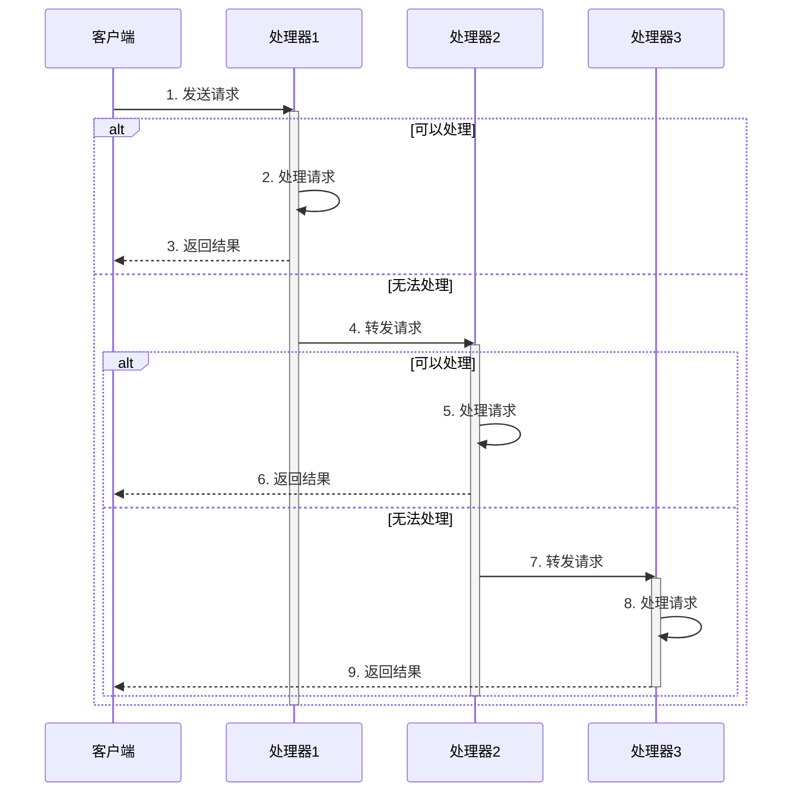
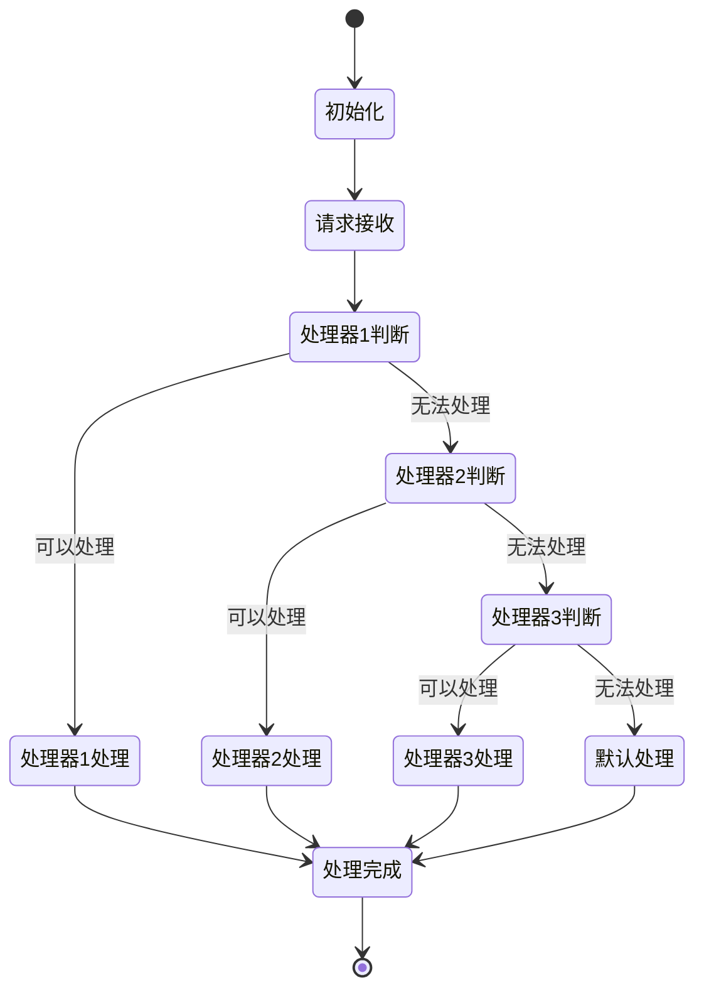
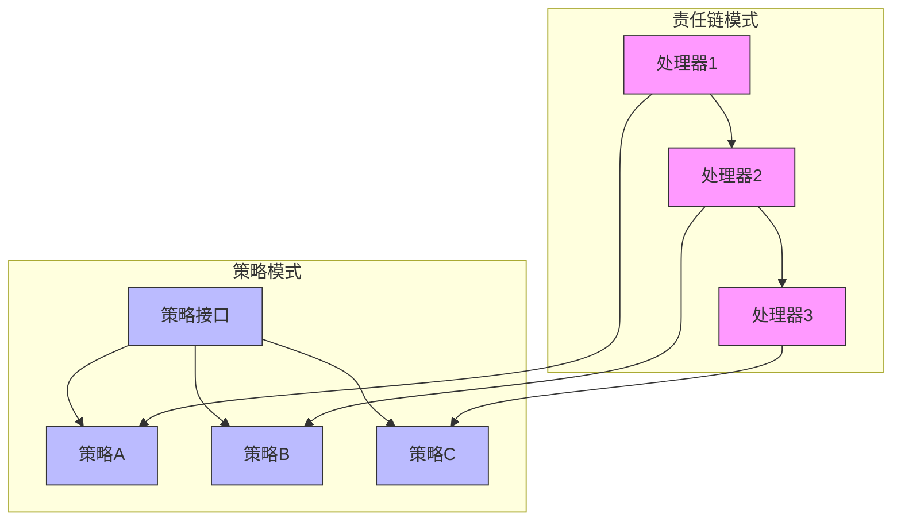
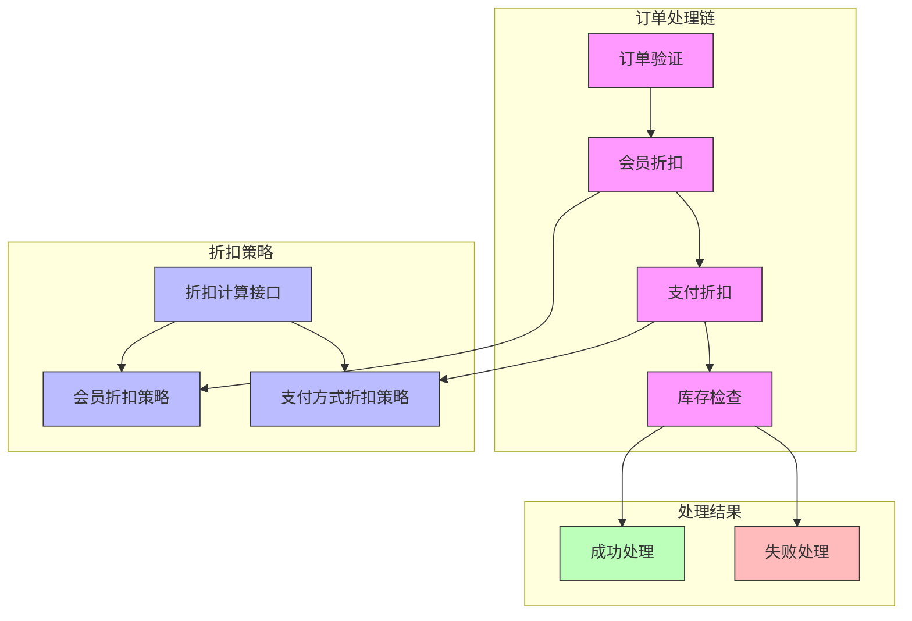
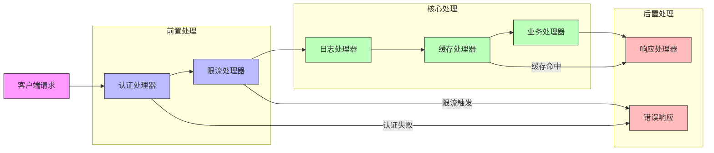

# 责任链模式图表

## 请求处理流程图

```mermaid
sequenceDiagram
    participant Client as 客户端
    participant Handler1 as 处理器1
    participant Handler2 as 处理器2
    participant Handler3 as 处理器3
    
    Client->>Handler1: 1. 发送请求
    activate Handler1
    
    alt 可以处理
        Handler1->>Handler1: 2. 处理请求
        Handler1-->>Client: 3. 返回结果
    else 无法处理
        Handler1->>Handler2: 4. 转发请求
        activate Handler2
        
        alt 可以处理
            Handler2->>Handler2: 5. 处理请求
            Handler2-->>Client: 6. 返回结果
        else 无法处理
            Handler2->>Handler3: 7. 转发请求
            activate Handler3
            Handler3->>Handler3: 8. 处理请求
            Handler3-->>Client: 9. 返回结果
            deactivate Handler3
        end
        
        deactivate Handler2
    end
    
    deactivate Handler1
```

## 责任链模式状态流转图

```mermaid
stateDiagram-v2
    [*] --> 初始化
    初始化 --> 请求接收
    
    请求接收 --> 处理器1判断
    处理器1判断 --> 处理器1处理: 可以处理
    处理器1判断 --> 处理器2判断: 无法处理
    
    处理器2判断 --> 处理器2处理: 可以处理
    处理器2判断 --> 处理器3判断: 无法处理
    
    处理器3判断 --> 处理器3处理: 可以处理
    处理器3判断 --> 默认处理: 无法处理
    
    处理器1处理 --> 处理完成
    处理器2处理 --> 处理完成
    处理器3处理 --> 处理完成
    默认处理 --> 处理完成
    
    处理完成 --> [*]
```

## 责任链与策略模式组合

```mermaid
graph TB
    subgraph 责任链模式
    A[处理器1] --> B[处理器2]
    B --> C[处理器3]
    end
    
    subgraph 策略模式
    D[策略接口]
    D --> E[策略A]
    D --> F[策略B]
    D --> G[策略C]
    end
    
    A --> E
    B --> F
    C --> G
    
    style A fill:#f9f,stroke:#333
    style B fill:#f9f,stroke:#333
    style C fill:#f9f,stroke:#333
    style D fill:#bbf,stroke:#333
    style E fill:#bbf,stroke:#333
    style F fill:#bbf,stroke:#333
    style G fill:#bbf,stroke:#333
```

## 订单处理系统架构图

```mermaid
graph TB
    subgraph 订单处理链
    A[订单验证] --> B[会员折扣]
    B --> C[支付折扣]
    C --> D[库存检查]
    end
    
    subgraph 折扣策略
    E[折扣计算接口]
    E --> F[会员折扣策略]
    E --> G[支付方式折扣策略]
    end
    
    subgraph 处理结果
    H[成功处理]
    I[失败处理]
    end
    
    B --> F
    C --> G
    D --> H
    D --> I
    
    style A fill:#f9f,stroke:#333
    style B fill:#f9f,stroke:#333
    style C fill:#f9f,stroke:#333
    style D fill:#f9f,stroke:#333
    style E fill:#bbf,stroke:#333
    style F fill:#bbf,stroke:#333
    style G fill:#bbf,stroke:#333
    style H fill:#bfb,stroke:#333
    style I fill:#fbb,stroke:#333
```

## API网关处理流程

```mermaid
flowchart LR
    A[客户端请求] --> B[认证处理器]
    B --> C[限流处理器]
    C --> D[日志处理器]
    D --> E[缓存处理器]
    E --> F[业务处理器]
    F --> G[响应处理器]
    
    B -- 认证失败 --> H[错误响应]
    C -- 限流触发 --> H
    E -- 缓存命中 --> G
    
    subgraph 前置处理
    B
    C
    end
    
    subgraph 核心处理
    D
    E
    F
    end
    
    subgraph 后置处理
    G
    H
    end
    
    style A fill:#f9f,stroke:#333
    style B fill:#bbf,stroke:#333
    style C fill:#bbf,stroke:#333
    style D fill:#bfb,stroke:#333
    style E fill:#bfb,stroke:#333
    style F fill:#bfb,stroke:#333
    style G fill:#fbb,stroke:#333
    style H fill:#fbb,stroke:#333
``` 